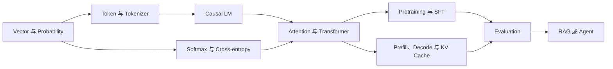
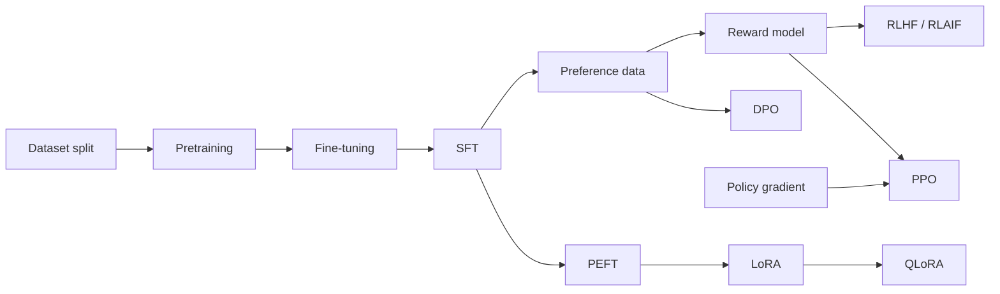
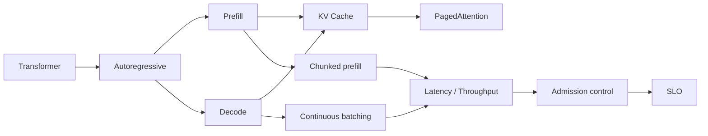
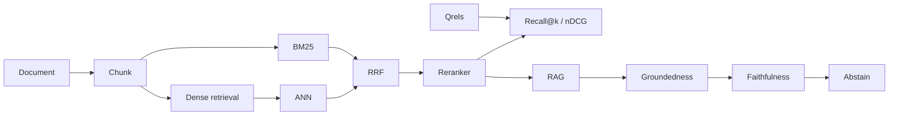
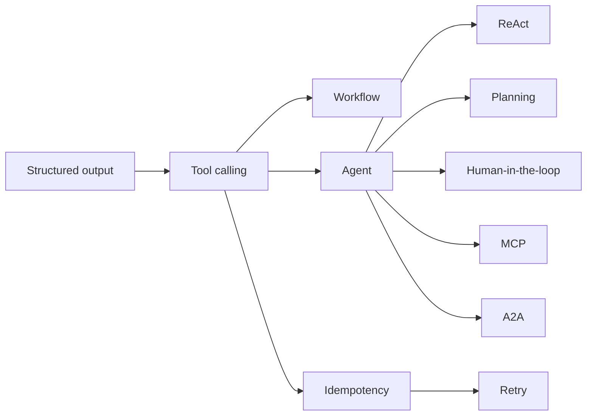
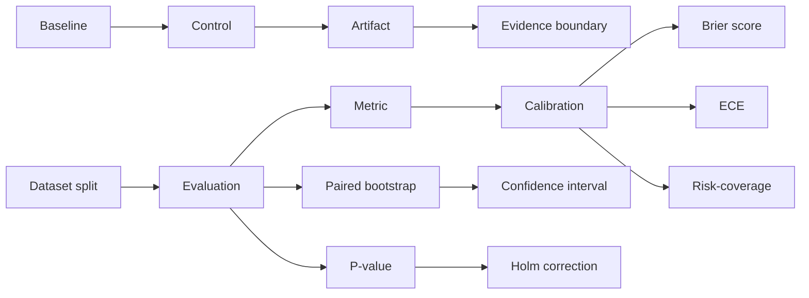

# 概念依赖与易混淆地图

这张地图把[术语知识图谱](glossary.md)从字母顺序还原成学习顺序。箭头表示“先理解左边，右边会更容易”，不是历史先后，也不表示左边足以推出右边。

每个术语都有正文与可运行验证入口。实验的作用是隔离机制和暴露边界，不是用一个 toy 证明生产质量。

## 一条最短主干

对应入口：

1. [Vector](glossary.md#term-vector)、[Probability](glossary.md#term-probability)；
2. [Token](glossary.md#term-token)、[Tokenizer](glossary.md#term-tokenizer)、[Causal LM](glossary.md#term-causal-lm)；
3. [Softmax](glossary.md#term-softmax)、[Cross-entropy](glossary.md#term-cross-entropy)、[Transformer](glossary.md#term-transformer)；
4. [Pretraining](glossary.md#term-pretraining)、[SFT](glossary.md#term-sft)、[Evaluation](glossary.md#term-evaluation)；
5. [RAG](glossary.md#term-rag)或 [Agent](glossary.md#term-agent)。

## 训练与对齐链

这条链最重要的分叉是：SFT 学条件分布中的理想回答；偏好优化使用比较或奖励信号；LoRA/QLoRA 描述参数更新方式，不描述训练目标。

## 推理与服务链

先把 prefill 与 decode 当成两种负载，再讨论 batching、cache 和调度。只报告平均 tokens/s 无法回答首 token、尾延迟或过载时发生了什么。

## RAG 诊断链

检索问题必须沿链定位：语料是否存在、权限后是否可见、大候选是否召回、reranker 是否保留、上下文是否选入、生成是否使用。最终答案错误不能直接归因于 embedding。

## Agent 控制链

工具调用只产生候选动作。身份、授权、幂等、副作用和完成判定属于 runtime，而不是语言模型概率自动提供的性质。

## 评测与证据链

统计量只有在系统身份、采样单位、分母和决策规则固定后才有意义。Artifact 保存观察；evidence boundary 约束能从观察推出什么。

## 十组最重要的易混淆概念

| 概念 A | 概念 B | 真正的区别 | 判断问题 |
|---|---|---|---|
| [Token](glossary.md#term-token) | [Word](glossary.md#term-word) | token 是 tokenizer 的离散 ID 单位，word 是语言或任务单位 | 换 tokenizer 后单位会不会变化？ |
| [Logit](glossary.md#term-logit) | [Probability](glossary.md#term-probability) | logit 未归一化，概率依赖完整候选集合和 softmax | 候选集合改变后数值是否仍可直接比较？ |
| [Causal mask](glossary.md#term-causal-mask) | [Loss mask](glossary.md#term-loss-mask) | 前者限制可读取位置，后者限制哪些位置贡献损失 | 这是信息泄漏问题还是监督分母问题？ |
| [Checkpoint](glossary.md#term-checkpoint) | [Activation checkpointing](glossary.md#term-activation-checkpointing) | 前者是持久化恢复状态，后者是训练显存重算技术 | 崩溃后能否从它恢复训练？ |
| [GQA](glossary.md#term-gqa) | [MLA](glossary.md#term-mla) | GQA 共享标准 K/V heads，MLA 使用 latent 压缩语义 | 标准 KV 元素公式仍然成立吗？ |
| [SFT](glossary.md#term-sft) | [DPO](glossary.md#term-dpo) | SFT 拟合理想回答，DPO 使用相对偏好与参考策略 | 数据是单个 target 还是同 prompt 的比较？ |
| [Mixed precision](glossary.md#term-mixed-precision) | [Quantization](glossary.md#term-quantization) | 前者组合浮点精度执行训练，后者将状态映射到低位宽 code | 是否需要 scale、zero point 或校准集？ |
| [Prefix cache](glossary.md#term-prefix-cache) | [Prompt cache](glossary.md#term-prompt-cache) | 前者是 runtime 的 token/KV identity，后者常是 provider 产品契约 | 谁定义命中、权限和计费？ |
| [Groundedness](glossary.md#term-groundedness) | [Faithfulness](glossary.md#term-faithfulness) | 前者问是否接入证据，后者问具体 claim 是否被证据支持 | 引用存在但论断不被支持时哪个失败？ |
| [MCP](glossary.md#term-mcp) | [A2A](glossary.md#term-a2a) | MCP 连接 host/client 与能力 server，A2A 连接独立 Agent 的任务生命周期 | 交换的是工具能力还是独立任务状态？ |

## 掌握一个术语的最低证据

把“见过这个词”与“会使用这个概念”分开：

1. **定义**：不用同义词循环解释，能指出输入、输出或研究对象；
2. **关系**：能说出至少一个先修概念和一个易混淆概念；
3. **机制**：能画出数据流、状态流或写出关键公式；
4. **验证**：运行词条绑定的实验，先写预测，再解释观察；
5. **边界**：明确实验没有证明的外推结论。

达到前两项是识别，达到前三项是理解，五项全部完成才算能用于工程判断。
