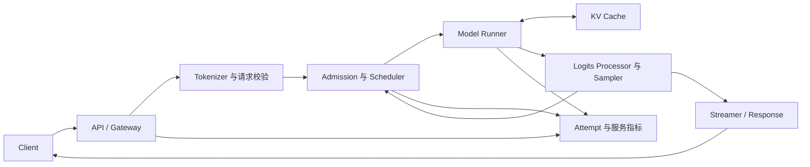

# 一次请求如何穿过 LLM 推理引擎

<!-- learning-contract -->
<div class="learning-contract" markdown="1">

**学习导航**

- **适合读者**：已经理解 Transformer，希望把模型计算、调度、KV Cache 和流式服务连起来的开发者。
- **先修**：[推理基础](inference.md)中的 prefill、decode 与 KV Cache。
- **首次阅读**：先跟随请求 A 走完全程，再看请求 B 如何进入同一个 batch，最后阅读失败与取消路径。
- **完成信号**：能画出一次请求的状态、KV 长度、输出 token 和四个计时时刻怎样随调度轮次变化。
- **卡住时**：先忽略多请求和分页，只保留“prefill 一次，decode 多次”的单请求时间线。

</div>

很多推理术语单独看并不难。真正容易迷路的地方，是不知道它们在一次请求的什么时刻出现。

本章只跟踪两个请求。请求 A 先到，请求 B 稍后到。我们会反复问四个问题：

1. 请求现在处于什么状态？
2. 本轮模型实际处理了哪些 token position？
3. KV Cache 中已经保存了什么？
4. 用户此时看到了什么？

## 先看完整地图

一次请求会经过三个不同层面。把它们分开，是理解推理系统的第一步。



- **协议层**接收请求，验证身份、模型名、长度、采样参数和流式格式。
- **引擎层**决定请求何时进入 GPU、每轮执行哪些序列，以及 KV 占多少容量。
- **模型层**执行 Transformer forward，产生 logits，再由采样器选出 token。

HTTP 请求进入服务以后，还要经历排队、调度和模型执行；模型产生 token 后，又要经过解码、缓冲和网络发送，
客户端才会收到字节。两段过程应使用不同时间戳观测。
这三个时刻必须分别记录。

## 请求 A：从 prompt 到三个输出 token

假设 tokenizer 已经把请求 A 的 prompt 转成四个 token：

```text
prompt = [x1, x2, x3, x4]
max_new_tokens = 3
```

为了看清 KV 的增长，暂时忽略 EOS、stop string 和网络延迟。
模型最终生成 `[y1, y2, y3]`。

### 进入队列时还没有执行模型

服务首先建立一张请求卡片。真实字段因 runtime 而异，但通常包含：

| 字段 | 本例值 | 用途 |
|---|---|---|
| request id | `A` | 串起日志、流式事件和服务端 trace |
| prompt token ids | `[x1,x2,x3,x4]` | prefill 输入 |
| maximum output | 3 | 长度终止条件 |
| sampling config | 例如 greedy | 定义如何从 logits 选 token |
| status | waiting | 尚未获得执行与 KV 容量 |
| block table | 空 | admission 后才分配 |

这时可以开始计算排队时间，但还不能计算模型服务时间，也没有任何 KV 可以释放。

### Prefill：四个输入位置产生第一个输出

Scheduler 接纳 A 后，Model Runner 对四个 prompt position 做一次 causal forward。
各层产生的 K/V 被写入缓存，最后一个 prompt position 的 logits 用于选择 `y1`。

```text
模型处理: x1  x2  x3  x4
KV 长度:                  4
新输出:                  y1
```

Prefill 结束时，用户可以收到第一个输出 token `y1`。但 `y1` 自己的 K/V 还没有计算；
它会在下一次 decode forward 中作为输入进入模型。

这一区分解释了为什么“输出三个 token”并不意味着一定额外执行三次 decode。

### Decode：每轮让序列前进一步

第一轮 decode 把 `y1` 输入模型，将它的 K/V 追加到缓存，并从新 logits 选出 `y2`。
第二轮 decode 对 `y2` 做同样的事，选出 `y3`。

| 模型工作 | forward 后 KV 长度 | 本轮产生的输出 | 累计用户输出 |
|---|---:|---|---|
| prefill `[x1,x2,x3,x4]` | 4 | `y1` | `[y1]` |
| decode 输入 `y1` | 5 | `y2` | `[y1,y2]` |
| decode 输入 `y2` | 6 | `y3` | `[y1,y2,y3]` |

达到长度上限后，请求完成。因为不再需要用 `y3` 预测下一个 token，所以本例无需计算 `y3` 的 K/V。

若 prompt 长度为 (P)，输出长度为 (O\ge1)，且没有 prefix reuse、speculation 或 beam，
这份账本中的 forward positions 是：

\[
P + O - 1.
\]

这是模型工作量口径，不是 API 计费规则。Padding、重计算、投机验证和缓存命中都会改变真实 kernel work。

## KV block table 在这三轮里怎样变化 { #kv-block-table }

现在把 KV Cache 的 block size 设为 2。为便于阅读，假设 A 得到的物理 block id 依次是 5、1、8。

| 时刻 | 逻辑内容 | A 的 block table | 尾块状态 |
|---|---|---|---|
| admission 后 | 尚未写入 | 预留策略由 runtime 决定 | — |
| prefill 后 | `x1 x2 / x3 x4` | `[5,1]` | block 1 已满 |
| decode `y1` 后 | `x1 x2 / x3 x4 / y1` | `[5,1,8]` | block 8 使用 1/2 |
| decode `y2` 后 | `x1 x2 / x3 x4 / y1 y2` | `[5,1,8]` | block 8 已满 |

Block table 保存的是**逻辑块到物理块的映射**。物理 id 不必连续，Attention kernel 仍须按逻辑顺序读取它们。

分页解决的是动态分配、共享和连续空间要求，不会消灭所有浪费。每条活动序列的最后一块仍可能没有填满。

### 为什么共享 partial tail 必须 copy-on-write

假设请求 B 与 A 共享一个五 token 前缀。两张 block table 都指向同一个未填满尾块：

```text
A: [0, 1]    block 1 使用 2/3
B: [0, 1]    block 1 使用 2/3
```

若 A 直接把新 token 写入 block 1，B 读到的前缀也会被改变。
正确做法是先为 A 预留新块，复制尾块已有 K/V，再修改 A 的映射并追加 token：

```text
A: [0, 2]    block 2 = copied tail + A 的新 token
B: [0, 1]    block 1 保持不变
```

这就是 copy-on-write（COW）。如果没有空闲块，append 应在改变旧尾块之前整体失败。

可以在 [Paged KV 引导实验](../practice/labs/lab-7a-paged-kv.md) 中亲自观察这次状态变化。

## 请求 B 到来后，batch 不再是固定名单 { #request-b }

请求 A 完成 prefill 后，请求 B 到达。B 的 prompt 有两个 token，期望输出两个 token。

```text
A: prompt=4, output=3
B: prompt=2, output=2
```

静态 batching 可能先组成一批，再等待批内所有序列结束。Continuous batching 则在调度边界加入新请求、
移除已完成请求，让 batch 的成员随时间变化。

下面只展示一种教学策略：decode-ready 请求每轮先获得一个位置，剩余 token budget 用于 chunked prefill。
本仓库的 CPU 调度示例采用这套策略，方便逐轮手算。不同 vLLM 版本可能采用其他优先级和抢占规则。

| 调度轮次 | 新 admission | prefill 工作 | decode 工作 | 边界上可见输出 |
|---:|---|---|---|---|
| 0 | A | A 的一段 prompt | — | 取决于 prefill 是否完成 |
| 1 | B | A 或 B 的剩余 prompt | 已完成 prefill 的请求 | 新首 token 或后续 token |
| 2+ | 视容量而定 | 未完成的 prompt chunk | 所有被选中的 decode-ready 请求 | 各请求独立前进 |

表格故意不写死每轮数字，因为结果还取决于 `max_batch_tokens`、序列上限和 prefill chunk。
真正需要掌握的是 Scheduler 每轮都在回答下面四个问题：

1. 哪些 waiting 请求可以 admission？
2. 哪些 running 请求本轮获得计算位置？
3. Token budget 和 KV block 是否同时足够？
4. 完成、取消或被抢占的请求如何释放或重建状态？

### Prefill 与 decode 不必永远二选一

有的精简实现一轮只做 prefill 或只做 decode；有的 runtime 支持 chunked prefill，
把 prompt 片段和 decode token 放进同一批工作中。策略还可能随版本变化。

因此“continuous batching”只说明 batch 成员能动态变化，不能单独推出：

- prefill 是否优先；
- 一轮是否混合 prefill 与 decode；
- 抢占选择谁；
- 首 token 在哪个调度边界可见；
- 是否支持 prefix cache、priority 或 speculative decoding。

阅读实现或分析 trace 时，必须把这些策略逐项写清楚。

## Model Runner 实际准备什么

Scheduler 选择的是请求和工作量，Model Runner 要把它们变成模型能执行的张量。常见工作包括：

1. 收集本轮 token ids、positions 和每条序列的长度。
2. 生成 slot mapping 或 block table，让新 K/V 写到正确物理位置。
3. 为变长批次准备边界信息，避免把所有序列 padding 到同一长度。
4. 调用模型 forward，并只保留本轮需要的 logits。
5. 把 logits 交给 processor 和 sampler。

在 decode 中，每条普通序列通常只新增一个输入位置，但会读取该序列已有的全部可见 K/V。
GQA 允许多个 query heads 共享较少的 K/V heads，从而降低 KV 容量。

### 在 nano-vLLM 中对照这条路径

固定 nano-vLLM commit 的 `LLMEngine.step()` 恰好把本章三个引擎动作排在一起：

```text
Scheduler.schedule()
-> ModelRunner.call("run", seqs, is_prefill)
-> Scheduler.postprocess(seqs, token_ids, is_prefill)
```

`ModelRunner` 再根据 `is_prefill` 选择 `prepare_prefill()` 或 `prepare_decode()`，执行自带的
`Qwen3ForCausalLM`，最后交给 `Sampler`。Transformers 在这条路径中提供 config 和 tokenizer，
并没有用 `AutoModel.generate()` 完成 forward。

[实验 7B](../practice/labs/lab-7b-nano-vllm-qwen3.md) 会在真实 Qwen3-0.6B/CUDA 运行中临时包装
`Scheduler.schedule()`，但仍调用 upstream `LLMEngine.step()`。报告把本轮 phase、scheduled tokens、
sequence status、cached tokens、block references 和执行路径放在同一条记录中。先用本章建立状态机，
再用实验回答“这一次具体为什么走到这个分支”。

## 从 logits 到用户可见文本

模型 forward 返回 logits 后，请求还没有完成。引擎通常继续执行：

```text
logits
  -> repetition / presence / frequency 等 processor
  -> temperature
  -> top-k / top-p 或约束 mask
  -> renormalize
  -> sample token id
  -> EOS、长度、stop 与 grammar 状态检查
  -> tokenizer 增量解码
  -> SSE 或非流式响应
```

顺序是协议的一部分。两个服务即使都接受 `temperature` 和 `top_p`，也可能因默认值、processor 顺序、
tokenizer 或 tie-break 不同而产生不同分布。

Stop string 可能跨 token 或 SSE chunk。客户端即使已经截掉 stop 文本，服务端仍可能继续 forward。
模型停止、KV 释放和计费终止是后续的独立事件，需要服务端 trace 才能确认。

## 四个时刻怎样变成指标

对一次流式 attempt，至少保留四个单调时间戳：

| 时刻 | 含义 |
|---|---|
| `offered_at` | 负载发生器原计划提交请求的时刻 |
| `started_at` | 客户端真正开始 HTTP dispatch 的时刻 |
| `first_token_at` | 收到第一个非空内容 delta 的时刻 |
| `completed_at` | 成功、超时、取消或错误终态 |

常见指标由这些事件派生：

- Client queue：`started_at - offered_at`。
- Dispatch TTFT：`first_token_at - started_at`。
- Offered TTFT：`first_token_at - offered_at`。
- E2E：`completed_at - started_at`，或明确使用 offered 口径。
- TPOT：第一个输出之后的生成区间除以 `output_tokens - 1`；只有一个输出 token 时未定义。

TTFT 不是纯 prefill 时间。它还可能包含客户端排队、网关、服务端队列、tokenization 和网络传输。
没有服务端 trace 时，不应只凭一个 TTFT 数字把问题归因给 GPU。

## 完成、失败与取消都要收口

请求可能因 EOS、长度上限或 stop 正常完成，也可能经历：

- admission 超时或 429；
- token/KV 容量不足；
- model worker 或通信失败；
- 客户端断连；
- server deadline；
- 流式协议或 tokenizer 错误。

每条路径都要产生唯一终态，并回答三个不同问题：

1. 客户端是否已经停止等待？
2. 后端是否已经停止继续生成？
3. Sequence、KV block 和并发 permit 是否已经释放？

这三件事不会自动同时发生。Python task 收到取消，不足以证明已经进入的 GPU kernel 可中断；
HTTP response 关闭，也不足以证明 runtime 已经 abort 对应 sequence。

## 把本章映射到仓库代码

第一次读代码时，按请求流向阅读，不必先打开所有测试。

| 本章环节 | 仓库入口 | 先观察什么 |
|---|---|---|
| 离散 admission 与 batching | `src/about_llm/inference/continuous_batching.py` | 每轮 admitted、prefill、decode 和 emitted token |
| KV block 与 COW | `src/about_llm/inference/kv_allocator.py` | block table、refcount 和容量失败前后状态 |
| 真实 CPU K/V tensor | `src/about_llm/inference/paged_kv_torch.py` | logical order、COW 后两条序列的值 |
| 固定 Qwen3 + nano-vLLM GPU trace | `projects/inference-serving/nano_vllm_study.py` | phase、status、prefix hit、KV ledger 与执行路径 |
| 采样 | `src/about_llm/inference/sampling.py` | processor、mask、renormalization 和 RNG 映射 |
| SSE | `src/about_llm/inference/sse.py` | byte chunk 如何还原为完整 event |
| 指标 | `src/about_llm/inference/metrics.py` | 分母、失败终态和未定义值 |

精确的测试与证据范围集中在[推理服务证据页](../evidence/inference-serving-controls.md)。
教材负责建立心智模型，证据页负责回答“这条结论目前由什么证明”。

## 用一张表复述请求 A

读完后，应该能够不看正文补全下面这张表：

| 问题 | 请求 A 的答案 |
|---|---|
| Prompt 和输出长度 | 4 与 3 |
| Prefill 后 KV 长度 | 4 |
| Decode forward 次数 | 2 |
| 总 forward positions | 6 |
| 最终输出 token 数 | 3 |
| 最后一个输出是否必须写入 KV | 否，本例完成后不再预测下一 token |
| Block table 为什么可不连续 | 它保存逻辑块到任意物理块的映射 |
| 断连为何不等于 KV 已释放 | 协议、生成任务与引擎资源是不同生命周期 |

## 自测

1. 画出 (P=3,O=4) 时每轮输入、输出和 KV 长度。为什么总工作是 6 个 position？
2. 两条序列共享一个未满尾块时，一条序列 append 为什么不能原地写？
3. Continuous batching 与“prefill 优先”是什么关系？前者是否必然推出后者？
4. 客户端只记录 `started_at` 会漏掉哪一段等待？
5. 收到 `CancelledError` 后，还需要什么证据才能说明模型停止并释放 KV？

下一步先完成 [Paged KV 引导实验](../practice/labs/lab-7a-paged-kv.md)，
再进入[推理优化](inference-optimization.md)学习怎样根据 TTFT、TPOT、容量和吞吐选择优化。
