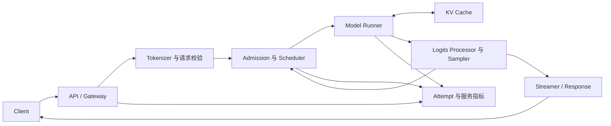

# 一次请求如何穿过 LLM 推理引擎

<!-- learning-contract -->
<div class="learning-contract" markdown="1">

**学习导航**

- **适合读者**：已经理解 Transformer，希望把模型计算、调度、KV Cache 和流式服务连起来的开发者。
- **先修**：[推理基础](inference.md)中的 prefill、decode 与 KV Cache。
- **首次阅读**：先跟随请求 A 走完全程，再看 A、B、C 怎样共享计算预算，最后阅读失败与取消路径。
- **完成信号**：能画出一次请求的状态、KV 长度、输出 token 和四个计时时刻怎样随调度轮次变化。
- **卡住时**：先忽略多请求和分页，只保留“prefill 一次，decode 多次”的单请求时间线。

</div>

很多推理术语单独看并不难。真正容易迷路的地方，是不知道它们在一次请求的什么时刻出现。

本章先单独跟踪请求 A，再让稍后到达的 B、C 加入调度。我们会反复问四个问题：

1. 请求现在处于什么状态？
2. 本轮模型实际处理了哪些 token position？
3. KV Cache 中已经保存了什么？
4. 用户此时看到了什么？

## 先看完整地图

一次请求会经过三个不同层面。把它们分开，是理解推理系统的第一步。



- **协议层**接收请求，验证身份、模型名、长度、采样参数和流式格式。
- **引擎层**决定请求何时进入 GPU、每轮执行哪些序列，以及 KV 占多少容量。
- **模型层**执行 Transformer forward，产生 logits，再由采样器选出 token。

HTTP 请求进入服务以后，要先排队、调度并执行模型。模型选出 token 后，还要经过文本解码、缓冲和网络发送，
客户端才会收到字节。因此，“请求发出”“首 token 到达”和“响应结束”不是同一个时刻；后文会用四个时间戳把它们记清楚。

## 请求 A：从 prompt 到三个输出 token

假设 tokenizer 已经把请求 A 的 prompt 转成四个 token：

```text
prompt = [x1, x2, x3, x4]
max_new_tokens = 3
```

为了看清 KV 的增长，暂时忽略 EOS、stop string 和网络延迟。
模型最终生成 `[y1, y2, y3]`。

### 进入队列时还没有执行模型

服务首先建立一张请求卡片。真实字段因 runtime 而异，但通常包含：

| 字段 | 本例值 | 用途 |
|---|---|---|
| request id | `A` | 串起日志、流式事件和服务端 trace |
| prompt token ids | `[x1,x2,x3,x4]` | prefill 输入 |
| maximum output | 3 | 长度终止条件 |
| sampling config | 例如 greedy | 定义如何从 logits 选 token |
| status | waiting | 尚未获得执行与 KV 容量 |
| block table | 空 | admission 后才分配 |

这时可以开始计算排队时间，但还不能计算模型服务时间，也没有任何 KV 可以释放。

### Prefill：四个输入位置产生第一个输出

调度器接纳 A 后，模型运行器把 `x1` 到 `x4` 一次送入因果语言模型。每一层都会把这四个位置的 key 和 value
写入 KV Cache；模型再读取最后一个位置的 logits，从候选 token 中选出 `y1`。

```text
模型处理: x1  x2  x3  x4
KV 长度:                  4
新输出:                  y1
```

Prefill 结束时，用户可以收到第一个输出 token `y1`。但 `y1` 自己的 K/V 还没有计算；
它会在下一次 decode forward 中作为输入进入模型。

这一区分解释了为什么“输出三个 token”并不意味着一定额外执行三次 decode。

### Decode：每轮让序列前进一步

第一轮 decode 把 `y1` 输入模型，将它的 K/V 追加到缓存，并从新 logits 选出 `y2`。
第二轮 decode 对 `y2` 做同样的事，选出 `y3`。

| 模型工作 | forward 后 KV 长度 | 本轮产生的输出 | 累计用户输出 |
|---|---:|---|---|
| prefill `[x1,x2,x3,x4]` | 4 | `y1` | `[y1]` |
| decode 输入 `y1` | 5 | `y2` | `[y1,y2]` |
| decode 输入 `y2` | 6 | `y3` | `[y1,y2,y3]` |

达到长度上限后，请求完成。因为不再需要用 `y3` 预测下一个 token，所以本例无需计算 `y3` 的 K/V。

设输入长度为 \(P\)，输出长度为 \(O\ge1\)。在不使用前缀复用、投机解码和 beam search 时，
模型实际处理的位置数是：

\[
P + O - 1.
\]

这是模型工作量口径，不是 API 计费规则。Padding、重计算、投机验证和缓存命中都会改变真实 kernel work。

## KV block table 在这三轮里怎样变化 { #kv-block-table }

现在把 KV Cache 的 block size 设为 2。为便于阅读，假设 A 得到的物理 block id 依次是 5、1、8。

| 时刻 | 逻辑内容 | A 的 block table | 尾块状态 |
|---|---|---|---|
| admission 后 | 尚未写入 | 预留策略由 runtime 决定 | — |
| prefill 后 | `x1 x2 / x3 x4` | `[5,1]` | block 1 已满 |
| decode `y1` 后 | `x1 x2 / x3 x4 / y1` | `[5,1,8]` | block 8 使用 1/2 |
| decode `y2` 后 | `x1 x2 / x3 x4 / y1 y2` | `[5,1,8]` | block 8 已满 |

Block table 保存的是**逻辑块到物理块的映射**。物理 id 不必连续，Attention kernel 仍须按逻辑顺序读取它们。

分页解决的是动态分配、共享和连续空间要求，不会消灭所有浪费。每条活动序列的最后一块仍可能没有填满。

### 为什么共享 partial tail 必须 copy-on-write

假设请求 B 与 A 共享一个五 token 前缀。两张 block table 都指向同一个未填满尾块：

```text
A: [0, 1]    block 1 使用 2/3
B: [0, 1]    block 1 使用 2/3
```

若 A 直接把新 token 写入 block 1，B 读到的前缀也会被改变。
正确做法是先为 A 预留新块，复制尾块已有 K/V，再修改 A 的映射并追加 token：

```text
A: [0, 2]    block 2 = copied tail + A 的新 token
B: [0, 1]    block 1 保持不变
```

这就是 copy-on-write（COW）。如果没有空闲块，append 应在改变旧尾块之前整体失败。

可以在 [Paged KV 引导实验](../practice/labs/lab-7a-paged-kv.md) 中亲自观察这次状态变化。

## 请求 B、C 到来后，batch 不再是固定名单 { #request-b }

现在把单请求时间线放进一个很小的调度器。A 在边界 0 到达；B 和 C 在边界 1 到达：

```text
A: arrival=0, prompt=[x1,x2,x3,x4], output=[y1,y2,y3]
B: arrival=1, prompt=[b1,b2],       output=[z1,z2]
C: arrival=1, prompt=[c1],          output=[w1]
```

调度器最多同时保留 2 条序列，每轮最多处理 4 个 token position，并且一条请求每轮最多 prefill 3 个位置。
它先给已经进入 decode 的请求各留一个位置，再保证每条 prefill 请求至少前进一步，最后把剩余预算按先到先服务的顺序分完。

这里的“第 0 轮”表示区间 `[0,1)`。模型在区间内工作，输出在右侧边界 1 变得可见。其余轮次同理。

| 区间 | 左边界新接纳 | 本轮模型处理的位置 | 使用预算 | 右边界可见输出 | 本轮结束、下轮接纳前 |
|---|---|---|---:|---|---|
| `[0,1)` | A | A prefill `x1,x2,x3` | 3/4 | — | A 仍在 prefill；B、C 到达 |
| `[1,2)` | B | A prefill `x4`；B prefill `b1,b2` | 3/4 | A:`y1`；B:`z1` | A、B 运行；C 等待 |
| `[2,3)` | — | A decode `y1`；B decode `z1` | 2/4 | A:`y2`；B:`z2` | B 完成；A 运行；C 等待 |
| `[3,4)` | C | A decode `y2`；C prefill `c1` | 2/4 | A:`y3`；C:`w1` | A、C 完成 |

第二轮最容易读错：A 的最后一个 prompt 位置和 B 的两个 prompt 位置一共只占 3 个计算位置，
却同时产生了 `y1` 和 `z1`。首个输出来自 prompt 最后一个位置的 logits，不需要再占一个 decode 位置。

C 展示了 continuous batching（连续批处理）的核心：它在 B 完成、空出序列槽位后立刻进入下一轮，
不必等待 A 也结束。A 的 prompt 被拆成 `3+1` 两段，则是 chunked prefill（分块预填充）。

### 把 token 工作量对上

三个请求各自处理的位置数为：

```text
A: 4 + 3 - 1 = 6
B: 2 + 2 - 1 = 3
C: 1 + 1 - 1 = 1
总计:              10
```

逐轮相加同样得到 `3+3+2+2=10`。四轮一共有 `4×4=16` 个 token 槽位，所以这个固定样例的槽位利用率是
`10/16=62.5%`。它只是离散调度账本，不是 GPU utilization，也不能换算成真实延迟。

可以直接运行仓库中的 CPU 参考实现，核对接纳、prefill、decode、首 token 和完成边界：

~~~bash
python projects/inference-serving/continuous_batching_toy.py
~~~

同一份输出还把排队与生成时间分开了。这里的单位是离散调度步，不是秒：

| 请求 | 到达 | 接纳 | 首 token | 完成 | 排队步数 | 从到达到首 token |
|---|---:|---:|---:|---:|---:|---:|
| A | 0 | 0 | 2 | 4 | 0 | 2 |
| B | 1 | 1 | 2 | 3 | 0 | 1 |
| C | 1 | 3 | 4 | 4 | 2 | 3 |

C 的首 token 等了 3 步，其中前 2 步在队列中，真正进入引擎后只用 1 步。这正是后文为什么要把 queue time
与模型服务时间分开。C 只有一个输出 token，因此没有“首 token 之后的平均每 token 时间”（TPOT）。

### 再把 KV 的增长对上

下面继续使用每块 2 个 token 的设定，并假设三个请求不共享前缀、完成后立即释放活动引用。
表中的块数由 `ceil(KV 长度 / 2)` 手算，表示当前逻辑内容至少需要多少块；它不指定物理 block id，
也不假设真实引擎何时预留显存或保留 prefix cache。

| 边界 | 本轮新写入 KV 的位置 | 释放前的逻辑 KV 长度 | 至少需要的块数 | 完成请求释放后的活动块 |
|---:|---|---|---:|---:|
| 1 | A:`x1,x2,x3` | A=3 | 2 | 2 |
| 2 | A:`x4`；B:`b1,b2` | A=4，B=2 | 2+1=3 | 3 |
| 3 | A:`y1`；B:`z1` | A=5，B=3 | 3+2=5 | 3 |
| 4 | A:`y2`；C:`c1` | A=6，C=1 | 3+1=4 | 0 |

边界 3 上，B 刚产生最后一个输出 `z2`，因此无需再为 `z2` 计算 K/V；B 的活动块随后释放。
边界 4 同理，A 的 `y3` 和 C 的 `w1` 都是最后一个输出，完成清理后不再有活动块。

CPU 参考实现只验证调度和 token 守恒，并没有实现 KV allocator。物理块、引用计数和写时复制请在
[Paged KV 引导实验](../practice/labs/lab-7a-paged-kv.md)中观察；真实 Qwen3 请求的 block trace 则在
[实验 7B](../practice/labs/lab-7b-nano-vllm-qwen3.md)中生成。

### 真实引擎的策略可能不同

上面的结果对应一套明确的教学策略。Continuous batching 只表示 batch 成员可以在调度边界变化，
并没有规定 prefill 与 decode 谁优先。有的实现把两者分开执行，有的实现允许 prompt 分块与 decode 混在一轮。

因此，阅读一个真实 runtime 时还要确认：每轮 token 预算、序列上限、prefill 分块、抢占顺序、前缀缓存和优先级。
这些选择共同决定首 token 在哪一轮出现，也决定容量不足时由谁让出资源。

## Model Runner 实际准备什么

调度器只决定“这轮算谁、算几个位置”。模型运行器（Model Runner）还要把这个决定变成模型可以执行的张量：

1. 收集本轮 token ids、positions 和每条序列的长度。
2. 生成 slot mapping 或 block table，让新 K/V 写到正确物理位置。
3. 为变长批次准备边界信息，避免把所有序列 padding 到同一长度。
4. 调用模型 forward，并只保留本轮需要的 logits。
5. 把 logits 交给 processor 和 sampler。

在 decode 中，每条普通序列通常只新增一个输入位置，但会读取该序列已有的全部可见 K/V。
GQA 允许多个 query heads 共享较少的 K/V heads，从而降低 KV 容量。

### 在 nano-vLLM 中对照这条路径

本项目选定的 nano-vLLM 版本把一次调度轮次写在 `LLMEngine.step()` 中，顺序正好对应本章的三步：

```text
Scheduler.schedule()
-> ModelRunner.call("run", seqs, is_prefill)
-> Scheduler.postprocess(seqs, token_ids, is_prefill)
```

`ModelRunner` 根据 `is_prefill` 选择 `prepare_prefill()` 或 `prepare_decode()`，随后执行 nano-vLLM 自带的
`Qwen3ForCausalLM`，并把 logits 交给 `Sampler`。Transformers 在这里负责读取模型配置和 tokenizer；
实际 forward 不是由 `AutoModel.generate()` 完成的。

[实验 7B](../practice/labs/lab-7b-nano-vllm-qwen3.md) 在真实 Qwen3-0.6B/CUDA 运行中观察
`Scheduler.schedule()`，但不会替换原来的 `LLMEngine.step()`。报告逐轮列出计算阶段、token 数、
sequence 状态和 KV block 占用。先理解本章的四轮手算，再去回答“真实请求为什么走到这个分支”。

## 从 logits 到用户可见文本

模型 forward 返回 logits 后，请求还没有完成。引擎通常继续执行：

```text
logits
  -> repetition / presence / frequency 等 processor
  -> temperature
  -> top-k / top-p 或约束 mask
  -> renormalize
  -> sample token id
  -> EOS、长度、stop 与 grammar 状态检查
  -> tokenizer 增量解码
  -> SSE 或非流式响应
```

顺序是协议的一部分。两个服务即使都接受 `temperature` 和 `top_p`，也可能因默认值、processor 顺序、
tokenizer 或 tie-break 不同而产生不同分布。

停止字符串不一定恰好对应一个 token，也可能被拆到两次流式发送中。如果只有客户端停止显示文字，
服务端仍可能继续生成。要判断算力和显存是否真的停止消耗，需要分别观察服务端何时识别停止条件、
何时释放 KV，以及何时结束本次请求的计量。

## 四个时刻怎样变成指标

对一次流式 attempt，至少保留四个单调时间戳：

| 时刻 | 含义 |
|---|---|
| `offered_at` | 负载发生器原计划提交请求的时刻 |
| `started_at` | 客户端真正开始 HTTP dispatch 的时刻 |
| `first_token_at` | 收到第一个非空内容 delta 的时刻 |
| `completed_at` | 成功、超时、取消或错误终态 |

常见指标由这些事件派生：

- Client queue：`started_at - offered_at`。
- Dispatch TTFT：`first_token_at - started_at`。
- Offered TTFT：`first_token_at - offered_at`。
- E2E：`completed_at - started_at`，或明确使用 offered 口径。
- TPOT：第一个输出之后的生成区间除以 `output_tokens - 1`；只有一个输出 token 时未定义。

TTFT 不是纯 prefill 时间。它还可能包含客户端排队、网关、服务端队列、tokenization 和网络传输。
没有服务端 trace 时，不应只凭一个 TTFT 数字把问题归因给 GPU。

## 完成、失败与取消都要收口

请求可能因 EOS、长度上限或 stop 正常完成，也可能经历：

- admission 超时或 429；
- token/KV 容量不足；
- model worker 或通信失败；
- 客户端断连；
- server deadline；
- 流式协议或 tokenizer 错误。

每条路径都要产生唯一终态，并回答三个不同问题：

1. 客户端是否已经停止等待？
2. 后端是否已经停止继续生成？
3. Sequence、KV block 和并发 permit 是否已经释放？

以请求 A 已经返回 `y1`、用户随后关闭连接为例，取消通常要经过三道边界：

| 边界 | 可以观察到什么 | 此时还不能推出什么 |
|---|---|---|
| 网关发现连接断开 | HTTP 响应关闭，客户端协程结束 | 推理引擎已经收到取消 |
| 引擎接受 `abort(A)` | A 不再进入后续调度轮次 | 正在执行的 GPU kernel 已被中途打断 |
| 运行器回到安全边界并清理 | A 从活动序列中消失，KV 引用归零，并发名额归还 | — |

因此，看到 Python task 被取消只证明了第一层附近的状态。要确认资源已经释放，还要在同一个 request id 下看到
引擎终态、后续不再调度以及 KV/并发账本回到预期值。

## 把本章映射到仓库代码

第一次读代码时，按请求流向阅读，不必先打开所有测试。

| 本章环节 | 仓库入口 | 先观察什么 |
|---|---|---|
| 离散 admission 与 batching | `src/about_llm/inference/continuous_batching.py` | 每轮 admitted、prefill、decode 和 emitted token |
| KV block 与 COW | `src/about_llm/inference/kv_allocator.py` | block table、refcount 和容量失败前后状态 |
| 真实 CPU K/V tensor | `src/about_llm/inference/paged_kv_torch.py` | logical order、COW 后两条序列的值 |
| 固定 Qwen3 + nano-vLLM GPU trace | `projects/inference-serving/nano_vllm_study.py` | phase、status、prefix hit、KV ledger 与执行路径 |
| 采样 | `src/about_llm/inference/sampling.py` | processor、mask、renormalization 和 RNG 映射 |
| SSE | `src/about_llm/inference/sse.py` | byte chunk 如何还原为完整 event |
| 指标 | `src/about_llm/inference/metrics.py` | 分母、失败终态和未定义值 |

精确的测试与证据范围集中在[推理服务证据页](../evidence/inference-serving-controls.md)。
教材负责建立心智模型，证据页负责回答“这条结论目前由什么证明”。

## 用一张表复述请求 A

读完后，应该能够不看正文补全下面这张表：

| 问题 | 请求 A 的答案 |
|---|---|
| Prompt 和输出长度 | 4 与 3 |
| Prefill 后 KV 长度 | 4 |
| Decode forward 次数 | 2 |
| 总 forward positions | 6 |
| 最终输出 token 数 | 3 |
| 最后一个输出是否必须写入 KV | 否，本例完成后不再预测下一 token |
| Block table 为什么可不连续 | 它保存逻辑块到任意物理块的映射 |
| 断连为何不等于 KV 已释放 | 协议、生成任务与引擎资源是不同生命周期 |

## 自测

1. 画出 \(P=3,O=4\) 时每轮输入、输出和 KV 长度。为什么总工作是 6 个 position？
2. 两条序列共享一个未满尾块时，一条序列 append 为什么不能原地写？
3. 在 A/B/C 的四轮账本中，C 为什么要等到边界 3？总工作量为什么是 10 而不是 11？
4. Continuous batching 与“prefill 优先”是什么关系？前者是否必然推出后者？
5. 客户端只记录 `started_at` 会漏掉哪一段等待？
6. 收到 `CancelledError` 后，还需要什么证据才能说明模型停止并释放 KV？

下一步先完成 [Paged KV 引导实验](../practice/labs/lab-7a-paged-kv.md)，
再进入[推理优化](inference-optimization.md)学习怎样根据 TTFT、TPOT、容量和吞吐选择优化。
