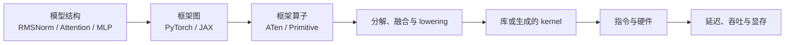

# LLM 算子与计算栈：跟一次 RMSNorm 走到硬件

<!-- learning-contract -->
<div class="learning-contract" markdown="1">

**学习导航**

- **适合读者**：已经看懂 Transformer 公式，想继续学习框架、编译器、kernel 或芯片适配的开发者。
- **先修**：[Transformer](../core/transformer.md)中的张量形状、RMSNorm 和一次前向计算。
- **首次阅读**：先运行 RMSNorm 实验，再读抽象层、支持审计与 profiling。
- **完成信号**：能解释一个 PyTorch Module 为什么不等于一个 ATen 算子或一个 GPU kernel，并能设计支持验收。
- **卡住时**：只追踪 `RMSNorm([B,T,D])`，不要同时展开完整模型和全部 CUDA 术语。

</div>

同一个 Qwen 或 Llama checkpoint，在一套环境中能够快速推理，换到另一套环境却可能加载失败、回退 CPU，
或者虽然能生成文本，速度却远低于硬件峰值。问题通常不在模型名字本身，而在模型计算穿过的这些层：



本章不把这条链写成组件名词表，而是跟着一次 RMSNorm 调用逐层下钻。Attention、量化、MoE、分布式通信和
推理调度已经有独立章节，后文会把它们接回同一张地图。

## 先运行：同一次 RMSNorm 为什么会出现两层图 { #rmsnorm-trace }

下面的命令只需要 PyTorch，不下载模型：

```powershell
python projects/transformers-basics/trace_rmsnorm_operator_stack.py
```

脚本创建形状为 `[2,3,4]` 的连续张量，然后交换前两个维度。交换后的 view 仍与原张量共享 storage，
但 stride 从 `[12,4,1]` 变成 `[4,12,1]`；调用 `contiguous()` 后才得到新布局。随后同一份非连续输入走过：

1. 用乘法、均值和 `rsqrt` 写出的 RMSNorm 参考实现；
2. `torch.nn.functional.rms_norm`；
3. `torch.fx` 捕获的 Python 计算图；
4. `torch.export` 产生的 ATen 图；
5. 可选的 PyTorch profiler 事件。

加入 `--profile` 可以观察当前 PyTorch 版本在 CPU 上实际提交了哪些 ATen 事件：

```powershell
python projects/transformers-basics/trace_rmsnorm_operator_stack.py --profile
```

你的 3070 Laptop 环境可进一步运行：

```powershell
python projects/transformers-basics/trace_rmsnorm_operator_stack.py `
  --device cuda --profile --json
```

GPU 运行能够证明这次输入确实走过当前 CUDA backend；它仍不是性能基准，也不能证明所有 dtype、shape、layout
和反向路径都已支持。完整实验记录方法见[实验 2D](../practice/labs/lab-2d-operator-stack.md)。

## 第一层：数学定义只回答“算什么”

设 hidden state 为 \(x\in\mathbb{R}^{B\times T\times D}\)，权重为 \(w\in\mathbb{R}^{D}\)。RMSNorm 沿最后
一维计算：

\[
y_{btd}
=
x_{btd}
\left(
\frac{1}{D}\sum_{j=1}^{D}x_{btj}^{2}+\epsilon
\right)^{-1/2}
w_d.
\]

这个定义固定了归约（reduction）维度、\(\epsilon\) 的位置和广播关系。至于张量怎样存储、需要启动几个
kernel、采用什么累加精度，以及最终在哪种芯片上执行，都要到后面的计算栈中才能确定。

一个可移植的算子契约还需要写清：

| 契约项 | RMSNorm 例子 | 写错后会发生什么 |
|---|---|---|
| Shape | 输入 `[B,T,D]`，权重 `[D]`，输出 `[B,T,D]` | 沿错维度归一化或广播到错误位置 |
| Dtype | 输入、权重、累加和输出分别是什么类型 | FP16 reduction 溢出或发生静默转换 |
| Layout/stride | 是否接受非连续 view，最后一维是否连续 | 触发复制、慢路径或直接拒绝 |
| 数值语义 | `eps`、舍入、累加顺序与容差 | 结果近似但不满足训练/推理要求 |
| 动态性 | `B/T` 是否动态，`D` 是否固定 | 新 shape 重新编译或回退 |
| Autograd | forward、backward 与高阶梯度范围 | “推理能跑”被误写成“训练支持” |

因此，张量（Tensor）不只是一个形状。View、转置和 reshape 可能只改变描述布局的元数据，并不搬运数值。

`contiguous()`、数据类型转换和跨设备搬运则可能真正读写数据。模型公式不显示这些开销，运行记录却会显示出来。

## 第二层：模型算子、框架算子与计算图不是一回事

模型代码可能只有一行：

```python
hidden = self.input_layernorm(hidden)
```

这行代码可以对应一个框架原生 `rms_norm` 算子，也可以分解为 `mul → mean → add → rsqrt → mul → mul`。
本章实验的 FX 图展示 Python 运算关系，`torch.export` 图则把同一关系表达成
`aten.mul.Tensor`、`aten.mean.dim` 等 ATen operator overload。

这几个名词分别回答不同问题：

| 层次 | 它描述什么 | 不能据此断言什么 |
|---|---|---|
| `nn.Module` | 参数组织和模型前向接口 | 一次调用只启动一个 kernel |
| FX node | Python 层捕获到的运算关系 | 已覆盖所有动态控制流和副作用 |
| ATen operator | PyTorch 的算子 schema 与 overload | 在每个 backend 都有同样实现与性能 |
| Dispatch | 根据 device、layout、dtype、Autograd、Autocast 等选择路径 | 最终一定不会分解、融合或回退 |
| Exported graph | 带约束的可提前处理 ATen 图 | 已经完成目标硬件 lowering |
| Kernel | 设备上一次启动执行的程序 | 数学上只对应一个高层算子 |

PyTorch 的 dispatcher（调度器）会根据一次调用的实际条件选择实现。设备和数据类型是其中两项条件，梯度计算、
自动混合精度和算子的注册方式也会参与选择。

选择完成后，复合算子可能继续展开为其他 ATen 算子。为特定后端注册的算子，则可能调用现成的算子库或自定义
kernel。

JAX 用另一套术语表达相似过程。它先追踪 Python 函数，得到 jaxpr 和 primitive；随后转换成 StableHLO/XLA
能够处理的中间表示，最后交给目标后端编译。

ONNX 的角色不同。它主要定义可交换的模型格式和算子规范，真正执行模型仍需要 ONNX Runtime 或其他运行时。

## 第三层：编译器决定怎样改写图

Eager 模式遇到一次调用就派发一次。Compiled 模式先捕获一段计算图，再尝试分解和融合算子、安排内存，最后
生成代码或调用现成的算子库。

在常见的 PyTorch 2.x 配置中，各组件大致这样分工：

- TorchDynamo 捕获可以编译的计算图；
- AOTAutograd 处理供编译器使用的前向图和反向图；
- TorchInductor 负责编译后端，并可能生成 Triton 或 C++ 代码。

这只是典型路径。具体经过哪些组件，会随 PyTorch 版本、所选后端和图的内容变化。

下面四件事需要分开观察：

1. **Capture**：哪些 Python 运算进入图，哪里发生 graph break？
2. **Decomposition**：复合算子被拆成哪些更基础的语义？
3. **Fusion/lowering**：哪些节点合并，最终交给库还是生成 kernel？
4. **Guards/cache**：哪些 shape、stride、dtype 或控制条件变化会重新编译？

`torch.export` 成功只说明这组输入约束下得到了可分析的图。`torch.compile` 成功也不自动表示 kernel 更少或端到端
更快：首次编译、动态 shape、图外 Python、数据复制和不适合当前 shape 的融合都可能抵消收益。

## 第四层：kernel 才真正面对硬件

GPU kernel 会把工作逐级分给网格（grid）、线程块（block）和线程（thread）。

在 NVIDIA GPU 上，线程再以 warp 为单位调度。

一个流式多处理器（SM）能同时容纳多少活跃工作，受到寄存器、共享内存和线程块数量的共同限制。实际活跃程度
通常用 occupancy（占用率）描述。

较高占用率有助于隐藏等待延迟，却不是最终目标。让每个线程使用更多寄存器会降低占用率，但也可能增加数据复用、
减少访存，最终运行得更快。

典型数据路径可以简化为：

```text
host launch
→ HBM/VRAM 读取输入
→ cache / shared memory / register 中复用
→ CUDA Core 或 Tensor Core 执行
→ 写回输出
```

相邻线程能否合并访问显存、共享内存是否发生 bank conflict（存储体冲突）、分块大小是否适合当前形状，以及同步
次数，都会改变实际速度。矩阵 kernel 还要检查数据类型和内存对齐能否满足 Tensor Core 的 MMA 矩阵指令要求。

在 NVIDIA 软件栈里，这些组件解决的问题并不相同：

- CUDA C++ 和 Triton 可以用来编写并编译 kernel，CUTLASS 提供构建高性能 CUDA kernel 的模板与组件；
- cuBLASLt 主要提供 GEMM 及其后处理（epilogue），cuDNN 提供神经网络算子和图式执行能力；
- NCCL 负责多 GPU 之间的集合通信。

kernel 继续向下编译时，可能先得到虚拟指令层 PTX，再生成适配具体 GPU 架构的机器指令 SASS。预编译库、
即时生成的代码和不同代际 GPU 采用的路径可能不同，因此不能只看 Python 函数名就判断最终用了哪些指令。

| 组件 | 主要职责 | 常见误解 |
|---|---|---|
| CUDA runtime/driver | 设备、内存、stream、launch 与代码装载 | 它等于全部数学算子库 |
| cuBLAS/cuBLASLt | GEMM、batched/grouped GEMM 与部分 epilogue | 所有 Linear 都走同一 kernel |
| cuDNN | 神经网络算子与图式执行能力 | 它负责整个 LLM 服务调度 |
| CUTLASS | CUDA 高性能计算模板与组件 | 使用 CUTLASS 就自动适合所有 shape |
| Triton | 编写并编译自定义并行 kernel 的 DSL | Triton 等于 PyTorch 图编译器本身 |
| NCCL | 多 GPU 集合通信 | 它定义 tensor parallel 的模型切分 |
| TensorRT/TensorRT-LLM | 图优化、LLM plugin/runtime 与部署路径 | 能解析模型就代表所有功能性能相同 |
| Nsight Systems/Compute | 系统时间线与单 kernel 分析 | 一张截图足以证明普遍加速 |

RMSNorm、Attention 和全归约（AllReduce）是通用的数学或通信语义。

CUDA API、PTX/SASS 和上表中的库，则是 NVIDIA 平台提供的具体实现路径。

## 为什么一个高层算子不等于一个 kernel

RMSNorm 在 eager 模式下可能依次执行归约、`rsqrt` 和多次逐元素读写，每一步都可能产生中间结果。融合后的
kernel 可以在同一块数据上连续完成平方、归约、缩放和权重乘法，从而减少中间张量和显存往返。

映射关系也可能反过来：一个看起来完整的 Attention 算子，仍可能因为序列长度、mask、head dimension 或 dtype
而拆成多个 kernel。因此，高层算子和 kernel 之间始终可能是一对多或多对一。

判断性能时，至少区分三类成本：

| 类型 | 常见 LLM 算子 | 第一项检查 |
|---|---|---|
| Compute-bound | 大 batch/prefill GEMM、部分长序列 Attention | Tensor Core 利用与 tile |
| Memory-bound | 小 batch decode、RMSNorm、elementwise、权重读取 | 搬运字节、融合和布局复制 |
| Launch/latency-bound | 很小的 reduction、sampling、碎片化图 | kernel 数、CPU gap、CUDA Graph |

Roofline 用算术强度 \(I=F/Q\) 连接计算量 \(F\) 与数据搬运量 \(Q\)。它给出理想性能上界，等价地也能给出
执行时间的理想下界。这个模型不包含 launch、同步、调度和通信；可运行公式见
[硬件性能模型](hardware-edge.md#roofline-model)。

## 把一层 Transformer 拆成算子热点

下面只列计算角色，shape 推导仍以 [Transformer 主章](../core/transformer.md)为准：

| 模型阶段 | 主要算子模式 | 常见系统问题 |
|---|---|---|
| Embedding | Gather/indexing | 随机访问、词表分片 |
| RMSNorm/LayerNorm | Reduction + elementwise | 累加精度、融合、非连续布局 |
| Q/K/V 与 output projection | GEMM/GEMV | Prefill/decode shape 不同 |
| RoPE | Elementwise + reshape | 位置、layout 与融合边界 |
| Attention | QK matmul、mask、softmax、PV matmul | IO、ragged sequence、cache layout |
| SwiGLU MLP | 两个 up/gate projection、激活、down projection | GEMM 与 epilogue fusion |
| MoE | Top-k、permute、grouped GEMM、scatter | 负载不均衡和 all-to-all |
| LM head/sampling | GEMM、softmax/top-k、随机数 | 大词表带宽与低 batch launch |

Attention 的在线 softmax 见[数值计算](../foundations/attention-numerics.md)，分页 KV Cache 与前缀复用见
[推理优化](inference-optimization.md)和[实验 7A](../practice/labs/lab-7a-paged-kv.md)。

MoE 的路由、专家容量、分组矩阵乘法和专家并行见 [MoE 系统](../frontier/moe-systems.md)。

## “支持这个模型”要拆成可验证问题 { #support-audit }

模型能够加载，只证明权重名称、shape 和模型类至少走到了一条路径。一个平台的支持程度可以分六级记录：

1. **能够解析**：配置、权重和计算图可识别；
2. **功能可运行**：当前输入的所有算子有执行路径；
3. **目标设备执行**：没有意外 CPU fallback、host round trip 或静默 dtype 转换；
4. **场景覆盖**：目标 shape、layout、动态输入、forward/backward 和分布式组合均被验证；
5. **性能可用**：热点算子具有适合当前 workload 的 kernel、融合和内存行为；
6. **生产可用**：并发、失败恢复、观测、升级和长运行稳定性符合要求。

每个关键算子都可以填写一张支持卡：

| 检查项 | 要保存的证据 |
|---|---|
| 语义 | 独立参考实现、边界输入、容差和差分结果 |
| Dtype | 输入、权重、乘法、累加和输出的实际类型 |
| Shape/layout | 测试矩阵、动态维度、stride/alignment 与失败方式 |
| Forward/backward | 两条路径分别通过，梯度与 reference 对账 |
| Device | profiler 中的真实执行设备、复制和同步 |
| Compile/fallback | graph break、重新编译、unsupported op 和慢路径 |
| Performance | 固定 workload 下的预热、同步、重复测量和资源数据 |
| Production | 并发、取消、OOM、版本升级和可回滚配置 |

从 FX/ONNX 图导出 operator inventory 是盘点起点，不是完整结论。运行时控制流、custom op、sampling、cache 管理、
通信和形状特化路径仍需单独覆盖。

## 跨平台迁移时，按层映射而不是翻译 API

把 CUDA 程序迁到其他 GPU/NPU，第一步不是寻找同名 API，而是固定数学语义和算子契约，然后逐层回答：

```text
模型算子清单
→ 目标框架/编译器能否表达
→ dtype、shape、layout 和动态性是否覆盖
→ 使用现有库、算子组合还是自定义 kernel
→ forward/backward 与分布式如何注册
→ 差分正确性
→ microbenchmark
→ 模型与服务回归
```

不同加速器有各自的软件栈：

- NVIDIA 使用 CUDA；
- AMD 使用 ROCm/HIP；
- 昇腾使用 CANN；
- Intel GPU 使用 oneAPI/XPU；
- TPU 通常通过 XLA 编译和执行。

比较这些平台时，可以逐项回答四个问题：

1. 算子语义是否一致？
2. 哪些数据类型、形状和内存布局可用？
3. 运行中是否回退到主机或较慢的实现？
4. 性能是否满足目标工作负载？

接口相似只代表其中一层容易迁移，不能推出数值边界、kernel 选择和实际性能也相同。

做跨厂商比较时，需要记录设备代际、软件版本、显存与互联。动态形状、自定义算子、集合通信和性能分析工具也要
分别核对，最后在相同的真实模型任务上测量。这里给出的是统一比较方法，不表示不同平台的功能或性能等价。

## Profiling：先从症状缩小范围，再下钻 kernel

一次可信的性能诊断按下面顺序进行：

1. 先固定模型 revision、输入/输出长度、batch、dtype、功耗模式和软件版本；
2. 用 reference 验证输出和梯度，再讨论速度；
3. 预热编译、allocator 和 cache，计时窗口前后按设备语义同步；
4. 先看端到端 TTFT、TPOT、吞吐、显存和失败，再看 PyTorch profiler；
5. 用 Nsight Systems 找 CPU gap、launch、复制、同步和 collective；
6. 对确认的热点再用 Nsight Compute 分析 occupancy、memory throughput、指令与 Roofline；
7. 只改一个变量，保留原始数据和退化结果。

Microbenchmark 回答一个算子在指定 shape/dtype/layout 上的成本；端到端 benchmark 还包含调度、cache、tokenizer、
网络和请求分布。两者不能互相替代。

## 当前仓库已经覆盖到哪里

需求大纲中的内容不是全部空白。下面按“能否形成完整学习闭环”归类：

| 主题 | 当前状态 | 主要入口 |
|---|---|---|
| Transformer 算子与 shape | 已有完整主线 | [Transformer](../core/transformer.md) |
| Attention/online softmax | 已有数学与参考实现 | [Attention 数值计算](../foundations/attention-numerics.md) |
| KV、PagedAttention、prefix reuse | 已有状态机、真实 tensor 与 nano-vLLM 路线 | [推理请求](inference-request-lifecycle.md)、[实验 7A](../practice/labs/lab-7a-paged-kv.md) |
| Prefill/decode、batching、CUDA Graph | 已有请求级与源码级实验 | [推理优化](inference-optimization.md)、[实验 7B](../practice/labs/lab-7b-nano-vllm-qwen3.md) |
| Weight/KV quantization | 已有 packing、scale、误差与 reload 实验 | [推理优化](inference-optimization.md) |
| MoE routing/grouped work/all-to-all | 已有前向、capacity、通信和反向主线 | [MoE 系统](../frontier/moe-systems.md) |
| 分布式训练与通信 | 已有 DP/TP/PP/EP、global loss 与恢复 | [分布式训练](distributed-training.md) |
| Roofline、显存与消费 GPU | 已有公式、预算和 3070 路线 | [硬件与端侧](hardware-edge.md) |
| 框架算子、export 与支持审计 | 本章和实验 2D 补成入门闭环 | [实验 2D](../practice/labs/lab-2d-operator-stack.md) |
| 自定义 Triton/CUDA kernel 优化 | 尚无经过目标 GPU 验证的优化日志 | 需要在 3070 或其他目标设备实测 |
| 跨厂商 backend 对照 | 目前只有统一审计方法，没有双平台实测 | 不能写成已完成适配 |

Attention、KV Cache 和 MoE 已经有各自的学习主线。接下来更值得做的是在目标 GPU 上选择 RMSNorm 或另一种
逐元素/归约 kernel，依次完成正确性对账、性能分析和优化，再用同一张支持卡审查第二种后端。

## 推荐学习顺序

```text
Transformer shape
→ 本章 RMSNorm 计算栈
→ 实验 2D 的 FX/export/profiler
→ Attention 与 KV
→ Roofline 与 profiling
→ nano-vLLM 请求 trace
→ 目标 GPU kernel 或跨平台适配
```

后续路线取决于你的目标：

- 学习推理服务：进入 [Inference Serving](../practice/projects/inference-serving.md)；
- 学习训练系统：进入[分布式训练](distributed-training.md)；
- 学习 kernel 工程：继续在目标设备上编写 Triton/CUDA 实现，并用 Nsight 和多组形状测量验证优化。

## 自测

1. 为什么 `nn.RMSNorm`、`aten::rms_norm` 和 fused RMSNorm kernel 不是三个同义词？
2. 为什么非连续张量即使数值相同，也可能选择不同实现或多一次复制？
3. `torch.export` 成功能够证明哪些事情，又不能证明哪些事情？
4. “模型能生成文本”和“全部算子在目标 NPU 上生产可用”之间还缺哪几级证据？
5. Nsight Systems 与 Nsight Compute 分别应该在什么阶段使用？
