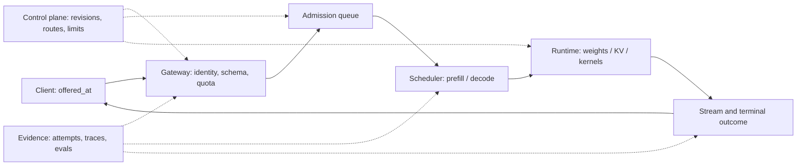

# 服务与可观测性

<!-- learning-contract -->
<div class="learning-contract" markdown="1">

**学习导航**

- **适合读者**：负责 LLM API、平台、SRE 或质量运营的工程师。
- **先修**：[请求生命周期](inference-request-lifecycle.md)、HTTP、队列和基本 SLO 概念。
- **首次阅读**：跟完高峰期的一次聊天请求，再看过载、发布和事故处理。
- **完成信号**：能写出包含流量分母、排队、取消、容量和降级条件的服务 SLO。
- **卡住时**：先区分[推理指标](inference.md)中的 queue、TTFT、TPOT 与端到端延迟。

</div>

周一上午十点，一条聊天请求带着 1,200 个输入 token 和 200 个输出 token 上限到达服务。
低峰时，用户约 300 ms 就能看到第一个字；现在他等了 8 秒，最后收到 `504`。

值班工程师打开看板，却看见两个似乎矛盾的数字：成功请求的 p95 只有 1.4 秒，GPU 利用率也只有 62%。
真正的问题藏在统计口径里：大量请求在客户端并发槽和服务队列中超时，既没进入“成功请求延迟”，也没让 GPU 开始计算。

这正是 LLM serving 比“给 `generate()` 套一层 HTTP”难的地方。一次请求会依次争用连接、队列、
prefill、KV cache、decode 和流式传输；任何一层都可能先结束，而下游工作仍在继续。

系统工程路线可以先完成 [vLLM 单卡验收](vllm-serving.md)，再用本章把一个实例扩展成可运营服务。
最终实践落在 [Inference Serving 项目](../practice/projects/inference-serving.md)。

## 先跟请求走一遍

把上面的请求拆成可观察状态：

| 时刻 | 状态 | 系统需要回答的问题 |
|---|---|---|
| 客户端计划发送 | `offered` | 流量何时真正到达？客户端自己排了多久？ |
| 网关验证身份和输入 | `eligible` | 它是否属于服务承诺范围？ |
| 等待容量 | `queued` | 前面有多少 token work，deadline 还剩多久？ |
| 预留 sequence 与 KV | `admitted` | 预留是否足以覆盖这次请求？ |
| prefill / decode | `running` | 首 token、后续 token 与取消分别发生在何时？ |
| 返回或终止 | `terminal` | 成功、拒绝、超时、断连还是结果未知？资源真的释放了吗？ |



图里有三条平面。数据面搬运请求和 token；控制面决定版本、配额、路由与发布；证据面保存实际执行记录。
模型运行时只负责生成，不能替网关决定认证主体、租户权限、价格或 hard limit。

反过来，网关返回 `200` 也只说明 HTTP 路径成功。要确认目标 checkpoint、tokenizer 和 template 确实执行，
还需要用 request ID 把网关记录与服务端 generation trace 连起来。

### 这条服务链怎样对应 nano-vLLM

nano-vLLM 实现的是模型引擎，不是一套完整的在线服务。把前面的服务状态映射到实验代码，可以看清边界：

| 服务状态 | nano-vLLM 中能观察到什么 | 仍由服务外围负责什么 |
|---|---|---|
| `offered / eligible` | 尚未进入引擎 | HTTP、认证、Schema、租户配额与请求上限 |
| `queued` | `add_request()` 创建 `WAITING` sequence | 服务队列 deadline、公平性和快速拒绝 |
| `admitted` | Scheduler 选择 sequence，BlockManager 分配 KV block | 全局并发额度和跨副本 admission |
| `running` | ModelRunner 执行 prefill/decode，Sampler 选 token | Socket 断连、流式背压和外部依赖 |
| `terminal` | Postprocess 标记完成并释放活动 KV 引用 | HTTP 终态、费用核销、审计与重试语义 |

[实验 7B](../practice/labs/lab-7b-nano-vllm-qwen3.md)从 `LLM.generate → add_request` 开始，记录 Scheduler、
BlockManager、ModelRunner、Qwen3 和 Sampler 的真实执行。它回答“引擎内部为什么走到这一步”。本章继续回答外围问题：
请求是否应该进入引擎、客户端看到什么终态，以及服务过载时如何保持可解释。

## 第一个问题：哪些请求算成功

延迟分位数通常只统计成功请求，因此必须和完整终态计数一起看：

```text
attempted
├── invalid / unauthorized / over_quota
└── eligible
    ├── success
    ├── rate_limited / queue_timeout
    ├── execution_timeout / cancelled
    └── server_error / outcome_unknown
```

服务应在看到结果前定义 `eligible`。一种常用口径是：请求已经认证、符合 schema，并处于租户合同配额内。
在这个定义下：

\[
\text{success rate}
=
\frac{N_{\text{success}}}{N_{\text{eligible offered}}}.
\]

慢请求、`429` 和模型拒答不能在事后为了改善数字而移出分母。恶意请求、无效格式和超合同流量可以单独运营，
但资格规则要先写进服务契约。协议成功、任务成功和安全策略正确拒绝也是三种不同结果，不能只看 HTTP 状态码。

聊天、批量抽取和 Agent 对 SLO 的侧重点不同：

- 聊天首先关心可用性、TTFT、TPOT 和流中断率；
- 批量任务通常更关心截止时间内完成率和 tokens/s/GPU；
- Agent 还要计算工具链终态、重复副作用和每个成功任务的总成本。

每轮至少报告 attempted、eligible、success、timeout、`429`、`5xx` 与 cancelled 的原始数量。
低流量服务的 p99 很容易被单个样本支配，此时样本量和较长窗口比一个漂亮的小数更有解释力。

目标成功率为 \(S\) 时，窗口内的失败预算是 \(1-S\)。Error budget 用来约束变更速度和可靠性，
不是可以故意制造失败的配额；窗口、维护期和低样本处理方式应在上线前固定。

## 第二个问题：服务承诺的是哪种流量

容量不是模型名附带的常数。同一个模型处理 32 条短分类和 32 条 32k prompt，内存、队列与首 token 延迟会完全不同。
一次可比较的 workload 至少固定：

| 维度 | 它会怎样改变结果 |
|---|---|
| arrival process 与 offered rate | 决定队列怎样形成，以及是否真正压到饱和点 |
| prompt / output 长度联合分布 | 长 prompt 压 prefill，长输出长期占用 sequence 与 KV |
| 会话和租户分布 | 改变公平性、热点与 cache 可复用范围 |
| model、dtype、量化和 adapter | 改变显存、kernel 路径和 batch compatibility |
| sampling、RAG 和 tool | 改变 decode 分支、外部等待与最终质量 |
| deadline、取消和重试 | 改变在途工作、重复费用与失败分母 |
| cache hit 与 prefix 长度 | 改变实际 prefill work，不能代替冷缓存容量 |
| 硬件、runtime、driver 和 kernel | 决定实际执行路径和吞吐 |

Closed-loop worker 完成上一条请求后才发送下一条。服务一变慢，它就自动降载，适合测用户式并发，
却可能错过真正的饱和过程。Constant 或 Poisson open-loop 按外生时间表继续发请求，更适合寻找容量 knee。

两者都要记录 `offered_at`。若客户端还没取得并发槽，等待时间属于 client queue；若负载生成器自己晚于计划时间，
还要报告 generator lag。客户端队列、服务队列和网络等待不能混成一个“TTFT”。

输入与输出 cap 只是上界。报告还应保存实际长度分布、截断数、拒绝数、模型与运行时 revision。
敏感生产流量可以只保存受控样本和结构化 histogram，但这些统计仍要绑定生成时间、查询和过滤规则。

## Admission：在昂贵工作开始前决定是否接单

无限队列不会增加容量，只会让一次快速拒绝变成长时间超时。Admission 应在昂贵 prefill 和外部副作用之前，
同时限制 active sequences、预计 token/KV 占用，以及 queue 的条数或总工作量。

普通 causal generation 可先用一个粗估计排序请求：

\[
\widehat W_i=\widehat P_i+O_i^{cap}-1.
\]

这里 \(\widehat P_i\) 是输入长度估计，\(O_i^{cap}\) 是输出长度上限。这个式子估算需要处理多少个序列位置，
不能直接换算成 GPU 秒或显存字节。

束搜索、推测解码、前缀命中、抢占和补齐都会改变真实工作量。估算 KV 容量时，还要加入模型层数、K/V head 数、
每个 head 的维度、数值类型和 block allocator 的分配规则。

队列策略是一项产品选择：

- 先到先服务（FCFS）容易解释，但超长请求会阻塞后面的短请求；
- 按长度分队列可以保护短请求，同时要防止长请求一直得不到执行；
- 优先队列需要配额和随等待时间提升优先级的 aging 规则。

优先级应来自认证后的控制面策略，不能接受 Prompt 自报的 `priority=critical`。

超载时，快速返回可解释的 `429` 或执行已授权降级，通常比让所有请求越过 deadline 更好。
长上下文可以进入独立 lane；重试提示必须带 backoff，避免所有客户端同时制造 retry storm。

容量只在明确的 resource-release 事件后归还。排队超时且从未 dispatch 的请求可以立即释放预留；
execution timeout 或客户端断连后，底层线程、GPU kernel 或远程 provider 可能仍在运行，不能仅凭 `504` 提前腾出同一份容量。

## API 要把终态说清楚

客户端不应从一段错误文案猜测发生了什么。稳定接口至少区分：

```text
success / invalid / unauthorized / rate_limited
queue_timeout / execution_timeout / cancelled
server_error / outcome_unknown
```

这三个 ID 分别回答不同问题：

| 标识 | 关联对象 |
|---|---|
| Request ID | 一次网络请求 |
| Logical call ID | 用户眼中的同一次调用及其多次重试 |
| Idempotency key | 业务约定中需要去重的一次操作 |

重新生成文本会产生另一份 token 和费用。付款、发信或创建资源等副作用还需要稳定的 effect ID、状态查询和对账流程，
不能只依靠 HTTP 客户端重试。

版本协商失败时应明确报错。客户端请求的 model、adapter 或 API feature 不存在时，服务不能静默换模型后
返回普通成功，否则调用者无法知道实际运行了什么。
如果产品允许降级，receipt 中要写实际 revision、降级原因和能力差异，质量与合规策略也要先批准这条路径。

### 流式输出与取消是两个协议

Server-Sent Events（SSE）只能证明服务在分块发送字节。后端可能先生成完整结果，再分块发出；
要验证增量生成，需要观察首个 delta 到达时 decode 是否仍在运行。

停止字符串可能横跨多个 token、SSE 事件，甚至 UTF-8 字节块。客户端需要暂存“仍可能组成停止字符串”的最长后缀。
协议还要明确：停止字符串是否返回给用户，多个规则重叠时谁优先，以及 Unicode、usage 和 finish reason 怎样处理。

客户端截断展示并不会让后端自然停止。取消测试应该分别测量：

1. disconnect-to-work-stop；
2. work-stop-to-KV-release；
3. 远程 provider 是否收到取消；
4. 已开始的外部副作用最终属于 completed、failed 还是 unknown。

最小集成测试应走真实 socket 与独立服务进程，覆盖认证、schema、非流式、流式和错误终态。
目标 GPU runtime 上的 KV 释放、容量和故障注入仍需单独验证。

## 路由、降级与缓存先守住边界

模型路由分两步。第一步先检查硬条件：数据地域、许可证、模态、上下文长度、工具与 Schema 能力、租户隔离和
安全策略。不满足任意一项的模型都要排除。

第二步才在可行候选中比较质量、延迟和成本。例如让小模型处理分类，让大模型处理开放推理，或者在低置信度时
转交人工。

降级可以减少候选、缩短上下文、关闭非必要工具、切换已验证的备用模型或转人工。
安全检查、租户隔离和数据地域不能作为高峰期的性能开关。路由器本身也需要版本化评测，
尤其要覆盖“备用模型也不可用”和“两个候选的输出 schema 不兼容”。

缓存可以出现在四个位置：

| 缓存 | 复用对象 | 关键边界 |
|---|---|---|
| 响应缓存 | 完整答案 | 输入、采样、个性化和结果时效 |
| 语义缓存 | 相似问题的答案 | 租户、权限、相似阈值与内容更新 |
| Prefix / KV cache | 已计算前缀 | 精确 token、模型、位置编码、KV dtype 与可见域 |
| 检索缓存 | 候选或结果 | 索引 revision、ACL 与查询上下文 |

缓存键中的身份与权限字段必须来自认证和策略层。一次 Prefix/KV 命中至少要绑定：

- 租户和权限策略；
- 模型、tokenizer、template 与 adapter 版本；
- Position/RoPE 配置和 KV 数值类型；
- 完全相同的 token 前缀。

指纹可以用来快速寻找候选 bucket，真正命中前仍要比较完整字段。敏感数据还需要 TTL、删除、加密和时间侧信道控制。

## 一个副本健康，不代表整个服务有容量

常见服务包含网关或路由器、多个模型副本，以及外部 RAG 和工具依赖。每一层的并发限制只在自己的作用域内生效。

例如，4 个 worker 分别持有 `Semaphore(8)`，整个进程组最多可能同时放行 32 个请求，而不是 8 个。单个副本的本地
队列也无法独自实施租户的全局配额。

Tensor parallel 和 pipeline parallel 让一个模型实例跨多台设备执行；副本并行则让多个完整实例接收不同请求。
前两者的扩缩容单位是一个跨设备实例，后者的扩缩容单位是一个完整副本。

粘性路由可以提高前缀缓存命中率，也可能把流量集中成热点。用于选路的 session key 必须经过认证，并且不能跨租户
复用缓存。

Readiness 检查回答“这个副本现在能否接流量”，需要覆盖目标模型、tokenizer、template、adapter、设备、scheduler
和关键依赖。Liveness 检查只回答“进程是否还活着，是否值得重启”。

滚动发布时，先停止接收新请求并摘除路由，再等待在途请求完成或按上限取消，最后释放模型与 KV。

GPU 利用率不足以单独决定扩缩容：admission 过严时，GPU 可能很闲而队列已经超时；服务饱和时，GPU 又可能长期满载。

扩缩容信号应组合队列等待时间、已接收序列数、KV block 使用量、prefill/decode 工作量、抢占次数、错误率和目标延迟。

新副本还要经历模型下载、完整性验证、权重加载、kernel/graph warmup 和 cache 冷启动。
容量计划至少覆盖稳态、burst、单副本故障，以及发布期间少一部分 capacity 四种场景。

## Trace 要能解释时间去了哪里

一次请求的 trace 应串起网关、Prompt 构造、检索、模型、工具、验证和响应。三类可观测数据各有用途：

- 指标（metrics）观察整体趋势；
- Trace 还原一条请求跨组件的时间线；
- 日志保存某个事件的详细信息。

Request ID 适合写入 trace 或日志，不适合作为长期指标标签，否则会制造极高的基数。原始 Prompt、工具参数和异常
响应体也不应进入普通指标。

同一进程内的耗时使用单调时钟测量。不同机器的单调时钟没有共同起点，所以跨机器时间戳不能直接相减。

每个组件分别记录自己的 span duration，再用 trace ID 表达调用先后关系。客户端端到端耗时减去已知 span 后若仍有
空白，应将其标成网络、队列或未知时间，保留尚未解释的事实。

一份服务 receipt 至少关联：

- logical call 与当前 attempt；
- authenticated subject / tenant；
- 实际 model、runtime、template 与 adapter revision；
- 请求上限、最终终态和降级/缓存/重试信息；
- usage 来自 provider/runtime，还是本地 estimate。

这些字段让记录可对账，但普通 hash 或自洽 JSON 不认证执行者和来源。计费或高风险发布还需要受控日志、访问控制，
必要时使用签名并与外部账单核对。

## 质量和性能要在同一场发布中相遇

线上通常没有即时正确答案。服务可以持续回放版本化评测集，抽样做人工审查，并观察输入语言、长度、拒答率、
用户纠错和转人工率。

发布判断必须同时看质量和性能。一个版本即使 TTFT 更短，只要 Schema 失败或引用错误增加，就不应直接发布；另一个
版本即使离线质量更高，只要队列超时激增，也可能降低成功任务率。

Shadow 复制输入但不把结果给用户，适合检查兼容性和离线质量；它会额外消耗容量，并扩大敏感数据处理范围。
Canary 承接真实结果，因此要提前固定流量资格、观察窗口、质量/安全/可靠性 gate、停止条件和回滚 owner。

一次发布包含的不只是模型权重，还包括：

- Tokenizer、chat template 和 adapter；
- 推理框架、kernel 与采样默认值；
- API、Schema、Prompt、RAG 索引和工具契约；
- 安全策略与路由配置。

推荐按下面顺序推进：

1. 验证不可变 artifact 的完整性、shape、loader、tokenizer/template 和最小生成；
2. 在隔离环境运行质量、安全、协议和目标 workload；
3. 预热副本，检查 readiness、显存/KV baseline 与关键 trace；
4. 执行 shadow 或小比例 canary；
5. 扩大流量，同时保留上一版本 capacity 和路由回滚；
6. 演练 in-flight drain、cache/schema compatibility 与未决 effect 对账。

Trace schema、cache key 和序列化状态需要版本兼容，否则模型回滚可能被一次不可逆 schema 迁移阻断。
回滚完成的判断是用户请求恢复、质量回到门槛且未决 attempt 已处理，而不是控制台显示旧权重已部署。

## 成本和事故最终都按一次成功任务结算

总成本还包括 Embedding、重排、检索存储、工具、网络、可观测、人工审核和失败重试。
更便宜但经常返工的模型，可能拥有更高的每成功任务成本。

自托管服务可以先预留 token 和 KV 容量，在请求进入终态后再按实际工作量结算。调用云 API 时，每一次可能计费的
网络请求也要单独预留费用。

成本数据有三种来源：本地估算、运行时 usage 和服务商账单。请求被取消或返回 `500` 后是否收费，应以服务商契约和
最终账单为准。

事故发生时先止损，再定位。几个常见入口是：

| 现象 | 先做什么 | 接着观察什么 |
|---|---|---|
| TTFT / queue 上升 | 冻结发布，限制新流量 | offered load、长度、admission、prefill、KV 与副本健康 |
| TPOT 变慢 | 保住目标版本和 workload | batch、decode kernel、功耗、通信与邻居任务 |
| OOM | 停止接收超长请求 | 权重、KV、workspace、碎片和泄漏 |
| 取消或错误升高 | 按 typed terminal 拆分 | gateway、queue、engine、stream 与远程 provider |
| 质量或安全回归 | 停止 canary，路由回已验证版本 | model、Prompt、index、policy 与失败样本 |
| 跨租户或秘密泄漏 | 隔离缓存、日志、索引和 credential | 访问审计、数据范围与撤销流程 |

复盘应分开记录 trigger、影响分母、检测延迟、止损、恢复和仍待 reconciliation 的请求。
如果历史请求没有可靠 revision identity，就明确写“受影响范围无法确定”，不能用当前配置反推过去。

## 做一次可辩护的容量实验

1. 冻结 model/runtime/hardware 和 workload manifest，先跑单请求 correctness baseline。
2. 在低负载下确认时钟、SSE parser、终态分类与服务端 trace 可以对账。
3. 用 burst 和 open-loop 多档提高 eligible offered rate，每档采用一致的预热、运行和冷却窗口。
4. 保存每次网络请求；把成功率、客户端/服务端排队时间、TTFT、TPOT 与资源指标放在一起看。
5. 同步采集 batch、prefill/decode work、KV、preemption、GPU/CPU/网络和外部依赖。
6. 用质量、安全、成功率、尾延迟、资源与成本的联合 gate 选择 operating point。
7. 为单副本故障和发布保留余量；长度、租户、cache、adapter 或硬件变化后重新测量。

这个实验能得到特定硬件、runtime 和 workload snapshot 下的容量 knee。
它不能把一个点外推成长期 SLA，也不能用成功请求的最快分位数掩盖拒绝和超时。

## 实践入口

[Inference Serving 项目](../practice/projects/inference-serving.md)把单请求正确性、调度/KV、HTTP 流式取消和容量实验分开。
先确认一条请求的协议和终态，再进入真实 GPU 压测；局部实验各自成立，也不能拼接成未验证的生产结论。

## 自测

1. 高峰期成功请求 p95 很好，为什么用户仍可能大量超时？
2. 客户端收到 `504` 后，系统要看到什么证据才能归还 KV capacity？
3. 为什么“并发 32”不足以描述一次容量实验？
4. 语义缓存和 Prefix/KV cache 分别要绑定哪些权限与版本字段？
5. Shadow、canary 和 rollback 各自改变了哪部分真实流量？
6. 如果 GPU utilization 只有 60%，你会先查看请求时间线中的哪些状态？
