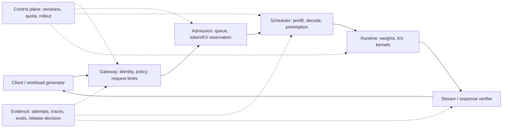

# 服务与可观测性

<!-- learning-contract -->

**学习导航**

- **适合读者**：LLM API、SRE、平台和质量运营工程师。
- **先修**：[推理基础](inference.md)、HTTP、队列和基本 SLO 概念。
- **首次阅读**：SLO → API 契约 → 路由/降级 → 背压 → 质量监控。
- **完成信号**：能写含失败分母、容量、取消和降级的服务 SLO。
- **卡住时**：先区分[推理指标](inference.md)中的 TTFT、TPOT 与端到端延迟。

## 先画清服务边界

LLM serving 不是“给 `generate()` 套一层 HTTP”。一个可运营系统至少有三条平面：

- **数据面（data plane）**：认证后的请求经过路由、排队、调度、prefill/decode、stream、后处理和返回；
- **控制面（control plane）**：管理 model/tokenizer/template/adapter、配额、路由、发布、回滚和租户策略；
- **证据面（evidence plane）**：保存 attempt、trace、指标、版本 identity、质量评测与变更决策，回答“实际运行了什么、为什么发布”。

模型运行时不应自行决定 authenticated tenant、权限、价格、发布 revision 或是否越过 hard limit。反过来，网关返回 200 也不能证明目标 checkpoint、正确 tokenizer 或目标 kernel 真被执行；需要把控制面 identity、数据面 request id 与服务端执行证据关联。

## 先定义 SLO

服务目标应按流量类型分层，例如聊天重视流式 TPOT，批量抽取重视吞吐，Agent 重视工具链总成功率。常见 SLI：

- 可用性、请求成功率、超时率；
- p50/p95/p99 TTFT、TPOT 和端到端延迟；
- 输入/输出 tokens、并发、队列长度、batch 大小；
- tokens/s/GPU、GPU 显存和利用率；
- 每成功任务成本，而非只看每 token 价格；
- 格式合法率、引用正确率、安全拦截与业务质量。

成功请求的 latency percentile 是条件统计，不能替代 availability。每轮同时记录 attempted、success、timeout、429、5xx、cancelled；无成功请求时 p95 不应伪报为 0。Offered QPS、attempted RPS 与 successful RPS 口径不同，容量报告必须标明分子、分母与时间窗口。

先固定“谁进入分母”。一种常见写法是：

\[
\text{success rate}=\frac{N_{\text{success}}}{N_{\text{eligible offered}}}
\]

`eligible` 必须在看结果前由合同定义，例如已认证、schema-valid、在租户配额内的请求。认证攻击、格式错误和超合同流量可分开运营，但不能为了让数字好看，在事后把慢请求、429 或模型拒答移出分母。业务成功、协议成功和安全拒绝又是不同终态：HTTP 成功不等于任务成功，安全策略正确拒绝也不应被粗暴改写为模型故障。

若目标成功率是 \(S\)，窗口内允许的失败份额是 \(1-S\)。Error budget 是变更速度与可靠性的治理工具，不是“可以故意失败”的配额；窗口、流量资格、维护期、低样本处理和多窗口告警都要预先固定。低流量服务用一个请求计算 p99 很不稳定，应同时展示样本量、原始终态计数和更长窗口，不能用 percentile 隐藏分母。

负载生成器的 concurrency semaphore 也是队列。只从取得槽位后开始 TTFT/E2E 计时，会隐藏 client queue；同时记录 workload `offered_at`、HTTP dispatch、首 token 与 terminal。Client queue 不等于服务端 queue，快速 429 的 terminal latency 很低也不等于体验达标，因此 queue/latency 必须与 success rate 联合门禁。

Closed-loop worker 通常在上一请求完成后才发下一条，服务变慢会自动降低 offered load；constant/Poisson open-loop 则按外生 schedule 继续到达，更适合找饱和 knee。open-loop 也必须报告 generator lag：把 scheduled timestamp 写成 `offered_at` 可让迟到进入 client queue，却不证明发生器实际按时执行。有限预生成任务、无限流量服务和生产 arrival distribution 是三种不同证据。

## 把 workload 写成版本化契约

容量不是模型名的常数。一次实验至少固定：

| 维度 | 为什么会改变结论 |
|---|---|
| arrival process 与 offered rate | 决定是否形成队列；closed-loop 会在变慢时自降载 |
| prompt/output 长度联合分布 | 长 prompt 压 prefill，长 output 长时间占用 sequence/KV |
| 并发会话与租户分布 | 决定公平性、noisy-neighbor 和 prefix/cache 可复用范围 |
| 模型、dtype、量化、adapter | 改变权重容量、kernel、切换与 batch 兼容性 |
| sampling、beam、tool/RAG | 改变 decode 分支、外部等待、结果质量与终态 |
| cache hit、prefix 长度 | 改变实际 prefill work，但不能用期望命中替代最坏容量 |
| deadline、取消与重试 | 改变在途工作、重复费用和失败分母 |
| 硬件、runtime、driver/kernel revision | 决定实际吞吐、显存和支持的执行路径 |

只给“并发 32”没有可比较性：32 条 32-token 分类与 32 条 32k prompt/长生成不是同一负载。输入、输出 cap 也只是上界；报告要同时保存实际分布和截断/拒绝数量。真实流量含敏感数据时，可保存受控样本或结构化 histogram/quantile artifact，但聚合结果仍需绑定生成它的 query、过滤和时间窗口。

## API 设计

采用稳定请求 id、幂等键、超时、取消、速率限制和明确错误码。流式连接中断应停止后端生成，避免“用户已走、GPU 仍算”。记录模型版本、tokenizer/chat template、采样参数、adapter、检索和工具版本。

先把终态做成类型而不是从文案猜测：`success`、`invalid`、`unauthorized`、`rate_limited`、`queue_timeout`、`execution_timeout`、`cancelled`、`server_error`、`outcome_unknown` 至少要能分开。Gateway timeout、engine deadline、client disconnect 和 provider timeout 发生在不同边界；返回 504 不证明底层 work 已停止，也不能立即释放仍被 thread/kernel 占用的 admission/KV capacity。

Request id 用于关联一次 attempt；logical call id 用于聚合可能的重试；idempotency key 用于某个明确 provider/业务契约下的去重。三个字段不能互相替代。纯文本生成即使没有业务副作用，replay 仍可能产生另一份 token/费用；带工具或写操作时，还要把“模型建议动作”与“执行外部 effect”分开，后者使用稳定 effect id、查询/reconciliation 和业务 verifier。

版本协商必须 fail closed。若客户端请求的 model/adapter/API feature 不存在，不应静默换成另一个模型再返回普通成功；允许降级时，把实际 revision、降级原因和能力差异放入机器可读 receipt/trace，并让质量与合规策略先授权这条路径。

“HTTP 200”还不足以证明服务调用了目标权重。最小集成证据应绑定 immutable model/checkpoint manifest，在加载前核对 bytes，另以服务 manifest 固定 prompt、token/usage/finish、runtime 和 API 子集；用独立进程走真实 socket，并从 server-side audit 证明 framework generation 被调用。仓库的 Qwen target-service control 按这条路径执行了 models、401/422/404、non-stream、SSE 与两次 `GenerationMixin.generate()`，Uvicorn 0.52.1 重录 report 为 `sha256:63e566ca…617ddb`。它不保存 raw request/response，也不把无密钥 fingerprint 当来源认证。

但“返回 SSE”不等于边生成边发送。该 reference backend 先完成整个 `generate()`，再依次发文本 delta、finish、usage 和 `[DONE]`；因此它只能验证 framing 与两种响应投影一致，不能证明 incremental decode、client disconnect 后取消、KV 释放或停止计费。真实上线还要把 client disconnect、engine request id、generation task 与资源释放 trace 关联。

仓库另有一条故意与目标模型隔离的 incremental control：authored async backend 在完整 case 中先逐 delta 交付、后完成；在取消 case 中，client 收到首个 content 时 server audit 仍为 active/backend-incomplete，显式关闭 response 后 ASGI task 与 cooperative iterator 均观察 `CancelledError`，后续 authored token 未产生。Uvicorn 0.52.1 重录报告 `sha256:25846822…2b5d00` 因而能证明这条单进程 loopback 协作取消路径，却不能证明 Transformers 阻塞线程、vLLM/CUDA kernel、KV/GPU 资源、远程 provider 或计费同时停止。生产验收仍需给目标 runtime 加 request-id 关联的 decode/allocator trace，并测 disconnect-to-work-stop 与 disconnect-to-resource-release 两个不同延迟。

再下一层 tiny Transformers control 在随机 1,272 参数 GPT-2 上真实启动 `GenerationMixin.generate()` thread：authored streamer 在首 token 后暂停，断连触发 backend event，authored `StoppingCriteria` 观察 event 后让 `generate()` 返回并 join。Uvicorn 0.52.1 重录报告 `sha256:eadcab54…f62bc7` 证明的是“**专门植入 cooperative check 的这条 CPU thread 路径**”，不是 Python 能强杀 thread，也不是未修改或已经卡在 kernel/driver 的调用必然退出。它没有目标 tokenizer/checkpoint/logits，也没有观测 KV/CPU/GPU memory release；生产实现应给 stop-check 最坏响应时间、thread/process recycle fallback 和 allocator trace 分别设门槛。

Stop string 是独立的增量文本协议：它可能跨 token/event/UTF-8 byte chunk，客户端必须暂存仍可能成为 stop 的最长 suffix，不能先展示后撤回。明确是否返回 stop、overlap/priority、大小写/Unicode normalization、usage 与 finish reason。客户端本地截断只改变展示，不证明服务端停止 decode、释放 KV 或停止计费；需要 cancellation/terminal trace 关联验证。

重试只用于瞬时失败，并使用指数退避与抖动。对非幂等工具调用（付款、发邮件、创建资源），不能盲目重试；需执行 id、去重和状态查询。

## 路由与降级

可按任务难度、语言、上下文长度、合规要求和负载选择模型。小模型处理分类/抽取，大模型处理开放推理。降级策略包括减少候选、缩短上下文、关闭非必要工具、切备用模型或转人工；不能悄悄降低安全检查。

路由先做 hard gate，再做优化：数据地域、许可证、模态、上下文、tool/schema 能力、租户隔离和安全策略不满足的候选直接不可行；只在可行集合内比较质量、延迟与成本。模型路由器本身也要版本化和评测，特别保留“低置信度转大模型/人工”“备用模型也不可用”和“两个候选输出语义不兼容”的失败路径。

## 部署拓扑与隔离边界

常见拓扑可分成 gateway/router、model-serving replicas 和外部 RAG/tool dependencies。每一层的并发限制只对自己的范围成立：

- 进程内 `Semaphore(8)` 不等于 4 worker 的服务总并发是 8；若每个 worker 独立，它可能是 32；
- replica-local queue 不等于租户全局配额，跨副本路由可能让同一主体重复占用 capacity；
- tensor/pipeline parallel 是一个模型实例跨设备执行，replica parallel 是多个实例承接不同请求，故障域与扩缩容单位不同；
- sticky routing 可提高 session/prefix cache locality，但可能制造热点，且不能用未认证 session key 跨租户复用缓存；
- adapter 动态装载会改变内存、batch compatibility 与冷启动，不能把“权重已在磁盘”当作 ready。

Readiness 必须检查该副本接流量所需的 model/tokenizer/template/adapter、设备、scheduler 和关键依赖；liveness 只回答进程是否应被重启。进程能返回 `/healthz` 不代表目标权重加载完，也不代表剩余 capacity 足以接长请求。滚动发布时，先从路由摘除、停止 admission、等待或有界取消 in-flight，再释放模型/KV；直接杀进程会把未决 attempt 留给调用方 reconciliation。

## Autoscaling 不是只看 GPU utilization

单看 GPU utilization 会遗漏排队、KV 容量、长 prompt 和外部依赖：GPU 可因 admission 太严而低利用，也可在 queue 已爆炸时长期满载。可组合观察 offered/dispatch rate、eligible queue age、admitted sequences、reserved/used KV blocks、prefill/decode token work、preemption、错误与目标 latency。

扩容有模型下载、完整性验证、权重加载、kernel/graph warmup 和 cache 冷启动延迟；scale-out 信号到新副本 ready 之间仍需 admission/load shedding。Scale-in 要保护 in-flight 和 leased cache，不以“HTTP 已断开”假设 GPU work 已停。容量计划至少给稳态、burst、单副本故障和发布期间少一部分 capacity 四个场景，而不是只报理想满配吞吐。

## 缓存

- 响应缓存：输入完全相同且结果允许复用。
- 语义缓存：相似问题复用，风险更高，需租户/权限/时效隔离。
- 前缀/KV 缓存：复用计算。
- 检索缓存：需结合索引版本和 ACL。

缓存键必须包含所有影响结果的版本与权限上下文；这些字段由认证/策略层从可信状态生成，不能接受模型或请求体自报。Prefix/KV cache 至少绑定 tenant、安全可见域、authorization/policy、model/tokenizer/template/adapter、position/RoPE、KV dtype 和 exact token prefix。Fingerprint 只做 bucket index，命中仍比较完整字段；否则 hash collision、过期 ACL 或同文本不同 tokenization 都可能错误复用。敏感数据设置 TTL、加密和删除机制，评估 hit/miss timing side channel。随机生成或个性化答案通常不适合直接响应缓存。

## 背压与过载保护

队列无限增长只会把失败变成超时。Admission 应在昂贵 tokenization/prefill 或远程副作用之前尽早执行，并同时约束至少三类资源：active sequence 数、预计 token/KV capacity、queue 的条数/总工作量。只限 request count 会让一个超长请求和一个短请求占同样配额；只限 token 又可能被大量微请求压垮连接、调度与日志。

可用一阶工作量估计帮助排队：

\[
\widehat W_i = \widehat P_i + O_i^{cap} - 1
\]

它只适用于普通 causal generation 的粗粒度 token-position reservation，不是 GPU 秒或账单；beam、speculative verification、prefix hit、preemption/recompute、padding 和外部工具都会改变实际工作。KV reservation 还要用层数、KV heads、head dim、dtype 与 block allocator 口径，不能直接拿 \(\widehat W_i\) 当显存。

请求状态至少经历 `offered → queued → admitted → running → terminal`。Capacity 只在确定的 terminal/resource-release 事件后归还；queue timeout 可在未 dispatch 时释放，execution timeout 若底层 work 仍运行则不能释放。取消发生在 queued、prefill、decode、外部 tool 等阶段时，分别验证 queue removal、scheduler removal、backend stop、KV release 和副作用 outcome，而不是统一记一句 cancelled。

Queue policy 是显式产品决定：FCFS 简单但会 head-of-line blocking；按长度分队可保护短请求，却可能让长请求饥饿；priority queue 需要 aging/配额，防止高优先级长期占满；per-tenant token bucket/deficit policy 可缓解 noisy neighbor，但权重、burst 与借用规则必须审计。不要用 Prompt 自报 `priority=critical`，优先级由认证与控制面策略派生。

超载时优先快速、可解释地拒绝或降级，而不是让所有请求跨过 deadline。长上下文/大 output cap 可进入独立 lane、要求更严格配额或转 batch；降级必须保留安全和数据地域 hard gate。若返回 retry hint，还要考虑调用方自动重试造成 retry storm；限流 receipt、backoff 和全局 load shedding 需要同一过载协议。

429 可以是正确的过载保护，但仍是调用方未成功完成的 attempt。是否满足 SLO 取决于流量是否在合同配额内；不能把 429 从 availability 分母删除，也不能把恶意/超配额流量无条件混入正常租户 SLO。

容量 knee 应用 open-loop sweep 找：逐档提高 eligible offered load，保持长度/租户/cache 分布，联合观察 success rate、client/server queue、TTFT/TPOT、preemption、KV 与 GPU。只找“吞吐最高点”不够；生产上限通常还受尾延迟、故障余量和质量约束。一次短 sweep 只能支持该硬件/runtime/workload snapshot，不能外推为长期 SLA。

## 追踪

一次请求的 trace 应串联：网关 → Prompt 构造 → 检索 → 重排 → 模型 → 工具 → 验证 → 响应。保存必要元数据和哈希，敏感原文按最小化原则处理。指标用于趋势，trace 用于单次诊断，日志用于事件细节，三者不能互相替代。

同一进程内的 duration 用 monotonic clock；跨机器 wall-clock timestamp 只有在同步误差可接受且被记录时才能相减。不能把 client `perf_counter()` 与 server monotonic 数值直接相减。分布式 trace 更稳妥的做法是各 component 记录本地 span duration，用 trace/request id 建因果关系，再把端到端 client duration与各本地 span 对照；无法解释的空白标为 unknown/transport/queue，不用负数或强行归因填满。

高基数字段也要分层：request id 属于 trace/log，不宜作为长期 metrics label；model/adapter revision 可进入受控低基数维度，raw Prompt、tenant secret、完整 URL/query、tool 参数和异常 body 不进入普通 metrics。Sampling trace 对调试有用，但 logits/token 明细可能泄漏用户内容且体量巨大，需要采样、权限和保留期。

一次服务 receipt 至少能关联 logical call/attempt、authenticated subject/tenant、实际 model/runtime revision、request cap、terminal outcome、usage 是否来自 provider/runtime 还是 estimate，以及发生降级/缓存/重试的证据。Receipt 自洽不等于来源认证；重要发布或计费场景还需受控日志、签名/访问控制与外部账单对账。

## 质量监控

线上缺少即时标签，可用代理指标和抽样人工审查，但要防止代理被优化歪。持续回放版本化评测集，监控输入分布漂移、语言/长度变化、拒答率、用户纠错与升级人工率。模型或 Prompt 更新采用 shadow/canary，保留快速回滚。

Shadow 只复制输入、不把结果给用户，适合比较兼容性与离线质量；它仍会消耗容量并扩大敏感数据处理范围。Canary 承接真实结果，必须先定义流量资格、样本量/观察窗口、质量/安全/可靠性 gate、停止条件和回滚 owner。请求不能随机跨越不兼容的数据地域、工具权限或 adapter schema；这些是 hard gate，不是实验变量。

模型质量与服务质量要联合决策。更快版本若让 schema failure、引用错误或人工升级增加，不能只凭 TTFT 发布；质量更高但让 queue timeout 扩大，也未必提高成功任务率。保存每个版本的 run manifest、workload、attempt artifact、离线/在线比较和最终 decision，避免 dashboard 当前值成为唯一历史证据。

## 发布、回滚与配置迁移

发布单元不只有 weight：至少包括 model/tokenizer/chat template、adapter、runtime/kernel、sampling defaults、API/schema、Prompt、RAG index、tool contract、policy 与 routing config。每个组件都要有 immutable identity 与兼容性检查；只回滚权重可能仍保留导致事故的新模板或策略。

推荐控制顺序：

1. 在不可变 artifact 上验证完整性、loader/shape/tokenizer/template 和最小生成；
2. 在隔离环境跑版本化质量、安全、协议与目标 workload；
3. 预热副本但不接用户流量，验证 readiness、显存/KV baseline 与关键 trace；
4. shadow 或小比例 canary，按预定义 gate 观察；
5. 扩大流量时保留上一版本 capacity 与一键路由回滚；
6. 回滚演练同时覆盖 in-flight drain、cache/index/schema compatibility 和未决 effect/reconciliation。

数据库/trace schema 迁移要能前后兼容，至少在 rollout 窗口允许新旧副本共存；否则 model rollback 可能被不可逆 schema 变化阻断。Cache key/serialized state 应带 schema/revision，不能让旧值被新版本误读。回滚成功是用户请求恢复、错误/质量回到门槛并完成未决对账，不是控制台显示旧版本已部署。

## 成本

总成本包含模型推理、Embedding/重排、检索存储、工具、网络、可观测、人工审核和失败重试。优化“每成功任务成本”：更便宜但错误率高的模型可能因重试和人工处理更贵。

成本控制同样使用 reserve/reconcile，而不是等账单后才发现越界。自托管服务可预留 sequence/KV/token capacity并在 terminal 后结算实际 work；云 API 还需每个可能计费的 attempt 独立费用 reservation。Estimate、runtime usage 和 provider invoice 是三种证据：本地 token 数不自动等于计费 token，HTTP 500/取消也不能仅凭 client trace断言为零费用。

## 事件响应

预先定义安全泄露、错误工具操作、模型不可用和质量大幅回归的负责人、分级、止损、证据保留、通知和复盘。回滚不仅是模型权重，也包括 Prompt、索引、工具 schema 和策略配置。

Runbook 不应只有“重启服务”。按现象至少准备：

- **TTFT/queue 升高**：先冻结发布，核对 offered load/长度/cache 分布，再看 admission、prefill、KV/preemption 与副本健康；
- **TPOT 变慢**：核对 batch、decode kernel、频率/功耗、通信和邻居 workload，不把 client 网络等待误归因给 GPU；
- **OOM/allocator failure**：停止接收超长请求，保留 request/KV/block trace，区分权重、KV、workspace、碎片与泄漏；
- **错误率/取消升高**：按 typed terminal 拆 gateway、queue、engine、stream、tool/provider，确认 timeout 后底层 work 是否仍在；
- **质量/安全回归**：停止 canary/路由到已验证版本，保存输入资格、raw restricted evidence、模型/Prompt/index/policy identity；
- **跨租户或秘密泄漏**：立即隔离缓存/日志/索引与 credential，保全访问审计并执行数据/密钥/工件撤销流程。

复盘把 trigger、影响分母、检测延迟、止损、恢复、未决 reconciliation 和防复发证据分开。没有可靠 request/revision identity 时，应明确写“无法确定受影响范围”，而不是用当前配置猜历史请求。

## 如何做一次可辩护的容量实验

1. 冻结 model/runtime/hardware 与 workload manifest，先跑单请求 correctness/usage baseline。
2. 用低负载验证负载生成器、时钟、SSE parser、终态分类和 server trace 能互相对账。
3. 选择 burst 与 constant/Poisson open-loop，多档扫 eligible offered rate；每档预热、运行和冷却窗口一致。
4. 保存全部 attempt，不因 timeout/429/5xx 删除；成功 latency 与 all-attempt outcome 联合计算。
5. 同步采集 server queue、prefill/decode tokens、batch、KV/preemption、GPU/CPU/网络和外部依赖。
6. 以质量、安全、success rate、尾延迟、资源和成本的联合 gate 选择 operating point，并给单副本故障/发布余量。
7. 换长度、租户、cache、adapter 或硬件后重新测；不要把一个点拟合成通用容量公式。

## 本仓库证据矩阵

| Control | 实际证明 | 不能据此声称 |
|---|---|---|
| strict attempt/SLO fixture | offered/dispatch、成功条件延迟、失败分母与 gate 算术 | 真实 event loop、server queue、GPU 容量 |
| continuous-batching CPU oracle | 固定 FCFS/decode-first policy 的 admission、chunk、work conservation | 某版 vLLM scheduler、秒级延迟或 GPU utilization |
| KV preemption metadata oracle | block capacity、抢占、重建 work 与不重复交付 token | 真实 K/V 数值、GPU page table、victim policy 性能 |
| 固定 Qwen HTTP control | 目标 snapshot→Transformers CPU FP32→loopback API 的固定执行路径 | vLLM/CUDA、incremental stream、吞吐、容量或质量 |
| authored incremental SSE control | 单进程 async iterator 的首 delta 前未完成与断连协作取消 | blocking thread/kernel、KV/GPU release、远端计费 |
| tiny Transformers thread control | 显式 event/`StoppingCriteria` 让受控 CPU `generate()` 返回并 join | Python 强杀 thread、未修改 runtime 或不可中断 kernel 会退出 |

这些 controls 是因果链中的局部证据，不能彼此拼接成“已完成生产服务”：Qwen control 没有 incremental decode，incremental control 没有模型，thread control 没有目标 checkpoint，统计 fixture 没有真实 GPU。生产结论必须在同一目标 runtime/workload 上取得关联证据。

## 自测

1. 为什么 p50 延迟优秀仍可能意味着体验很差？
2. 语义缓存为什么必须带权限与时效边界？
3. 如何防止客户端断流后继续浪费 GPU？
4. 为什么 replica-local semaphore 不能证明服务级并发上限？
5. 如何证明 504 后 capacity 何时可以安全释放？
6. Shadow、canary 与 rollback 分别需要哪些 identity 和 gate？
