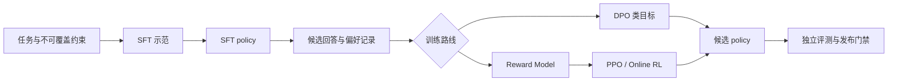

# 对齐与偏好优化入门

<!-- learning-contract -->

**学习导航**

- **适合读者**：第一次区分 SFT、奖励模型、DPO 与 PPO 的工程师。
- **先修**：[微调总览](finetuning.md)、条件概率、训练/验证切分。
- **首次阅读**：对齐对象 → 四种方法 → 数据流 → 偏好审计。
- **完成信号**：能为每种方法写出训练数据、优化对象和主要失败模式。
- **卡住时**：回到[SFT 数据闭环](sft-data-pipeline.md)，先建立可靠监督基线。

一句话心智模型：对齐不是一个单独算法，而是把目标人群、不可覆盖约束、反馈协议、训练目标和系统控制组合成可评测行为。

## 先区分四种方法

| 方法 | 主要数据 | 优化对象 | 首先警惕什么 |
|---|---|---|---|
| SFT | prompt + 示范回答 | 示范 token likelihood | 模板、mask、示范错误 |
| Reward Model | prompt + 成对偏好 | preferred 分数高于 rejected | 长度、风格和标注偏差 |
| DPO | prompt + chosen/rejected + reference | reference-relative 分类目标 | 数据泄漏、reference 与 beta |
| PPO/RL | policy rollout + reward/value | 受约束的策略收益 | reward hacking、KL、预算与方差 |

偏好训练通常建立在可用 SFT policy 上。基础指令跟随尚未稳定时，直接增加 DPO/PPO 不会自动补齐格式、知识和工具边界。

## 数据流比算法名字更重要

每条边都要绑定数据 revision、生成模型、rubric、标注者群体和切分。最终 winner 标签不能替代原始 judgment、展示顺序、tie 和 disagreement。

## 最小离线审计

~~~powershell
python -m about_llm.preference_cli audit --jsonl projects/single-gpu-finetuning/preference.example.jsonl --require-splits train,validation,test --output artifacts/preference-audit.json
~~~

最低通过条件：

1. 确认 train、validation、test 都存在且 group/pair 不跨 split。
2. 找到 label、strength、展示位置和 generator revision 分布。
3. 说明 exact audit 为什么不能证明语义无重复、rubric 有效或标注无偏。
4. 保留 tie/invalid，不为了适配 trainer 偷改为 winner。

## 怎样选择下一步

- 目标是格式、流程或领域示范：先做高质量 SFT 和独立回归集。
- 已有稳定 policy，且能收集可靠 pairwise preference：再考虑 DPO 或 RM。
- 任务需要在线探索，且 reward、KL、预算和安全控制可审计：才进入 PPO/Online RL。
- 需要外部事实、权限或实时数据：优先考虑 RAG、工具和系统约束，不把一切问题交给训练。

## 常见误判

- “人类偏好”不是无噪声、跨人群通用的单一标量。
- Reward Model 训练准确率高不代表没有学习长度或风格捷径。
- DPO 不等于不需要 reference、数据治理和独立评测。
- PPO reward 上升不等于真实任务、安全或用户价值上升。

## 进入完整章节

准备实现或评审算法时，再读[对齐、奖励模型与偏好优化完整章节](alignment.md)。需要从 policy gradient 推导到 PPO、GRPO 与 RLVR 时，进入[LLM 强化学习](reinforcement-learning.md)。
