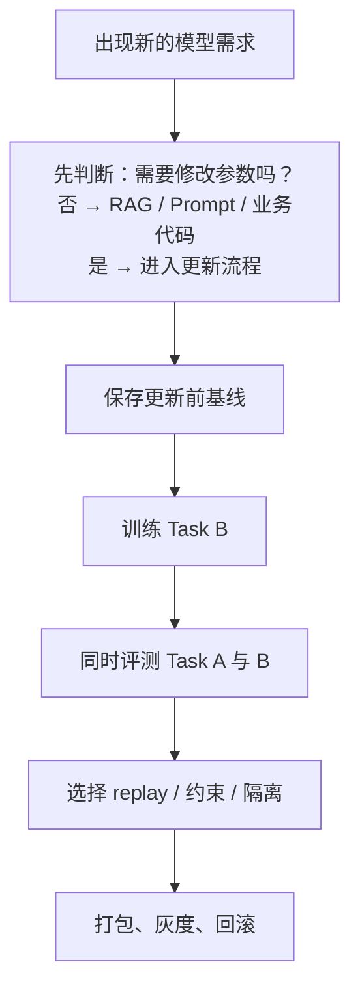

# 持续学习：从 Task B 到可回滚更新

<!-- learning-contract -->

**学习导航**

- **适合读者**：需要让模型持续学习新任务，同时保护旧能力的训练与发布负责人。
- **先修**：训练评测、数据切分、checkpoint 和分布偏移基础。
- **首次阅读**：跟随一次 Task B 更新，判断是否改权重、怎样发现 Task A 退化、如何保护与发布。
- **完成信号**：能为一次更新同时报告新任务收益、旧任务保持、额外成本、工件身份和回滚条件。
- **卡住时**：回到[训练数据工程](data.md)和[评测](../quality/evaluation.md)。

先看本章贯穿始终的两任务实验。一个小模型先把 Task A 学到 100% accuracy，再学习规则相反的 Task B。
直接训练 B 后，A 的正确率只剩约 2.7%；把全部旧样本和新样本一起训练时，两项任务都保持 100%。

这组数字只用来展示一次可观察的遗忘事故。它不会证明 replay 在真实模型上总有效。

真实系统会持续接收新事实和新政策，也会面对工具与用户分布的变化。并非每次变化都需要重新训练模型。

先决定由哪个组件承载变化：时效知识通常进入外部知识库，交互约束可以写入 Prompt，确定性规则适合放在业务代码中。
只有模型自身的能力或长期行为确实需要改变时，才更新参数并设计防遗忘机制。

把可删除的时效事实写入参数，或用 RAG 修复基础推理能力，都会让系统更难维护。

本章只沿下面的参数更新链路展开。局部编辑、工件合并与删除请求在后文链接到各自专题。

## 先判断这件事该不该改权重

| 变化 | 首选候选 | 为什么 |
| --- | --- | --- |
| 频繁变化、需来源的事实 | RAG/数据库/API | 可更新、可删除、可引用 |
| Prompt、格式或工作流 | Prompt、schema、确定性业务代码 | 便于回滚和验证 |
| 新领域语言分布 | 领域继续预训练（DAPT） | 学习术语、风格和分布 |
| 新任务行为 | SFT 或 adapter | 监督清晰、部署可隔离 |
| 偏好或安全边界 | 偏好训练 + 系统策略 | 同时需要行为与外部约束 |
| 单点参数事实实验 | 模型编辑（model editing） | 快速，但要检查是否误伤邻近知识 |
| 大范围能力/数据变化 | 联合重训 | 成本高但控制最完整 |

这些不是互斥选项。例如先用 RAG 提供最新法规，再用 SFT 教模型怎样引用和拒答；事实仍由外部系统提供。

## 只看新任务，会把遗忘藏起来

假设模型依次学习 \(T\) 个任务或时间段。采用从 0 开始的索引，\(R_{i,j}\) 表示完成任务 \(i\) 的训练后，
模型在任务 \(j\) 上的正确率（accuracy）；\(b_j\) 是任何顺序训练前的同一模型基线。

要计算 forward transfer，每个阶段还要评测尚未训练的未来任务，而不只是“所有已学任务”。

不能只比较更新前后目标域。至少报告：

- **plasticity**：新任务/新域学到了多少；
- **retention**：旧任务保留多少；
- **forward transfer**：旧知识是否帮助新任务；
- **backward transfer**：学习新任务后旧任务变好或变差；
- **safety retention**：拒答、权限和高风险行为是否回归；
- **calibration/efficiency**：置信度、长度、延迟和成本是否变化。

### 把 ACC、BWT、FWT 和 forgetting 写成公式

以下口径只适用于“accuracy 越高越好”；loss 等越低越好的指标必须重新处理方向。最终平均准确率为：

\[
\mathrm{ACC}=\frac{1}{T}\sum_{j=0}^{T-1}R_{T-1,j}.
\]

Backward transfer（BWT）比较旧任务最终表现与刚学完该任务时的对角线表现：

\[
\mathrm{BWT}=\frac{1}{T-1}\sum_{j=0}^{T-2}
\left(R_{T-1,j}-R_{j,j}\right).
\]

本仓库把 forgetting 定义为包含最终阶段的非负 peak-to-final drop：

\[
F_j=\max_{j\le i\le T-1}R_{i,j}-R_{T-1,j},
\qquad
\overline F=\frac{1}{T-1}\sum_{j=0}^{T-2}F_j.
\]

因此最终表现超过历史值时 \(F_j=0\)，最后一个任务按定义也是 0；这种口径不会把正向 backward transfer 写成“负遗忘”。有些论文从最大值中排除最终阶段，因而允许负值；复现实验必须说明是否包含当前阶段，不能只写 `forgetting`。

Forward transfer（FWT）比较学习任务 \(j\) 之前的表现与独立的 pretraining baseline：

\[
\mathrm{FWT}=\frac{1}{T-1}\sum_{j=1}^{T-1}
\left(R_{j-1,j}-b_j\right).
\]

对角线 \(R_{j,j}\) 只是“刚学完任务后的 accuracy”，不能单独证明 plasticity；学习增益还需要训练前或只训练到 \(j-1\) 的同任务对照。平均值会掩盖关键任务，应同时报告完整矩阵、逐任务 forgetting、seed 分布与置信区间。

## 旧能力是怎样被覆盖的

新数据梯度更新共享参数，可能覆盖旧任务依赖的表示；优化器状态、学习率、数据顺序与 normalization 也会影响更新路径。遗忘不只表现为准确率下降：

- 输出格式或语言风格变化；
- 校准恶化；
- 安全拒答边界漂移；
- 少数语言先退化；
- 原有工具 schema 不再稳定；
- 事实表面保留但推论关系失效。

新任务提高、旧任务下降，反映的是两者之间的权衡，不能只根据训练 loss 下降判断更新成功。

## Replay：训练新任务时别完全丢掉旧分布

训练新数据时混入旧分布样本，是最直接的 retention 方法。

### Buffer 设计

- 均匀 reservoir sampling：让历史记录拥有相同的入选概率；
- 分层采样：分别保证任务、语言或风险切片的覆盖；
- 困难样本采样：优先保留决策边界附近和曾经答错的样本；
- 合成 replay：保存摘要、特征或模型生成的旧任务样本；
- 最低配额：确保安全与接口契约样本不会被普通流量挤掉。

Replay 比例越高，通常越有利于保留旧任务，但也会占用新任务的训练预算。
实际选择应比较“新任务质量—旧任务保持率”的 Pareto 曲线，而不是固定一个经验比例。

容量为 \(m\) 的 uniform reservoir 可以单遍处理未知长度的 stream。先放入前 \(m\) 项；看到从 0 开始编号的
第 \(t\) 项时，从 \([0,t]\) 均匀抽一个整数 \(r\)，仅当 \(r<m\) 时替换槽位 \(r\)。

归纳可得，处理 \(N\) 项后，每项进入最终 reservoir 的边际概率都是 \(m/N\)。这只保证对 stream 中的记录均匀，
不保证类别、语言、用户、风险或时间覆盖均衡，也不会自动处理重复记录。

### 合规边界

Replay buffer 会复制旧数据，也会延长这些副本的保留周期。删除请求要追踪到训练缓冲区、缓存、数据分片和派生数据记录。

使用模型合成旧样本可以减少原文存储，但会带来新的偏差：长尾样本可能消失，教师模型可能复述敏感记忆，
旧模型的错误也可能被反复训练。

### 可运行的两任务控制实验

运行：

~~~powershell
python projects/single-gpu-finetuning/continual_replay_toy.py
~~~

脚本使用 PyTorch，在 CPU 上完成两阶段 SGD 训练。它会输出正确率矩阵 \(R\)，并据此计算三类指标：

- 最终平均正确率（ACC）；
- 旧任务变化量（BWT）；
- 学习前对新任务的影响（FWT）。

Task A 和 B 的标签规则相反，但输入中带有明确的任务编号。因此，同一个 2→16→2 MLP 有能力同时解出两项任务。
这个设计把模型容量不足与训练造成的遗忘区分开来。

固定随机种子后，结果是：

| B 阶段训练方式 | A 最终正确率 | B 最终正确率 | A 的遗忘量 |
|---|---:|---:|---:|
| 只训练 B | 约 0.027 | 1.000 | 约 0.973 |
| 旧样本与新样本 1:1 全量 replay | 1.000 | 1.000 | 0.000 |

两条路径的 FWT 都约为 -0.418，因为 FWT 使用的是训练 B 之前的状态。B 阶段后来是否 replay，无法追溯改变它。
这个负值只表示：学完 A、尚未学习 B 时，模型在 B 上低于随机初始化基线；它不是 replay 造成负迁移的证据。

这个实验的范围很窄：

- task-incremental，输入明确告诉模型当前任务；
- 单个随机种子、full-batch、全量旧数据；
- CPU 上的合成二分类任务。

它没有覆盖有限缓冲区、未知任务路由、真实 LLM、安全回归、隐私删除或计算成本。
因此结论是“这套设置下全量 replay 消除了观察到的遗忘”，而不是“replay 总能消除遗忘”。

### 有限 Reservoir 与 20-seed 配对比较

运行 20-seed 对照：

~~~powershell
python projects/single-gpu-finetuning/continual_replay_toy.py --benchmark
~~~

这组对照使用随机种子 0–19。每个 seed 训练出的 Task A checkpoint 都复制成三份，再分别执行：

| 路径 | 每步新样本 | 每步旧样本 | B 阶段总步数 |
|---|---:|---:|---:|
| 不 replay | 256 | 0 | 100 |
| 容量 64 的均匀 reservoir | 256 | 64 | 100 |
| 全量 replay | 256 | 256 | 100 |

三条路径共享同一个起点，因此差值以 seed 为配对单位。它们匹配了优化器步数，却没有匹配样本数或计算量。
三条路径都看到 25,600 个新样本；看到的旧样本分别是 0、6,400 和 25,600 个。

下表汇总 20 个 seed。最后一列的 95% 区间来自 5,000 次百分位 bootstrap，
每次都以 seed 为单位重采样配对差值：

| 策略 | 旧任务最终正确率（均值） | 新任务最终正确率（均值） | 最终 ACC（均值） | 相对不 replay 的旧任务增益（95% CI） |
| --- | ---: | ---: | ---: | ---: |
| 不 replay | 0.1135 | 0.9994 | 0.5564 | — |
| 容量 64 的 reservoir | 0.5893 | 0.9922 | 0.7907 | +0.4758 [0.3389, 0.6104] |
| 全量 replay | 0.9824 | 0.9854 | 0.9839 | +0.8689 [0.8340, 0.9025] |

有限 reservoir 让新任务正确率平均下降 0.0072，95% 区间为 [-0.0102, -0.0045]。
全量 replay 的平均差值为 -0.0141，区间为 [-0.0223, -0.0074]。

在这套任务、数据与优化配置中，保留旧任务伴随轻微的新任务损失。换任务或改变计算匹配方式后，权衡可能不同。

任务数据在 seed 间完全相同，变化只来自初始化与 reservoir 选择。因此这个区间**不覆盖**新任务、数据采样、
超参数、硬件或真实部署不确定性。20 个连续 seed 也不是任意目标总体的概率样本。

每个 run 内部的 `confidence_intervals_computed=false` 表示单个 \(R\) 矩阵没有统计区间。
跨 seed 的配对区间保存在顶层 `paired_vs_no_replay`。报告还逐 seed 保存 reservoir 实际选择的索引和完整矩阵。

实验没有测量墙钟时间、能源或隐私与删除成本，所以不能据此宣称三条路径拥有相同成本。

因此，不能据此断言 64 是最佳容量，也不能忽略额外样本呈现量后宣称“同成本获益”。

## 正则化与蒸馏

Replay 通过再次展示旧样本来保护旧行为。旧数据难以大量保存时，还有两类约束可选：

- 参数正则保护模型的参数坐标；
- 锚点蒸馏保护模型在选定输入上的输出分布。

两者保护的对象不同，后面的两节分别展开。

### 参数距离

简单 L2 约束：

\[
\mathcal L
=
\mathcal L_{new}
+\lambda\|\theta-\theta_{old}\|_2^2.
\]

普通 L2 距离把所有参数偏移视为同样重要。EWC 类方法改用重要性 \(F_i\) 加权：

\[
\mathcal L
=
\mathcal L_{new}
+\frac{\lambda}{2}
\sum_iF_i(\theta_i-\theta_{old,i})^2.
\]

重要性估计依赖所选数据和近似方式。在大型模型上，保存与计算这些权重也有成本。
此外，参数坐标很近不保证函数行为很近，参数坐标变远也不一定意味着能力丢失。

### Logit distillation

在少量 replay 样本或固定锚点 Prompt 上，约束新旧模型的输出分布：

\[
\mathcal L_{distill}
=
D_{KL}(p_{old}(\cdot\mid x)\|p_{new}(\cdot\mid x)).
\]

蒸馏会保留旧模型行为，也可能把旧错误与偏见一起保留下来。
比较时要统一 tokenizer、temperature、mask，以及保存全部 logits 还是只保存 top-k。
只约束最终答案，无法保护中间 token 的条件分布。

## 用 adapter 隔离更新

另一种选择是冻结底座，只训练 LoRA、adapter 或 prefix。这样底座权重保持不变，还可以按领域切换增量参数。
不过，最终系统行为仍可能变化：

- adapter 可能压过底座原有行为；
- 多个 adapter 组合时可能互相干扰；
- base model 升级后，旧 adapter 可能不兼容；
- tokenizer、chat template 和 target module 必须匹配；
- 底座冻结后，路由与 Prompt 仍会改变旧任务结果。

高隔离场景可以按租户或领域选择 adapter，此时路由错误会成为新的系统风险。

## 新需求是语言分布变化时，再考虑继续预训练 {#7-dapttapt}

如果 Task B 的主要变化是新领域术语和文本分布，而不是明确的问答行为，继续预训练可能比 SFT 更合适：

- **DAPT**：在领域语料继续预训练，适应术语、风格和统计分布；
- **TAPT**：在更接近目标任务的未标注语料继续训练；
- **continued pretraining**：泛指从 checkpoint 延续自监督目标。

### 主要变量

- 新旧数据的混合比例与 replay 策略；
- 去重后的 token 数、实际训练看到的 token 数和重复轮数；
- 学习率、warmup 和训练步数；
- tokenizer 是否覆盖新语言/符号；
- 优化器状态是恢复还是重置；
- checkpoint 是否保存原训练数据游标；
- 通用与领域验证集的 loss，以及下游任务回归。

更换 tokenizer 会同时改变 embedding、输出矩阵和 token ID 契约，已经不是普通的数据更新。
扩充词表还要定义新 token 怎样初始化、哪些参数参与训练，以及旧文本能否得到兼容编码。

### 何时停止

领域 loss 继续下降时，通用能力可能已经恶化。训练过程中定期保存 checkpoint，
同时观察领域任务、通用任务、安全行为、语言切片和校准。
停止点来自这些目标的权衡，而不是默认选择最后一步。

## 持续 SFT 与偏好更新

新的 SFT 数据可能让回答风格变得单一、过度模板化，也可能改变拒答边界。
偏好更新还会受评价规则版本、标注者群体和评审模型漂移影响。

维护：

- 固定锚点 Prompt 与历史偏好对；
- 保存评价规则及其版本来源；
- 对新旧策略做盲化、配对评测；
- 同时观察回答长度、KL、概率比和正常问题误拒答；
- 使用当前策略生成新候选，而不是只评旧模型留下的答案。

政策发生实质变化时，应明确版本边界，不能把前后冲突标签混成“更多数据”而不记录时间。

## 模型合并、编辑与删除请求去哪里

持续学习页只跟踪一条连续主线：新任务到来后，怎样学习、保留旧能力并把 Task B 交付为可回滚的更新。
局部事实编辑、权重/Adapter 合并和重载兼容性见[模型合并与编辑](model-merging-editing.md)；
训练数据影响的删除威胁模型、近似方法与评价见[机器遗忘](machine-unlearning.md)。

## 每次更新都要能回答从哪里来

Task B 更新不是一份孤立的 `model.safetensors`。每个模型工件至少记录：

- 不可变的父模型 revision；
- 数据 manifest、过滤与删除状态、时间范围；
- tokenizer 与对话模板；
- 代码、依赖、精度和硬件；
- 优化器、学习率调度器与随机状态；
- adapter 或合并配方；
- 评测报告与发布审批；
- 兼容的 RAG 索引、Prompt、工具 schema 和策略版本。

回滚权重时也要恢复兼容的 tokenizer、adapter、Prompt、索引和工具契约。
只回滚模型权重，可能制造新的接口错误。

### 把 Task B 接到单卡 Adapter 闭环 {#single-gpu-task-b}

已有 Task A 的单卡 Adapter 后，Task B 应视为一次新的更新，不是把旧输出目录接着跑。先固定 Task A 留出集的版本、
安全/工具 anchor 与旧工件身份；这些 anchor 只用于比较，不能混入 Task B 的训练数据。随后为 Task B 重新发布
train-only readiness，固定 tokenizer/template 和父 base revision，完成小步训练并在新进程分别重载旧、新 Adapter。

发布判断至少同时比较基座模型、旧 Adapter 与新 Adapter 在同一批 Task A 锚点和 Task B 留出集上的表现，报告新任务
收益、逐项 retention、资源增量和失败分母。未过 gate 时，回滚兼容的 Adapter、Prompt、索引和工具契约。

`--resume-from-checkpoint` 只用于同一次被中断的运行（同一配置与工件身份）恢复 optimizer、数据游标和随机状态；它不能替代这次新更新前后的
评测。[Single-GPU Finetuning](../practice/projects/single-gpu-finetuning.md#task-b-update)给出这张发布卡片，
`continual_replay_toy.py` 则仍只用于观察合成任务中的 replay 机制。

## 部署中的持续更新

部署一次更新可以依次经过：

1. **离线重放**：用固定输入比较新旧工件；
2. **影子流量**：新模型只记录差异，不影响用户结果；
3. **小流量 canary**：限制用户范围并设置严格门禁；
4. **逐步放量**：按租户或区域扩大；
5. **上线后监控**：持续观察质量、拒答、工具失败、延迟和成本；
6. **回滚与对账**：恢复模型组件，并处理已经产生的外部状态。

模型、embedding 和 RAG 索引可能在不同时间更新。上线前要核对 schema、向量维度、tokenizer 和引用契约，
并设计混合版本短暂共存时的行为。

## 更新决策表

| 问题 | 若答案为“是” | 倾向方案 |
| --- | --- | --- |
| 事实需要来源、频繁更新或删除？ | 外部化更重要 | RAG/API |
| 需要学习新语言统计与术语？ | 参数适配有价值 | DAPT + replay |
| 只是输出格式/流程？ | 不必动全部权重 | Prompt/SFT/adapter |
| 多租户能力需隔离？ | 避免互相污染 | per-tenant adapter/routing |
| 只有一个事实需实验性修改？ | 局部但风险高 | editing + locality suite |
| 数据/能力范围整体变化？ | 局部方法可能不足 | joint retraining |

## 发布门禁

### 学习与保留

- 新域/任务达到预定 gate；
- 旧任务逐项报告 forgetting，不只平均值；
- 安全、语言、工具和 calibration anchor 无回归；
- 对 replay ratio/regularization 做 Pareto 分析。

### 发布工件 {#artifact}

- 父模型、数据、tokenizer、代码与合并来源完整；
- adapter/base/quantization 兼容性检查；
- checkpoint 恢复后数据 sampler 与 mixture 一致；
- 回滚包包含 Prompt、索引与工具 schema。

## 当前仓库证据边界

仓库真实运行了两任务的无 replay、有限 replay 和全量 replay 对照，并计算多个 seed 的配对区间；
单卡项目提供 Task B Adapter 的训练、独立重载与发布卡片。这些证据没有覆盖目标 LLM、真实时间序列、
多任务采样或生产安全集，只能说明固定小实验和工件契约中的行为。

## 常见误判

- 目标域提高不代表更新成功；旧任务、安全、工具和校准锚点仍要逐项报告。
- 冻结 base 不代表系统不会遗忘；Adapter、routing、Prompt 和模板都会改变行为。
- `--resume-from-checkpoint` 用于恢复同一次中断运行，不能替代一次新更新前后的比较。
- 只回滚权重不够；tokenizer、Adapter、Prompt、索引和工具契约必须保持兼容。

## 自测与实践

1. 为三个顺序任务构造 (R_{i,j}) 矩阵，计算 ACC、BWT、FWT 和逐任务 forgetting。
2. 比较 replay、参数正则化和 logit distillation 各自保护什么，也可能保留什么错误。
3. 为 Task B 写出 train-only readiness、Task A 锚点、新任务留出集与回滚包。
4. 设计一次影子流量到 canary 的持续更新流程，并写出停止条件。
