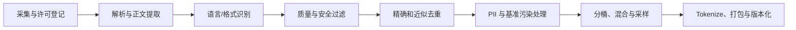

# 数据工程

## 数据决定模型看到的世界

训练数据不只是规模问题。来源、许可、语言比例、时间范围、质量标准和重复度共同塑造能力、偏见、记忆与风险。数据流水线必须可追溯：每条数据能回答“从哪里来、允许怎样用、经过哪些变换、进入了哪个模型版本”。

## 典型流水线

### 采集与许可

来源可包括公开网页、书籍、论文、代码、论坛、百科、授权语料、企业内部文档、人工标注和合成数据。“能访问”不等于“可训练”；需要记录版权、服务条款、隐私、地域法规、退出/删除机制和下游分发限制。

### 解析与规范化

网页要去导航、广告、脚本和重复模板；PDF 要处理阅读顺序、页眉页脚、表格和 OCR；代码要保留文件边界与许可证。Unicode 规范化、空白合并和大小写变换可能破坏代码、数学或特定语言，不能全局盲用。

### 质量过滤

启发式信号包括字符/单词长度、符号比例、重复行、语言置信度、困惑度、可读性和黑名单。分类器可估计教育价值、垃圾内容或毒性。过滤器会引入偏见：以标准英语或百科风格为“高质量”可能排斥方言、口语和少数语言。

### 去重

- 精确去重：哈希规范化后的文档或段落。
- 近似去重：MinHash + LSH、SimHash、n-gram Jaccard 或 Embedding。
- 模板去重：识别网站 boilerplate 或代码复制。

去重的单位和阈值很关键。过弱会造成记忆、评测污染和训练权重失真；过强会删除合法引用、常用代码和语言模式。应报告文档级与 token 级移除比例。

### 隐私与敏感内容

检测姓名、地址、电话、证件、医疗和财务数据等 PII，结合规则、NER、校验位和人工复核。检测器会漏报和误报；高风险来源应在采集层排除，而不是只依赖事后正则。保留数据删除请求与重训/模型处置流程。

### 污染检测

将评测题及其变体与训练语料做精确和模糊匹配，保留时间戳和来源。污染不只包括题干原文，也包括答案、解析、翻译和派生版本。对闭源预训练数据，基准高分更难解释。

## 数据混合

不同域按权重采样，而非简单拼接。目标是平衡自然分布、稀有能力和安全需求。高质量代码/数学数据常被上采样；过度上采样会过拟合或损害通用语言。温度采样可缓和高资源语言主导：

\[
p_i \propto n_i^\alpha,\quad 0<\alpha<1
\]

\(n_i\) 是域规模。权重应通过消融和下游评测选择，并记录每个训练阶段真实消耗的 token。

## 序列打包

短文档可拼入一个固定长度序列以减少 padding。必须决定文档间是否允许注意力、是否插入 EOS、位置 id 是否重置。跨文档注意力可能引入无意义关联；隔离注意力则需要额外 mask 支持。

## 合成数据

用途包括指令生成、推理轨迹、难例扩充、翻译、纠错和蒸馏。质量控制可用多模型生成、规则验证、执行测试、拒绝采样、人工抽检和多样性约束。反复用模型生成数据训练模型可能放大错误、收窄分布或造成 model collapse；必须保留高质量真实数据锚点和来源标记。

## 数据卡应记录

- 来源、时间范围、许可与地理/语言分布；
- 每阶段过滤规则、阈值、模型版本和移除比例；
- 去重方法、污染列表、PII 策略；
- 混合权重、token 数、文档长度；
- 已知缺口、偏见、风险与不适用场景。

## 自测

1. 为什么“去掉所有重复句子”可能伤害模型？
2. 如何验证质量分类器没有系统性排除某种语言或文体？
3. 序列打包时忘记插入 EOS 会造成什么训练信号？
