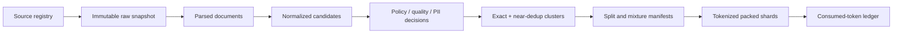

# 训练数据工程与治理

<!-- learning-contract -->
<div class="learning-contract" markdown="1">

**学习导航**

- **适合读者**：负责预训练、微调数据、数据治理或训练流水线的工程师。
- **先修**：知道 JSONL、hash、train/validation/test split 和 tokenizer 的基本作用。
- **首次阅读**：跟踪一个论坛帖子怎样进入 shard，又怎样响应删除请求。
- **完成信号**：能从训练 token 追到来源，并解释切分、去重和删除怎样重建。
- **卡住时**：先读[机器学习与深度学习](../foundations/ml-dl.md)中的数据划分。

</div>

设想我们从一个技术论坛采集到帖子 `thread-8841`。它包含一段很有价值的 GPU OOM 排查记录，
也混着代码缩进、用户签名和回复。三个月后，来源方要求删除这条帖子。

如果团队只保存了最终 `train-00031.bin`，就会立刻遇到一串无法回答的问题：帖子来自哪个快照？
解析器保留了哪些回复？它是否和另一站的镜像重复？进入 train 还是 validation？落在 shard 的哪个 token span？
哪些 checkpoint 或 adapter 消费过它？

训练数据工程的核心，就是在数据第一次进入系统时建立这些关系。模型最后看到的虽然只是 token IDs，
工程系统管理的却是一条从来源、快照、转换、决策到训练消费的供应链。

本章讨论技术设计与验证方法，不提供法律意见。版权、隐私、合同和地域要求应由具备相应职责与权限的人审查。

## 先看 `thread-8841` 怎样移动

它在一次构建中经历：

| 阶段 | 本例产生的记录 | 以后靠它回答什么 |
|---|---|---|
| Source registry | `forum-cn / terms@2026-07` | 为什么允许采集，用途与期限是什么 |
| Raw snapshot | 原始响应、时间、content hash | 当时到底取得了什么 |
| Parse | 主帖、回复、代码块与父子关系 | 解析器怎样理解页面结构 |
| Normalize | `forum-text@v3` | 哪些字符或空白发生过变化 |
| Policy / quality | keep、risk labels、reason codes | 为什么保留、隔离或删除 |
| Dedup cluster | canonical 与镜像成员 | 重复项之间是什么关系 |
| Split / mixture | `train`、domain、sampling weight | 它在哪个实验中怎样被抽样 |
| Tokenize / pack | tokenizer revision、shard、span | 哪些 objective token 真正进入训练 |
| Consumption | run、checkpoint、token ledger | 哪些产物受这条数据影响 |



每一层都保存父对象与版本。这样 parser 或 tokenizer 更新时会产生新 dataset version，
而不是静默覆盖旧数据。给定相同快照、配置和 seed，构建应得到相同 item 集合与稳定 ID；
不同硬件生成的压缩文件未必逐字节一致，但内容差异必须可解释。

## 下载之前，先登记来源和用途

“网页能打开”只说明可以访问，不回答是否允许训练、衍生权重、样本展示、再分发或商业使用。
Source registry 应记录：

- 获取方式、授权依据，以及 license / contract / terms 的快照；
- 允许的模型、产品和用途，是否允许再分发，何时到期；
- 个人信息、敏感类别、未成年人和数据驻留风险；
- opt-out、删除与争议处理入口；
- 来源中哪些部分属于第三方内容或不同许可证。

页面 footer 的许可证未必覆盖用户评论、图片、附件和引用。代码仓库也可能同时包含原创代码、vendored dependency、
生成文件和多个许可证。自动探测器适合发现待复核项，`unknown` 应进入隔离或人工决策，而不是自动变成允许。

Source allowlist 可以把未知来源挡在采集入口。若先抓取所有内容，再靠正则清理，敏感数据已经进入下载缓存、日志、
备份和中间文件。仓库的 [SFT 数据流水线](sft-data-pipeline.md)展示了 fail-closed registry、用途绑定和有限 scanner，
它是工程 reference，不是法律判断或完整 PII 检测器。

## Raw 快照回答“当时拿到了什么”

Raw 层尽量不可变，访问权限也最严格。对 `thread-8841`，至少保存 canonical URL、采集时间、HTTP 元数据、
原始 bytes hash 和 source revision。后面的 parsed、normalized 与 tokenized 对象都指回这份快照。

只保存清洗后的正文会丢失两类证据：一是 parser 当时是否错删或错排，二是来源后来更新后，
我们无法重建旧版本。不可变不意味着无限保留；保留期限、访问和删除仍受来源政策约束。

### 不同格式会以不同方式解析错

- **Web**：导航、cookie banner、评论、隐藏文本和动态区域可能混入正文。论坛与文档站通常需要不同 parser profile。
- **PDF / 扫描件**：多栏、页眉、脚注、表格和 OCR 会破坏阅读顺序。抽样检查乱码率、页码映射、OCR 模型与 confidence。
- **代码**：保留 repository、revision、path 和 license boundary，把 generated、minified、lockfile 与手写源码分开。
- **对话 / 日志**：保持完整 session 边界，并处理 consent、PII、tool result 和 system instruction。

对 `thread-8841`，parser 要把主帖、回复和代码块分别保留，同时记录父子关系。若把同一 thread 的轮次拆成独立 JSONL 行，
后续逐行 random split 会让一半对话进入训练、一半进入测试，制造明显泄漏。

## 规范化会改变信息

Unicode normalization、空白、HTML entity、大小写和数字格式处理都可能改变语义：

- NFKC 会合并一些原本需要区分的字符；
- 连续空格对 Python 缩进和 Markdown 表格有意义；
- 大小写影响专有名词与代码；
- 删除标点会改变版本号、数学式和否定语气；
- URL 参数有时是跟踪信息，有时决定页面内容。

因此 normalization profile 应按 format 或 domain 版本化。`thread-8841` 的正文可以折叠普通段落空白，
代码块必须保留缩进。用于 exact dedup 的规范化副本也不必等于最终训练文本。

Stable document ID 表示同一来源对象，content hash 表示某个 revision 的具体内容。正文更新后，
ID 可以保持关联、hash 应变化。只用正文 hash 做身份，会把一次更新误当成毫无关系的新文档。

## 过滤器每保留一次，也在改变数据分布

常见质量信号包括长度、字符分布、重复行、压缩率、language ID、perplexity、广告或安全 classifier、
结构完整性、代码测试和人工标签。这些信号最终都在回答一个分类问题：保留、隔离、降权还是删除。

因此不能只报告“过滤了 18%”。至少还要看：

- 各语言与领域的 precision、recall 和 confusion matrix；
- 阈值附近样本的人工复核；
- 方言、口语、少数语言和辅助技术文本的 false positive；
- 多个规则串联后的累计选择偏差；
- 更新规则前后，哪些 item 改变了决定。

如果另一个 LLM 给出“高质量”标签，记录 model revision、Prompt、temperature、parser 与失败率。
Judge 可能偏好较长、较标准或与自身风格相似的文本，这种偏好会逐渐写进训练分布。

权限不明、明确 secret 或政策禁止的数据通常进入 hard exclusion。教育价值、写作风格和难度更适合分桶或 soft weight，
因为一个不可靠阈值可能永久删除稀有表达。无论 hard filter 还是 weight，决定和 reason code 都要进入 manifest。

PII scanner 也属于分类器。Regex、checksum、NER、context classifier 与人工审计可以组合使用，
但公开企业电话与私人医疗记录不能仅因格式相同而得到同一处置。Secret/API key 还需要专门扫描与吊销流程。

Redaction 会留下上下文线索，也会制造新的高频占位符。替换策略应在隐私威胁模型和下游质量上一起验证。

## 去重先找候选，再决定关系

另一网站完整转载了 `thread-8841`。Exact dedup 可以对规范化文本计算 cryptographic hash，快速发现逐字相同内容。
但系统仍需决定去重单位、canonical item，以及两个来源的许可冲突如何处理。

Cluster membership 必须保留。如果只留下 canonical hash，来源方要求删除 canonical 时，系统既无法证明镜像关系，
也不知道能否合法地切换到另一个成员。

### 近似去重到底近似什么

轻微改写、模板插入或代码格式变化不会得到相同 hash。将文档表示为 n-gram / shingle 集合 \(A,B\) 后，
可以用 Jaccard 衡量词面重合：

\[
J(A,B)=\frac{|A\cap B|}{|A\cup B|}.
\]

MinHash 用签名相同率估计 Jaccard：

\[
\hat J(A,B)=\frac{1}{k}\sum_{i=1}^{k}\mathbf 1[h_i(A)=h_i(B)].
\]

将 \(k=br\) 个签名分成 \(b\) 个 band、每 band \(r\) 行。在理想独立模型中，
相似度为 \(s\) 的 pair 至少命中一个完整 band 的概率是：

\[
P(\text{candidate}\mid s)=1-(1-s^r)^b.
\]

这个式子用于理解参数方向。增加 \(b\) 往往带来更多候选和更高召回；增加 \(r\) 会收紧候选。
有限 hash family、短文本、公共模板和相关签名会让真实数据偏离理想曲线，所以最终仍要在目标切片上标注 pair。

MinHash 近似的是 shingle-set overlap，不是语义等价。SimHash 更接近加权特征的 Hamming neighborhood；
embedding 可以发现语义改写，同时也引入模型、语言和领域偏差。

### 动手观察一次 LSH 漏检和误报

运行：

~~~powershell
python projects/single-gpu-finetuning/minhash_lsh_toy.py
~~~

仓库实现先用 SHA-256 把 Unicode shingle 稳定映射到 \(2^{61}-1\) 模域，再用 seed 派生 affine hash 系数。
Band 命中只产生 candidate，程序随后重算精确 Jaccard。

固定的 5-item、10-pair fixture 使用 64 hashes 和 16×4 bands，得到 3 个候选；只有 1 个达到 0.8，
所以这次 snapshot precision 是 `1/3`。Exhaustive ground truth 上 recall 为 1。另一个 1-hash 反例中，
两个集合的 Jaccard 是 `2/3`，却没有 band collision，observed recall 为 0。

这些数字解释当前小 fixture 的候选机制。换新闻镜像、代码 fork 或数学证明后，需要重新标注 pair，
并报告 precision/recall、cluster size、token 移除率、语言/来源差异和 canonical selection。

去重顺序同样会改变结果：先切 chunk 容易删除共享局部段落；先对整文档去重会保留局部复制。
Pretraining、RAG 和 benchmark contamination 通常需要不同粒度。

## Split 的单位要沿着真实依赖选

若同一 thread、用户、repository、模板 family 或时间段内的样本彼此相关，就应该按这个 group 切分。
逐行 random split 只有在行近似独立时才合理。

污染不只包括题干和答案原文，还包括翻译、格式转换、轻微改写、benchmark 上游网页，
以及 SFT example 或 RAG corpus 中可以直接取得的答案。一个稳妥流程是：

1. 构建训练集前冻结 evaluation registry 与 holdout identity；
2. 在 raw、parsed 和 final data 分别运行 exact、shingle 与可审计的 semantic candidate search；
3. 人工复核高风险 pair，保存 match span、来源与决定；
4. 后续发现污染时标记受影响模型版本，并在 clean subset 上重测。

检测报告要说明查过哪些来源、语言和变体。“没有命中”只表示当前方法没有发现 candidate。
测试集被反复用于过滤和调参后，也已经成为 dev set，不再提供独立的最终评估。

## Mixture 决定模型实际反复看什么

去重后的 item 不会自动按原始比例进入训练。若域 \(i\) 有 \(n_i\) 个 token，一种温度采样是：

\[
p_i=\frac{n_i^\alpha}{\sum_j n_j^\alpha},
\qquad 0<\alpha\le 1.
\]

当 \(\alpha=1\) 时按数据量采样；\(0<\alpha<1\) 会相对提高小域权重。
若计划消费 \(D\) 个 token，域 \(i\) 的期望消费量为 \(Dp_i\)，重复倍数约为 \(Dp_i/n_i\)。
训练前先算这两个数，可以发现一个小域是否会被重复几百次。

Mixture 可以分阶段变化，例如先做广域预训练，再增加高质量领域数据。每次变化都记录 step 或 consumed-token 边界、
sampler RNG 和每域实际消费量。目标权重与实际取样可能因恢复位置、worker 数或 shard 顺序产生偏差。

上采样、复制 item 和 loss weighting 会产生不同 optimizer noise 与 epoch 语义。数据报告应分别给出：

```text
unique raw / normalized tokens
unique tokens after dedup
consumed objective tokens
padding / masked tokens
per-domain repetition
```

## Tokenizer 与 packing 决定训练目标

同一段文本更换 tokenizer 后，token 数、截断点、不同语言的成本和污染匹配都会变化。
Tokenizer revision 因此属于 dataset identity。

将短文档拼成长度 \(T\) 的 sequence 可以减少 padding，但必须明确：

- 文档间是否插入 BOS / EOS；
- label shift 是否跨过文档边界；
- attention 是否允许跨文档；
- position IDs 是否重置；
- 截断尾部是丢弃、续到下一条，还是先补 EOS；
- loss denominator 是否只包含有效 objective tokens。

例如 `[docA, EOS, docB]` 中，如果让 `EOS` 预测 `docB` 的首 token，就人为加入了跨文档目标。
可以 mask 该 label，也可以接受它，但训练定义必须明确。插入 EOS 本身不会改变 attention mask；
真正隔离文档需要 block-diagonal mask 或等价机制。

Packing efficiency 可以写成：

\[
\text{packing efficiency}
=
\frac{\text{valid objective tokens}}{\text{allocated sequence slots}}.
\]

这个比例只描述空间利用。错误的 loss mask 也可能得到 100% 利用率，同时把 padding 或错误边界纳入训练。
发布前应抽样打印 text、token IDs、labels、loss mask、position IDs 与 document boundaries，并用小例子逐位置核对。

## 合成数据也要进入同一条 lineage

Instruction expansion、难例、翻译、蒸馏、工具轨迹和拒答样本都可能来自生成模型。
每条 synthetic item 至少保留：

- generator model、Prompt/template、sampling config 与生成时间；
- raw response 和 seed（若目标接口定义了可重放 seed 语义）；
- verifier、执行测试、过滤 reason 与人工复核状态；
- 父数据，以及继承的许可证和隐私约束。

同一模型同时生成、评价和过滤时，盲点会相关。可以引入独立 verifier、可执行测试、人工抽样、真实数据锚点和多样性约束。
Rejection sampling 提高的是通过特定 verifier 的比例，也可能只是在利用 verifier 漏洞。

合成数据不会自动导致或避免 model collapse。风险取决于占比、选择机制、真实锚点、模型和跨代迭代，
因此要观察覆盖、长尾和多代质量，而不只看平均 loss。完整讨论见[合成数据、蒸馏与反馈环](synthetic-data.md)。

## 删除请求怎样沿 lineage 返回

现在来源方要求删除 `thread-8841`。系统需要沿着这条关系查找：

```text
source item
  -> raw / parsed / normalized revisions
  -> dedup cluster and canonical decision
  -> split / mixture manifest
  -> tokenized shard and token spans
  -> training runs
  -> checkpoints / adapters
```

首先写 tombstone，让未来构建不再消费它；然后重建受影响 shard，并更新 dedup cluster。
如果它是 canonical，还要重新判断剩余镜像的许可和质量，不能自动换成员。

删除 final dataset 中一行不会让已经训练的权重恢复到未见过该数据的状态。后续处置可能包括未来训练排除、
从干净 checkpoint 重训、经过验证的近似 unlearning，或系统层过滤。采用哪种方式取决于政策和威胁模型，
报告中应区分“数据存储已删除”和“模型影响已处置”。

同一 source revision 重跑应幂等；parser、policy 或 tokenizer 更新则产生新 dataset version。
Manifest 保存 parent version、added / updated / deleted 数量和 cluster 变化，旧版本不能被悄悄覆盖。

## Manifest 把一次构建固定下来

```yaml
dataset_id: pretrain-cn-2026-08-v3
parent: pretrain-cn-2026-08-v2
raw_snapshot: sha256:...
source_registry_revision: git:...
parser_profiles:
  web: readability-v4
  pdf: layout-ocr-v2
normalization_profile: multilingual-safe-v3
quality_policy: quality-gate-v7
dedup:
  exact_profile: exact-v2
  near_profile: minhash-5gram-v4
  canonical_policy: license-quality-time-v2
evaluation_registry: eval-holdouts-v5
pii_policy: pii-v6
tokenizer_revision: sha256:...
split_seed: 7319
mixture_revision: mix-v8
output_shards_manifest: sha256:...
```

版本字符串必须能解析回配置、代码 revision 和统计 artifact。只写 `quality-gate-v7`，
却找不到当时规则和输出，不足以重建数据集。

发布前用四组问题检查 manifest：

| 范围 | 必须能回答 |
|---|---|
| Identity / lineage | 每个 final item 来自哪里，shard span 怎样回到 source，删除冲突是否阻止发布 |
| 数据质量 | 解码、长度、语言、来源、过滤和 cluster 分布是否符合预期 |
| 训练语义 | labels、loss mask、boundary、EOS、position 和实际 mixture 是否正确 |
| 安全 / 评测 | PII、secret、holdout contamination 与恶意输入覆盖到什么范围 |

Data loader 还要限制路径、压缩炸弹、恶意 pickle 和超大对象。元数据来自不可信 source 时，
不能让它直接决定训练脚本路径、命令或高权限配置。

## 从训练异常反查数据链

| 现象 | 优先沿哪些记录检查 |
|---|---|
| Loss 突然异常地好 | train/validation overlap、label shift、padding mask、重复与答案污染 |
| 某语言 loss 变差 | tokenizer 膨胀、language ID 误杀、mixture、normalization、截断与 dedup removal |
| 恢复训练后 mixture 改变 | dataloader cursor、sampler RNG、worker 数、shard order、world size 与 consumed-token ledger |
| 数据量对不上 | raw、parsed、kept、unique、tokenized、allocated slots 与 objective tokens 分层对账 |

这些层的计数不能合并成一个“总 token 数”。每层回答不同问题，差值本身就是定位 parser、filter、dedup 或 packing 的线索。

## 自测与实践

1. 为 `thread-8841` 设计 stable source ID、revision 和 content hash；三者分别在什么情况下变化？
2. 为什么 exact-dedup 使用的 normalization profile 不一定适合最终训练文本？
3. 两个代码文件共享许可证头时，shingle Jaccard 可能怎样误导去重？
4. 给三个域计算温度采样后的 expected consumed tokens 与重复倍数。
5. 画出删除请求从 source item 到 checkpoint 的 lineage，并标出能直接重建与需要额外处置的部分。
6. 构造 `[docA, EOS, docB]`，逐位置写出 input、label、loss mask 和 attention mask。
