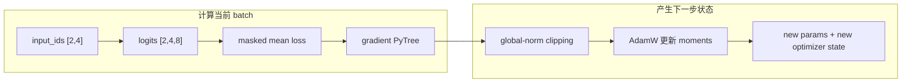

# JAX、Optax 与函数式训练闭环

<!-- learning-contract -->
<div class="learning-contract" markdown="1">

**学习导航**

- **适合读者**：用 JAX/Optax 实现可复现训练步的工程师。
- **先修**：Python、线性代数、自动微分和优化器状态基础。
- **首次阅读**：跟着固定 batch 走过前向、损失、梯度、Optax 更新和 JIT，再看对账与恢复。
- **完成信号**：能逐项说出一次训练步接收、改变和返回了哪些状态，并能写出可 JIT 的纯函数版本。
- **卡住时**：先读[机器学习与深度学习](../foundations/ml-dl.md)，再跑[JAX MiniGPT](../practice/projects/jax-minigpt.md#run)。

</div>

打开 `train_tiny.py`，第一次训练调用接收下面这批数据：

```text
input_ids = [[0, 1, 2, 3],
             [0, 1, 2, 3]]
targets   = [[1, 2, 3, 4],
             [1, 2, 3, 4]]
```

批大小是 2，序列长度是 4，词表大小是 8。模型只有 632 个参数，任务只是反复学习“下一个 token 加一”。
这个小任务不考验语言能力，却足以暴露梯度是否断开、目标是否错位，以及优化器有没有真正更新参数。

一次调用会让数据和状态依次发生下面的变化：



本页采用的函数式 JAX 训练步显式接收参数和优化器状态，再返回下一步的新状态。随机层存在时，PRNG key 也要沿这条链流动。
理解这一次状态变化后，PyTree、Optax 和 JIT 就不再是互不相干的术语。

仓库已经在 CPU 上运行了小批量过拟合、PyTorch 与 JAX 的同公式对账，以及换进程继续训练的实验。
这些结果没有覆盖 CUDA、TPU、混合精度、多机网络或大模型吞吐；对应命令和原始数值见
[JAX MiniGPT 项目](../practice/projects/jax-minigpt.md#run)。

## 第一步：把训练状态摆到函数参数里

在对象式训练器中，参数和优化器状态常藏在实例内部。JAX 更适合把模型写成一个显式的数组函数：

\[
\text{logits}=f(\theta, x; c)
\]

这里的 \(\theta\) 是参数树，\(x\) 是当前 batch，配置 \(c\) 在跟踪函数时保持不变。
训练步同样把旧状态作为输入，把新状态作为输出：

\[
(\theta_{t+1}, s_{t+1}, L_t, \lVert g_t\rVert)
=\operatorname{step}(\theta_t,s_t,x_t,y_t)
\]

\(s_t\) 是优化器状态，其中可以包含 Adam 的一阶矩、二阶矩和步数。显式状态便于编译、复制、分片和保存，
代价是调用者必须接住每一项新状态。若下一步误用旧的 \(s_t\)，优化器的时间线就会倒退。

可以先把 Notebook 04 的单进程 LoRA 训练当作对照：那里 Python 变量持有模型和 AdamW，训练循环持有固定样本，
`torch.manual_seed` 决定两次构造基座时的随机流。交给 JAX 编译的训练函数将需要的参数、Optax state 和随机 key
作为显式输入，调用方接住它返回的新值后才开始下一步。Notebook 保存的是可推理的 adapter，不是中途续训
checkpoint；若要续训，它同样需要保存 optimizer、step、随机状态与数据进度。

### PyTree

PyTree 是 JAX 对嵌套结构的称呼。字典、列表、元组或 dataclass 负责组织层次，叶子通常是 JAX 数组。
`jax.tree.map`、自动微分和 Optax 都会沿同一棵树找到对应叶子。

本仓库的参数树包含：

```text
params
├── token_embedding
├── position_embedding
├── blocks[]
│   ├── qkv / output
│   ├── up / down
│   └── attention_norm / mlp_norm
└── final_norm
```

树结构也是优化器和 checkpoint 的接口。参数改名、容器类型变化或层数变化后，旧优化器状态通常不能直接复用。
恢复训练时，应核对树结构定义、每片叶子的形状与数据类型；多设备训练还要核对分片方式。

## 随机性也是一份要传递的状态

JAX 不依赖一个会被暗中消费的全局随机数生成器。PRNG key 本身就是数组数据；初始化、dropout、数据增强和采样
分别取得一个子 key：

```python
key = jax.random.key(seed)
init_key, dropout_key, data_key = jax.random.split(key, 3)
params = init_params(init_key, config)
```

同一个 key 交给同一个随机操作，会再次得到相同结果。调用方应保留一个“供未来使用”的 key，
当前操作只接收拆出的子 key，并按约定不再复用。

多设备训练还要把训练步数、进程编号和设备编号折叠进随机流，并把当前随机状态写入 checkpoint。
只保存最初的整数 seed，不足以恢复已经前进数千步的随机时间线。

这里的“折叠”由训练程序明确规定：例如每个 rank 先从同一 run seed 派生自己的流，再按全局 step 与本地设备编号
派生本步所需 key。哪一份 key 由哪一个 rank 持有、哪些 mask 要在一组设备间相同，都属于训练契约；不能用单机
Notebook 的一个 seed 替分布式训练猜出这些规则。

本页开头的 632 参数模型没有 dropout，所以它的训练步无需接收随机 key。跨框架连续对账和恢复实验加入了随机 mask，
此时 key 必须成为训练状态的一部分，不能让编译后的函数读取 Python 全局随机数。

## 第二步：从 batch 得到 loss 和梯度树

### Masked cross entropy

前向函数把 `[2,4]` 的输入变成 `[2,4,8]` 的 logits。对一般的 \(z_{b,t,v}\) 与目标 \(y_{b,t}\)，
只在监督 mask \(m_{b,t}=1\) 的位置计算平均负对数似然：

\[
L=-\frac{1}{\sum_{b,t}m_{b,t}}
\sum_{b,t}m_{b,t}\log\operatorname{softmax}(z_{b,t})_{y_{b,t}}
\]

索引 logits 前，代码先把 `ignore_index` 位置临时替换成合法 token ID，再用 mask 消除这些位置的损失。
如果直接拿负数 ID 做 gather，“稍后再乘零”也已经来不及。

分母使用真正受监督的 token 数，而不是固定的“批大小乘序列长度”。否则 padding 比例变化会悄悄改变 loss 尺度。

整批目标都被忽略，或某个可见目标越过词表，都属于无效输入。低层数组函数返回 `NaN`，方便它保持可编译；
外层 `make_train_step` 在提交编译更新前读取并拒绝这类 batch。这样可以防止没有监督信号时，
AdamW 仍因 weight decay 改动参数。生产数据管线应更早统计并隔离零监督样本。

### `value_and_grad`

训练需要 loss 和梯度：

```python
def loss_function(current_params):
    logits = forward(current_params, input_ids, config)
    return cross_entropy_loss(logits, targets)

loss, gradients = jax.value_and_grad(loss_function)(params)
```

被求导函数需要返回标量 loss。若还要返回准确率等统计量，可以使用 auxiliary output；这些统计量怎样跨设备归约，
仍需单独设计。`stop_gradient`、离散索引、错误 mask，或在函数中把数组转成 Python 数字，都可能切断预期梯度路径。

## 第三步：让 Optax 把旧状态推进到新状态

Optax 不把参数藏在优化器对象内部。一次更新由三个显式动作组成：

1. `optimizer.init(params)` 创建与参数树相关的 state；
2. `optimizer.update(grads, state, params)` 产生 updates 与新 state；
3. `optax.apply_updates(params, updates)` 得到新参数。

本仓库先按全局范数裁剪梯度，再执行 AdamW：

```python
optimizer = optax.chain(
    optax.clip_by_global_norm(max_grad_norm),
    optax.adamw(learning_rate=learning_rate, weight_decay=weight_decay),
)
```

这两个变换的顺序会改变结果。日志先记录裁剪前的梯度范数，再把裁剪后的梯度交给 AdamW。
如果只记录裁剪后范数，所有超过阈值的尖峰看起来都会一样大，排查训练不稳定会更困难。

### AdamW 与参数 mask

AdamW 把解耦权重衰减直接放进参数更新。它与“在任意 loss 上加一个 L2 项”不是同一套更新规则。

真实 Transformer 往往不衰减归一化层的 scale 和类似 bias 的参数。Optax 可以接收一棵与参数 PyTree 对齐的 mask，
由 mask 决定哪些叶子参与衰减。

本页的小批量过拟合把权重衰减设为 0，因此暂时不会暴露参数 mask 的差异。这个设置只为检查训练接线，
不能直接充当生产预训练配方。

## 第四步：JIT 编译的是固定形状的训练程序

`jax.jit` 第一次接到训练步时，会跟踪 Python 函数对数组执行了哪些操作，再为当前参数树、形状、数据类型和
静态配置编译可执行程序。后续输入只要保持兼容，就可以复用这份程序。下面的变化可能触发重新编译：

- batch/sequence shape 改变；
- dtype 改变；
- 参数 PyTree 结构改变；
- 被当作 static 的配置值改变；
- Python 控制流依赖动态数组值。

如果每个 batch 都使用新的序列长度，编译缓存会不断增加。常见做法是按长度分桶，再 padding 到有限几种形状，
同时监控编译次数和缓存命中情况。

本仓库把不会随训练步变化的配置和优化器放进闭包，只把动态数组传给编译后的 `step`：

```python
def step(params, optimizer_state, input_ids, targets):
    loss, gradients = jax.value_and_grad(loss_function)(params)
    gradient_norm = optax.tree.norm(gradients)
    updates, new_state = optimizer.update(gradients, optimizer_state, params)
    new_params = optax.apply_updates(params, updates)
    return new_params, new_state, loss, gradient_norm

train_step = jax.jit(step)
```

### `print` 为什么不会在每一步都执行

`print`、向列表追加元素和写文件都属于 Python 副作用。它们通常在函数被跟踪时发生，而不是每次设备执行时发生。

依赖数组值的动态分支应使用 `jax.lax.cond` 等 JAX 控制流原语，或移到 JIT 外部。训练日志可以让编译函数返回统计数组，
再由主机在同步边界记录。JAX 的调试输出适合定位问题，不应直接充当生产日志系统。

## 第五步：等设备完成后再停止计时

JAX 通常异步提交设备计算。下面的代码可能在设备尚未算完时就停止计时，因此主要测到的是“提交任务”所花时间：

```python
started = time.perf_counter()
loss = train_step(...)[2]
elapsed = time.perf_counter() - started  # 可能尚未完成设备计算
```

要测完整的墙钟时间，先等待返回数组真正就绪：

```python
started = time.perf_counter()
params, state, loss, grad_norm = train_step(...)
loss.block_until_ready()
elapsed = time.perf_counter() - started
```

第一次调用同时包含函数跟踪、编译和执行，应与后续复用编译结果的训练步分开。

性能报告至少写清预热与编译时间、同步位置、训练步数、输入形状、数据类型、实际设备、主机到设备传输，
以及多次测量的分位数。

## 数据放置与 host-device 边界

Python 和 NumPy 通常在主机端准备数据，JAX 数组则可能位于 CPU、GPU 或 TPU。若训练循环每一步才执行 Python
分词或临时构造数组，加速设备就可能等待主机。数据管线需要明确：

- 固定或分桶 shape；
- 预取与主机到设备传输的时间边界；
- 怎样避免无意的设备到主机标量转换；
- 记录有效 token 数，而不是只报 examples/s；
- 在多 process 下保证 shard 不重不漏，并保存 iterator 位置。

`float(loss)`、`np.asarray(array)` 和打印数组都可能触发同步或数据传输。它们适合调试，
频繁出现在训练热路径中则会降低吞吐。

## 从单设备到 Sharding

单设备 JIT 不会自动变成高效的多设备训练。JAX `Array` 可以携带分片信息，mesh 把物理设备组织成命名轴，
再由分区规则把参数、激活和数据映射到这些轴。设计者仍需选择并验证：

- data parallel：复制参数，分 batch，梯度做 collective；
- tensor/model parallel：分矩阵维，层内需要 collective；
- sequence/context parallel：分序列/激活，attention 通信更复杂；
- expert parallel：按专家分权重与 token，依赖 all-to-all。

判断分片是否正确，要查看数组实际落在哪些设备与可寻址分片上，不能只看配置字符串。
多进程训练还要核对进程拓扑、全局与本地 batch、集合通信顺序、checkpoint 聚合和故障恢复。

当前可执行证据只来自单设备。`NamedSharding`、mesh 和具体分片策略需要在目标 GPU 或 TPU 上另行验证。
项目页面把这些工作列为后续方向，读者不应把它们当作已经验收的功能。

## 数值精度与等价性

JAX 默认数据类型、是否启用 x64、加速器 kernel 和矩阵乘精度都会影响结果。采用 BF16 或 FP16 时，还要明确：

- 参数、计算、梯度归约和优化器状态分别使用什么数据类型；
- FP16 是否使用 loss scaling；
- softmax、norm、loss 等敏感算子是否升精度；
- 溢出/NaN 检测和跳步策略；
- checkpoint 恢复后的数据类型与分片是否一致。

与 PyTorch 对账时，先固定相同权重、输入和 mask，再统一 GELU 近似、归一化 epsilon 与 embedding 权重共享方式。
比较顺序从 logits 和 loss 开始，再到单步梯度与参数更新。只看最终生成文本，无法定位数值分叉发生在哪一步。

## 从函数式心智模型进入验证

“Decoder-only Transformer”不能保证两份实现计算同一个函数。验证顺序与固定结果由项目和证据页负责：

| Control | 必须统一或保存 | 能证明 / 不能证明 |
|---|---|---|
| PyTorch↔JAX 单步 | 同一参数、输入、mask、affine LayerNorm、epsilon、tanh-GELU、tied embedding、masked loss 与 plain SGD | 依次对账 logits/loss、20 个 unique gradients、一步参数和 post-step forward；原生 JAX RMSNorm 是故意反例。 |
| 三步 AdamW | 同一 materialized dropout masks、clipping、first/second moments、count 与 schedule | 证明共享随机输入下的更新 parity；绕开而非证明两套 native RNG 等价。 |
| 跨进程 resume | Params、Optax state、typed PRNG、permutation/cursor、step 与每个 PyTree leaf 的 identity | 六步 split/uninterrupted bit-exact；只覆盖 authored CPU 单设备格式。 |
| 目标训练 | Native RNG、worker/prefetch、mixed precision、sharding/topology、atomic publication 与数据 identity | 当前项目尚未证明 accelerator、分布式、长训练收敛或性能。 |

精确误差、artifact 字段和 wrong-mask/wrong-key/wrong-cursor 结果见
[JAX MiniGPT 项目](../practice/projects/jax-minigpt.md#run)与[项目证据台账](../evidence/project-controls.md)。
文件能打开只证明可解析；训练轨迹连续必须在独立进程中对账下一批 sample、loss、gradient、optimizer 和最终参数。

## 可运行入口

完整参数和故障树由项目 README 维护；本页只保留最短执行顺序：

~~~powershell
python -m pip install -e ".[dev,torch,jax]"
python projects/jax-minigpt/train_tiny.py --steps 60 --learning-rate 0.02 --seed 11
python projects/jax-minigpt/cross_framework_parity.py
python projects/jax-minigpt/cross_framework_training_parity.py
python projects/jax-minigpt/checkpoint_resume_control.py
python -m pytest tests/test_gpt_jax.py
~~~

验收时确认 causal mask 不泄漏未来、loss/gradient 有限、embedding 更新、JIT 结果已 `block_until_ready()`，
并分别记录实际 backend/device。小批量 overfit 不衡量泛化；跨框架 parity 只覆盖显式统一的数学契约。

## 常见错误

- 在 jitted 函数中依赖 Python 全局状态、随机数或 side effect；
- 重复使用同一 PRNG key；
- 把首次 compile 时间混入 steady throughput；
- 计时不调用 `block_until_ready`；
- 每个 batch 使用不同 shape 导致反复编译；
- 忘记保存 optimizer/RNG/data iterator state；
- 对 norm/bias 无差别 weight decay，却称为标准配方；
- 用单 CPU/GPU overfit 结果声称多设备 sharding 已验证；
- 只比较 PyTorch/JAX 最终文本，不做 logits/gradient 对照。

## 面试追问

1. PyTree 和显式 optimizer state 为什么适合程序变换与分片？
2. `jax.jit` 在什么条件下重编译，动态长度数据怎样控制 shape 集？
3. JAX 异步 dispatch 为什么让朴素 wall-clock benchmark 失真？
4. AdamW、gradient clipping 与参数 mask 的顺序分别影响什么？
5. dropout key 在 step、device 和 process 维度应怎样派生？
6. 单设备代码迁移到 mesh/sharding 时要新增哪些正确性验证？
7. 怎样设计 PyTorch/JAX 单步等价实验？

## 一手资料

- JAX 官方文档，[Just-in-time compilation](https://docs.jax.dev/en/latest/jit-compilation.html)。
- JAX 官方文档，[Asynchronous dispatch](https://docs.jax.dev/en/latest/async_dispatch.html)。
- JAX 官方文档，[Distributed arrays and automatic parallelization](https://docs.jax.dev/en/latest/notebooks/Distributed_arrays_and_automatic_parallelization.html)。
- Optax 官方文档，[Getting started](https://optax.readthedocs.io/en/latest/getting_started.html)。
- 本仓库 `src/about_llm/from_scratch/gpt_jax.py`、`projects/jax-minigpt/train_tiny.py` 与 `tests/test_gpt_jax.py`；当前可执行证据的最高优先级来源。
