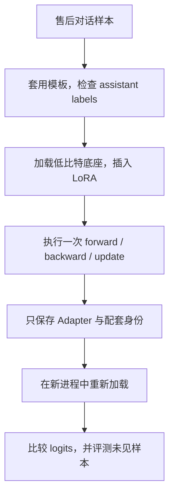

# LoRA、QLoRA 与单卡工程：显存省在哪里，风险又留在哪里

<!-- learning-contract -->
<div class="learning-contract" markdown="1">

**学习导航**

- **适合读者**：准备在单张消费级 GPU 上做微调的开发者与算法工程师。
- **先修**：[微调总览](finetuning.md)、Transformer 线性层和基础训练循环。
- **首次阅读**：跟随一次售后格式微调，依次检查标签、LoRA 位置、显存、梯度、保存和重载。
- **完成信号**：能解释一次 OOM 来自哪块内存，并让 Adapter 在全新底座进程中重现输出。
- **卡住时**：按[Single-GPU Finetuning](../practice/projects/single-gpu-finetuning.md#run)跑最小路径。

</div>

假设团队要求售后回答固定包含“结论、依据、下一步”三部分。一个 0.5B–1B 级 Instruct 模型已经会回答问题，
却经常漏掉其中一栏；笔记本 GPU 又容不下全参数训练。

LoRA 的思路是冻结原模型，只学习一组小更新；QLoRA 再把冻结底座压到低比特存储。

这两项技术能显著降低一部分显存，却不会自动解决数据、labels、activation、checkpoint 和评测问题。

本章不会从一串超参数开始，而是跟随这次格式微调走完六个检查点：



| 检查点 | 要回答的问题 | 失败时意味着什么 |
|---|---|---|
| 标签 | loss 究竟监督了哪些 assistant token？ | 训练目标已经错了 |
| LoRA 位置 | 哪些线性层可训练，参数量是多少？ | 模型可能没在学，或学错位置 |
| 显存 | 4-bit 底座之外还有哪些分配？ | “权重能放下”不等于“训练能跑” |
| 一次更新 | 梯度是否有限，底座是否保持冻结？ | 长训练只会放大故障 |
| 重载 | 新进程的输出能否与保存前一致？ | 发布包不完整或身份不匹配 |
| 质量 | 未参与训练的样本是否真的变好？ | 工程链路跑通仍不等于微调有效 |

## LoRA 实际给线性层加了什么

冻结底座权重 \(W_0\in\mathbb R^{d_{out}\times d_{in}}\)，只训练低秩增量：

\[
y=xW_0^\top + \frac{\alpha}{r}xA^\top B^\top,
\quad A\in\mathbb R^{r\times d_{in}},
\quad B\in\mathbb R^{d_{out}\times r}.
\]

原矩阵有 \(d_{out}d_{in}\) 个参数，Adapter 只有 \(r(d_{in}+d_{out})\) 个。常见初始化让 \(B=0\)、\(A\) 随机，
于是训练开始时 LoRA 分支输出为 0，模型函数与基座相同。

`alpha/r` 控制增量尺度。Rank 提高会增加可表达方向，也增加参数、optimizer state 和过拟合机会；它不是“越大
越好”的质量旋钮。

推理时可以保留独立 Adapter，也可以合并：

\[
W'=W_0+\frac{\alpha}{r}BA.
\]

合并前后要在固定输入上比较 logits 或生成结果。公式描述的是理想运算；实际实现还会受到 dtype、量化顺序和
共享权重（tied weights）处理方式影响。

## Target modules 决定模型哪里能改变

回到售后格式微调：我们先要决定这组小更新接到模型的哪些线性层。`target_modules` 不是可以跨模型照抄的名单。
不同 checkpoint 对同一功能使用的模块名和张量形状可能不同，因此要先打印实际模型树和匹配结果：

| 选择 | 训练容量与常见用途 | 代价 |
|---|---|---|
| `q_proj/v_proj` | 轻量行为或格式适配 | 可训练方向较少 |
| `q/k/v/o` | 更完整地调整 attention | 参数与 optimizer state 增加 |
| Attention + MLP linears | 更强领域/行为适配 | 显存、训练时间和过拟合风险更高 |
| Embedding/LM head | 新增 token 或输出头变化 | 保存、weight tying 与兼容更复杂 |

匹配完成后，打印每个可训练张量的名称、形状和参数量。若总数为 0，训练应立即停止。

新增 special token 时还要单独决定 embedding 和 LM head 的相关行是否训练。若两者都冻结，新 token 对应的行会停留在
初始化值；其他 LoRA 层或许可以适配这个固定表示，但 token 表示本身并没有被训练，必须单独验证效果。

Target modules 是实验变量。比较两种设置时，要固定数据、模板、每次更新的有效 token 数、更新步数和评测集。

## QLoRA 压缩的是冻结基座

QLoRA 把冻结底座以 4-bit 形式存储。执行矩阵乘法时，量化权重由 kernel 按需反量化到 BF16 或 FP16 参与计算，
而不是把整个模型永久恢复成高精度副本。

这项压缩只针对底座权重。LoRA 参数、梯度、优化器状态、激活值和部分临时工作区仍使用更高精度。

经典组件包括：

- **NF4**：为近似正态分布的权重设计量化取值；
- **双重量化（double quantization）**：继续压缩量化参数本身；
- **分页优化器（paged optimizer）**：在内存压力下转移优化器状态；
- **`prepare_model_for_kbit_training`**：PEFT 库用于准备低比特训练的辅助函数，会处理部分 norm、输入梯度和 checkpointing 设置。

原始 QLoRA 方法包含 NF4、双重量化和分页优化器，但具体训练脚本未必全部启用。本仓库入口启用了 NF4 与双重量化，
优化器则由训练配置决定。

配置名称也无法证明运行时已经走到高效 kernel。Bitsandbytes、CUDA、驱动、GPU 计算能力和模型张量形状都要在
目标设备上验证。

硬件和软件栈支持时，BF16 通常比 FP16 更不容易上溢；使用 FP16 时要额外观察 loss scaling 和 GradScaler 状态。
`load_in_4bit=True` 只描述底座的存储方式，不能概括整个训练的数值精度。

## 显存账本要逐项写

训练峰值可按下面的结构理解：

\[
M=M_{base}+M_{adapter}+M_{grad}+M_{optimizer}
+M_{activation}+M_{workspace}+M_{runtime}.
\]

把它当成一张账单，而不是一个“模型大小”数字：

- **底座**：量化后的权重值、缩放参数、未量化层和模型 buffer；
- **Adapter、梯度与优化器**：随可训练参数增长；AdamW 通常还保存一阶与二阶矩；
- **激活值**：随 micro-batch、序列长度、隐藏维度、层数和 checkpointing 设置变化；
- **临时工作区**：attention、反量化、logits 和 fused kernel 使用的中间内存；
- **运行时**：CUDA context、allocator 预留、编译或 CUDA Graph 缓存，以及其他进程占用。

“7B × 4 bit ≈ 3.5 GB”只算了权重 codes 的理想 payload，不能直接当成 QLoRA 峰值。

仓库估算器适合在下载模型前筛掉明显不可行的配置。下面用一个示意性的 7B 架构做一阶估算：

```powershell
python projects/single-gpu-finetuning/train_qlora.py `
  --model-id illustrative/model `
  --revision immutable-commit-placeholder `
  --num-parameters 7000000000 `
  --num-layers 32 `
  --hidden-size 4096 `
  --max-length 1024 `
  --micro-batch-size 1 `
  --gradient-accumulation 16 `
  --rank 16 `
  --alpha 32 `
  --target-modules q_proj,k_proj,v_proj,o_proj `
  --target-linears-per-layer 4 `
  --estimate-only
```

当前公式会得到约 3.85 GiB 的量化底座、0.25 GiB 的 Adapter 与优化器、0.70 GiB 的激活值，以及
1.38 GiB 的临时与运行时预留，总计约 6.18 GiB。

这些数字来自明确写出的近似：目标层按方阵估算、激活系数固定、运行时预留为 1 GiB。它们适合比较“序列翻倍会怎样”
或“rank 降低能省多少”，不能证明这套配置一定能放进某张 8 GiB 显卡。

最终要在目标 GPU 记录 `torch.cuda.max_memory_allocated()`、`max_memory_reserved()`、每步耗时和实际模块树。
`reserved - allocated` 主要反映 allocator 缓存与碎片等未使用预留，单凭这个差值不能判断发生了内存泄漏。

## OOM 时按什么顺序降级

假设第一次 dry-run OOM。按下面顺序一次只改一项，并在每次运行中记录改变后的训练语义：

1. 把 micro-batch 降到 1；
2. 打开 gradient checkpointing，以额外计算换取更少激活值；
3. 使用兼容的 SDPA 或 FlashAttention，并确认运行时没有退回普通实现；
4. 根据真实长度分布降低最大序列长度，或按长度分桶；
5. 减少 target modules 或 rank，同时承认可训练容量已经变化；
6. 换更小的底座，并重新建立质量基线。

`empty_cache()` 只能归还 allocator 中当前没有被 tensor 引用的缓存；仍存活的 tensor 不会因此消失，真实峰值也不会降低。
每次降级都应生成新的运行记录，因为它可能改变速度、容量乃至训练语义。

## Gradient accumulation 不只是“假装大 batch”

售后对话长短不同。假设两个微批次（micro-batch）分别有 10 和 100 个有效监督 token。
若先计算各批次的平均 loss，再把两个结果各乘 \(1/2\)，前 10 个 token 的单 token 权重会是后 100 个 token 的十倍。

若目标是“每个监督 token 权重相同”，应在整个 optimizer window 中累计 loss sum 和有效 token 数：

\[
\mathcal L_{window}
=
\frac{\sum_b\sum_{t\in V_b}\ell_{b,t}}
{\sum_b|V_b|},
\]

其中 \(V_b\) 是第 \(b\) 个 micro-batch 中真正参与监督的位置。实现时既要保留正确的分子，也要用整个累积窗口的
token 总数作为分母。

即使有效 token 总数相同，gradient accumulation 也不必与一次大 batch 逐位一致。Dropout 随机数、依赖 batch 的算子、
梯度裁剪、scheduler 更新时点和浮点归约顺序都可能造成差异。

因此，变长对话和 packing 场景应优先记录 `tokens/update`。最后一个不足完整 accumulation window 的 batch，
也要明确它使用哪个分母，以及是否执行 optimizer step。

公式和 DDP 对照见[分布式训练](../systems/distributed-training.md#global-batch-loss-normalization)。

## Gradient checkpointing 用时间换 activation

Gradient checkpointing 会丢弃一部分前向中间量，并在 backward 时重新计算。它降低激活值显存，代价是增加计算时间。

训练时通常关闭 `use_cache`。KV Cache 用于自回归推理阶段复用历史 K/V，和训练时重算激活值解决的不是同一个问题。

打开配置项后还要观察峰值显存和每步耗时。只有实测同时出现“显存下降、计算变慢或保持合理”，才能确认这条路径
在目标模型与运行时中真正生效。

## Labels 错了，PEFT 只会更便宜地学错

现在回到第一检查点。原始样本里，用户消息和目标回答是两个字段；经过 chat template 后，它们会变成一条带有
系统指令、用户消息、助手回答和结束标记的 token 序列。Loss mask 必须在这条最终序列上生成。

在 backward 前，从真实 batch 中抽一条并打印：

```text
rendered conversation
input_ids
assistant mask
final labels after collator
valid supervised token count
```

对因果语言模型（causal LM）而言，系统指令、用户消息、padding 和不希望监督的控制 token，其 label 通常设为
`-100`。只有目标回答位置保留对应 token ID，这样交叉熵只统计 assistant 的回答。

不能根据原始字符串的字符位置猜 mask，因为模板会插入 special token，还可能改变空格、换行和工具调用的序列化方式。

仓库的 Qwen SFT 验证程序复现过一个具体故障：原生对话模板没有标出助手的生成区间，TRL 得到的 assistant mask
全为 0。训练循环仍可能启动，但没有任何目标回答 token 参与 loss。

修复方式是使用经过审核、能明确标出 assistant 生成区间的 template，再让 collator 投影成最终 labels。
完整过程见[SFT 数据闭环](sft-data-pipeline.md)。

## 目标 GPU 的最小 dry-run

标签和显存预算都通过后，先只跑一次 optimizer update。这个 dry-run 的目标不是让售后回答明显变好，而是证明
训练链路每一段都在按预期工作：

1. 记录不可变的模型、tokenizer 和 template revision；
2. 抽查最终 labels，并确认截断没有切掉主要目标回答；
3. 列出 `requires_grad=True` 的参数，确认它们只属于预期 Adapter；
4. 完成 forward 和 backward，确认训练梯度都是有限值，冻结底座没有梯度；
5. 完成一次 optimizer step，记录峰值 allocated/reserved 显存和 tokens/s；
6. 保存 Adapter，再启动新进程，把它加载到同一底座上比较 logits。

这六项通过后，再逐步扩大到 10 steps、100 steps 和完整数据。每次只改变一个关键变量；若同时改 rank、目标层、
学习率、长度和 batch，出现退化时就无法定位原因。

## Adapter 发布包应该包含什么

| 内容 | 作用 |
|---|---|
| Adapter 权重与 PEFT 配置 | 定义低秩更新、rank 和目标层 |
| 不可变的底座身份 | 防止加载到错误 checkpoint |
| Tokenizer 与 chat template | 保持训练和推理的序列化一致 |
| 训练与数据 manifest | 回溯这次更新从哪里来 |
| 生成配置 | 固定未见样本的比较协议 |
| 文件清单、大小与摘要 | 发现发布包缺失或意外漂移 |

独立加载 Adapter，便于同一个底座服务多个任务，但会增加路由、batching 和版本管理成本。
把 Adapter 合并进底座，部署路径更简单，却失去动态切换能力；量化底座在合并过程中还可能需要更高精度的主存副本。

仓库的 `smoke_peft.py` 使用 tiny GPT 跑通“冻结 → 更新 → 保存 → 新模型重载 → 合并”这条最小链路：

```powershell
python projects/single-gpu-finetuning/smoke_peft.py `
  --steps 8 `
  --artifact-root artifacts/peft-export-control
```

在框架读取权重以前，检查程序会核对文件清单、safetensors 结构、底座与合并权重的张量签名，以及 LoRA A/B 是否齐全。

普通文件摘要只能发现内容变化，不能证明文件由可信发布者生成。若目录在“检查完成”和“框架重新打开”之间仍可写，
文件还可能被替换。生产发布应使用只读版本目录、内容寻址对象，或受访问控制与租约保护的句柄。

## 这次 Qwen LoRA 运行说明了什么

```powershell
python projects/single-gpu-finetuning/run_qwen_target_lora_control.py `
  --verify projects/single-gpu-finetuning/qwen2.5-0.5b-lora.recorded-report.json
```

这份记录使用固定版本的 Qwen2.5-0.5B-Instruct。它在 CPU、FP32 下执行一次 LoRA 更新，loss 只监督目标回答。

实验要检查的是这个 checkpoint 能否走通 Adapter 链路，不包含 QLoRA 或 GPU 性能。

| 观察项 | 运行结果 | 能支持的结论 |
|---|---:|---|
| Adapter 参数 | 270,336，占含 Adapter 总参数的约 0.0547% | 可训练规模确实很小 |
| 冻结底座梯度张量 | 0 | 这次 backward 没有给底座累积梯度 |
| 有限的 Adapter 梯度张量 | 96 | 96 个可训练梯度张量都存在且数值有限 |
| 更新前后底座指纹 | 完全一致 | 这次 optimizer step 没有修改冻结底座 |
| 保存前后 logits 最大误差 | 0 | 新进程重载精确复现了保存前输出 |
| 同一样本 loss | 0.00386 → 0.58456 | 这一步更新反而让训练样本 loss 上升 |

最后一行尤其重要：重载完全一致只证明“保存了刚才训练出的状态”，并不证明这个状态更好。
这次一步更新的学习率和样本都不能用来判断收敛；未见样本质量、GPU 显存、QLoRA kernel 和吞吐还需要新的实验。

完整 revision、文件摘要和工件大小保留在[项目控制台账](../evidence/project-controls.md)。

## 训练恢复比 Adapter 保存多得多

用于推理的 Adapter 目录，只需要让模型恢复输出。训练 checkpoint 还要让“下一次更新”接着原来的轨迹走。

因此，训练恢复需要额外保存优化器、学习率调度器、GradScaler、随机数状态和数据游标。
如果梯度累积窗口尚未结束，还要保存这个窗口的状态。

先明确 checkpoint 对应哪个提交边界：它是否已经执行 optimizer step，哪些样本已真正影响参数，恢复后应该从哪条样本继续。

两种常见协议是：

- **只在完整更新后保存**：完成 optimizer step 并清空梯度，再从下一条未提交样本继续；
- **允许在累积窗口中保存**：连同当前梯度、窗口位置、loss 分母和故障时随机数状态一起发布。

仓库提供三个小型 CPU 故障实验，分别观察三种漏存状态：GradScaler、DataLoader 预取游标，以及“已经读取但尚未提交更新”的
样本窗口。它们解释了训练为什么会在恢复后漂移。

目标 PEFT trainer 仍需单独做中断—恢复对照，运行入口见
[Single-GPU Finetuning 深挖实验](../practice/projects/single-gpu-finetuning.md#controls)。

## 多 Adapter 什么时候值得

按租户或任务分别训练 Adapter 可以隔离发布节奏，却会增加版本、路由、缓存和 batching 碎片。
频繁变化的事实更适合 RAG，而不是不断增加 Adapter。

多个 LoRA 的权重可以加权、串联或融合，但模型行为不会因此保证线性相加。
每一种组合都要重新评测任务干扰、权限隔离和敏感数据记忆风险。

## 常见故障从哪里查

| 现象 | 第一检查点 |
|---|---|
| 可训练参数为 0 | 目标模块名称与实际模型树 |
| Loss 不下降 | Assistant mask、标签 shift、学习率与重复样本 |
| 训练 loss 很低但生成很差 | 数据泄漏、teacher forcing、模板与解码配置 |
| 出现 NaN/Inf | FP16 上溢、异常样本、学习率与量化 kernel |
| 训练能跑，评测或保存时 OOM | 生成 KV Cache、logits、合并与 checkpoint 峰值 |
| Adapter 加载后行为异常 | 底座、tokenizer、template revision 与 `modules_to_save` |
| 合并前后偏差很大 | Dtype、量化顺序、scale 与共享权重 |
| 恢复训练后轨迹漂移 | 优化器、scheduler、GradScaler、随机数、数据游标与未提交梯度 |

最后回到售后格式任务，用同一个底座、数据版本、模板、有效 token batch、更新预算和未见样本，比较 LoRA、QLoRA
与一个简单基线。报告至少分成四组：

- **容量**：可训练参数 / 总参数、Adapter 大小；
- **资源**：峰值显存、tokens/s、总训练时长；
- **质量**：售后任务、通用能力、安全切片和失败样本；
- **可发布性**：保存前后输出误差、依赖身份和恢复实验。

至此，“一次 QLoRA 训练成功”才有完整含义：它既能在目标 GPU 上运行，也学到了预期行为，还能被可靠地保存、重载和比较。
