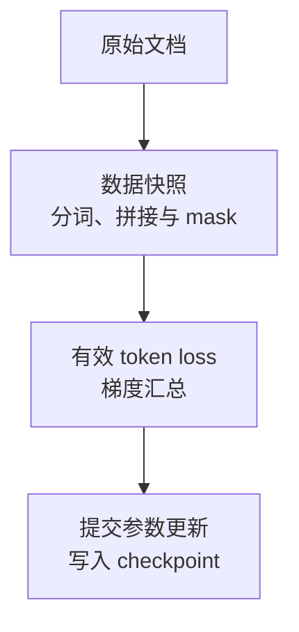

# 预训练：从下一个 Token 到一场可以恢复的训练

<!-- learning-contract -->
<div class="learning-contract" markdown="1">

**学习导航**

- **适合读者**：想理解预训练目标、数据系统、计算预算和 checkpoint 的工程师。
- **先修**：[Transformer](../core/transformer.md)、tokenization、loss 与梯度基础。
- **首次阅读**：跟着一次训练故障，依次检查样本、loss、参数更新和断点恢复。
- **完成信号**：能写出有效 token 口径，并说明 checkpoint 必须恢复哪些状态。
- **卡住时**：先回到[机器学习与深度学习](../foundations/ml-dl.md)的训练闭环。

</div>

假设一个小型 decoder-only（仅解码器）模型已经完成 20,000 次参数更新。下一批数据进入后，loss 突然变成
`NaN`。你从最近的 checkpoint（训练断点）恢复，曲线却没有回到原来的轨迹。

先别急着调学习率。我们需要回答三个更具体的问题：是哪条样本、哪个 target token 先产生了异常？第 20,000 次
更新究竟有没有完整提交？恢复时，模型、优化器和数据读取位置是否来自同一个时刻？

本章就沿着这次示意故障追踪一条样本。它不是一次真实训练的性能记录，而是一张用来理解预训练系统的地图：



沿途只要有一个身份或计数没有记录，`NaN` 和恢复分叉就可能变成无法重现的偶发故障。

## 一条 Token 序列在优化什么 {#token_1}

先看异常批次中的一条序列。对 \(x_{1:T}\)，仅解码器模型把联合概率分解为：

\[
p_\theta(x_{1:T})=\prod_{t=1}^{T}p_\theta(x_t\mid x_{<t}).
\]

带 mask 的平均负对数似然是：

\[
\mathcal L(\theta)=
-\frac{\sum_{i,t}m_{i,t}\log p_\theta(x_{i,t}\mid x_{i,<t})}
{\sum_{i,t}m_{i,t}},
\qquad m_{i,t}\in\{0,1\}.
\]

分母是实际参与训练的目标 token 数。Padding，以及训练协议明确忽略的位置，都不进入分子或分母。按固定的
`batch × max_length` 平均，会让 padding 比例悄悄改变梯度尺度。

训练使用 teacher forcing（教师强制）：整条真实序列已经给出。因果 mask 仍阻止位置看到未来，但各位置的 logits
可以并行计算。生成时没有未来的真实 token，只能把刚生成的结果送入下一步。

这个目标直接奖励“提高训练分布中下一个 token 的概率”。事实时效、工具授权和用户任务成功需要另外的数据或
训练目标。

### 用四个 Token 检查标签错位 {#token-shift}

设一条序列为：

```text
[BOS, A, B, EOS]
```

常见训练对齐是：

```text
input : BOS  A    B
target: A    B    EOS
```

有些模型在 loss 函数内部完成错位，有些数据整理器会提前处理。两处同时做，标签就会再错开一位。正式训练前，
用这个微型序列打印输入 ID、目标 ID 和参与 loss 的位置，确认 BOS、EOS、padding 与忽略标记的实际处理。

### 序列拼接要同时控制“能看谁”和“哪些位置计分” {#packing-visibility-loss}

把多个短文档放进一个窗口可以减少 padding，这叫 packing（序列拼接）。接下来要分别决定两件事：

- 文档之间是否允许互相读取。需要隔离时，使用分块对角或 document-aware attention mask；
- 哪些位置参与计分。这由 loss mask 决定，例如是否训练跨文档边界的下一个 token。

前者控制“能看谁”，后者控制“哪些位置计分”，不能互相替代。Position ID、EOS 与边界 token 的语义也要写进同一份
拼接协议。回到故障现场，我们因此要保存异常样本的文档边界和两种 mask，而不只是最终 token IDs。

## 数据系统先回答“这条 Token 从哪里来”

确认 shift 和 mask 后，我们还要追回异常 token 的来源。训练 shard（分片）只是加工后的产物，至少应能沿元数据找到：

```text
source ID / URI / snapshot time
license or usage basis / consent / retention
language / domain / quality / risk labels
raw + normalized hash / parser revision
PII-secret findings / deletion lineage
split + shard assignment
tokenizer ID + revision
```

若 token 分片无法追回原始来源，团队就很难处理删除请求、许可审计、评测集污染和解析器勘误。

过滤器会改变数据分布。语言识别可能误删代码混排和低资源语言，质量模型可能偏好主流写作风格，过强的安全过滤
还会删除研究危险行为所需的负样本。每条规则都应记录输入量、删除量、抽样复核结果和已知偏差。

### 去重与污染分四层看

| 层级 | 例子 |
|---|---|
| Exact duplicate | 完全相同字节或规范化文本 |
| Near duplicate | 模板页、转载、轻微改写 |
| Semantic overlap | 答案、摘要、翻译或解释泄露评测题 |
| Source-group leakage | 同一文档的不同切片跨 train/test |

污染检测会有漏报和误报。更可信的做法是同时保留时间切片、私有评测、扰动题与过程记录，而不是宣称“模型从未
见过任何等价内容”。

## 数据混合就是训练目标的一部分

找到样本来源后，还要判断它为什么在这一步出现。设数据域 \(d\) 有 \(n_d\) 个可用 token，一种温度式采样权重是：

\[
q_d=\frac{n_d^\alpha}{\sum_j n_j^\alpha},
\qquad 0\le\alpha\le1.
\]

当 `alpha=1` 时，采样接近各域原有的 token 比例。减小 `alpha` 会提高小域的相对权重，同时增加重复采样和过拟合
风险。这个参数应由目标分布和小规模实验决定，没有跨项目通用的最佳值。

例如，“代码占 20%”可能指原始字节、文档数、分词后的 token 数、batch 槽位或 loss 权重。这些口径会产生不同的
训练分布。真正更新参数的是参与 loss 的有效 token 及其梯度，因此运行记录必须写明使用哪一种口径。

训练中途改变数据配比，相当于改变目标分布。课程学习或后期加入高质量数据可能有价值，但要记录切换发生在哪个
token 或 update、切换前后的权重、数据快照和变化计划。否则 loss 跳变看起来会和数值故障一样。

## 用有效 Token 描述进度

数据取样完成后，一个 optimizer update（优化器更新）处理的近似有效 token 数是：

\[
N_{update}=B_{micro}\times A\times D_{data}\times T_{effective}.
\]

公式中的四项分别是：

- \(B_{micro}\)：每张卡上一个微批次的样本数；
- \(A\)：梯度累积次数；
- \(D_{data}\)：数据并行副本数；
- \(T_{effective}\)：每个样本平均参与 loss 的目标 token 数。

张量并行、流水线并行和专家并行没有读取新的独立样本，不能再次乘入 global batch（全局批量）。

大规模混合语料不一定有自然的 epoch（完整遍历）。相比“训练了三轮”，已消费的有效 token、优化器更新次数和
各数据域的实际曝光量更容易复核。

## 变长序列怎样保持每个 Token 同权 {#token-mean}

现在看故障批次怎样汇总 loss。在一个更新窗口内，第 \(i\) 个微批次的 loss 总和为 \(S_i\)，有效 token 数为
\(n_i\)。如果每个 token 权重相同，那么整个更新窗口的 loss 是：

\[
L=\frac{\sum_i S_i}{\sum_i n_i}.
\]

用数字看更直观。假设两个微批次分别得到：

| 微批次 | Loss 总和 | 有效 token 数 | 批内平均 loss |
|---|---:|---:|---:|
| A | 12 | 6 | 2.0 |
| B | 2 | 2 | 1.0 |

把两个批内平均值再次平均会得到 1.5；按 token 汇总则是 \((12+2)/(6+2)=1.75\)。前者给短批次中的 token 更大
权重。实现时应在整个更新窗口保留 loss 总和与 token 计数，得到全局计数后再缩放梯度，随后依次执行裁剪、优化器
更新和学习率更新。

DistributedDataParallel（DDP）默认对各 rank 的梯度求平均，因此缩放时还要考虑数据并行进程数。使用自动混合精度
时，应先把梯度恢复到真实尺度，再做全局范数裁剪。任何一个 rank 发现 `NaN` 或 `Inf`，所有 rank 都必须对“是否
提交这次优化器与学习率更新”作出同一个决定。

仓库提供四个逐层推进的小实验：

| 实验 | 回答的问题 |
|---|---|
| `gradient_accumulation_toy.py` | Batch mean 与 token mean 是否给出同一梯度 |
| `ddp_token_mean_control.py` | DDP rank mean 下 world-size 怎样进入缩放 |
| `ddp_accumulation_no_sync_control.py` | `no_sync`、clip 与一步 update 是否对账 |
| `ddp_amp_overflow_consensus_control.py` | 一个 rank overflow 时所有 rank 是否共同 skip |

精确 tensors、fractions 和负例放在[分布式训练](../systems/distributed-training.md#global-batch-loss-normalization)。
这些小型 CPU 实验只检查局部机制；大型预训练是否收敛、GPU 吞吐如何，仍需目标训练任务回答。

## \(6ND\) 能估什么，不能估什么

排查完一次参数更新，还需要估算整场训练的成本。对 \(N\) 个稠密、非 embedding 参数和 \(D\) 个训练 token，
常用的粗略估算是：

\[
C_{train}\approx6ND.
\]

直觉上，主要矩阵乘法的前向约为 \(2ND\)。反向需要对输入和权重求梯度，又付出约两倍前向的计算。

这个近似省略或粗化了许多成本，包括 attention 随长度变化的计算、embedding 与输出头、activation、归一化、
重计算、padding、通信和算子效率。

对 MoE，还要区分总参数和每个 token 实际激活的参数，并计入路由与 all-to-all 通信；长上下文下也不能忽略
attention FLOPs。\(6ND\) 只给出计算量级，不能直接换算 GPU 用时、费用或能耗。

## Scaling law 应从小型试验里学

Scaling law（缩放规律）研究发现：在固定模型族、数据和训练范围内，loss 往往会随参数量、数据量和计算量呈现
可拟合的趋势。分词器、数据质量、重复率、模型架构或优化器一旦变化，曲线也可能随之变化。

因此应先运行多组小规模试验，并保持训练与验证协议一致。用这些结果拟合本项目的曲线和不确定性，再决定模型与
数据预算。论文中的 compute-optimal ratio（计算最优配比）不能直接套到另一种模型、数据和目标任务上。

## 初始化冒烟测试看哪些信号

训练前向能跑通还不够。初始化需要让 activation 与 gradient 在深度上保持可用尺度。核对：

- Pre-Norm 或 Post-Norm、RMSNorm 或 LayerNorm，以及 epsilon；
- attention score 是否按 head dimension 正确缩放；
- residual projection（残差投影）的初始化；
- 共享权重的 embedding 与 LM head 是否真的指向同一份存储；
- RoPE、位置配置和新增词表行是否一致；
- 参数、计算、归约和优化器状态分别使用什么 dtype。

用一个固定 batch 记录每层 activation（激活值）的均方根与最大值、logits 分布、初始 loss、梯度范数和非有限数。
如果某层从第一步就爆炸，应先修初始化或数值路径。梯度裁剪只能限制更新幅度，无法消除已经失真的激活值。

## AdamW、Warmup 与更新频率

Adam 的 moments：

\[
m_t=\beta_1m_{t-1}+(1-\beta_1)g_t,
\qquad
v_t=\beta_2v_{t-1}+(1-\beta_2)g_t^2.
\]

偏差修正后，AdamW 的简化更新是：

\[
\theta_{t+1}=\theta_t
-\eta_t\frac{\hat m_t}{\sqrt{\hat v_t}+\epsilon}
-\eta_t\lambda\theta_t.
\]

不同实现可能采用不同的 epsilon 放置方式、moment dtype、主权重、权重衰减 mask 和融合算子。这些选择都会影响
复现，应写进训练配置。Warmup（预热）在随机初始化和动量尚不稳定时逐步增加学习率，之后再按余弦或线性计划衰减。

增大全局批量通常会降低梯度噪声，同时减少固定 token 预算下的更新次数。“Batch 加倍，学习率也线性加倍”只在
有限范围内是经验近似，需要用稳定性和最终质量验证。

全局 norm clipping：

\[
g'=g\min\left(1,\frac{c}{\lVert g\rVert_2+\epsilon}\right).
\]

梯度裁剪可以限制一次尖峰，却无法修复长期错标签或数值溢出。若大多数更新都触发裁剪，应调查数据、学习率、
loss scaling 和具体实现，而不是把平滑的裁剪后曲线当作训练健康的证据。

## 数值稳定要和数据、系统一起监控

BF16 的指数范围与 FP32 相同，通常比 FP16 更不容易溢出。FP16 训练常在反向传播前放大 loss，并在更新前还原梯度，
以减少小梯度下溢。混合精度也不表示所有状态都使用同一种数据类型；例如，优化器状态常保留更高精度。

| 层级 | 需要记录 | 常见问题 |
|---|---|---|
| Loss | Global + domain/language/length slices | 坏 batch、mask/shift、mix change |
| Gradient | Global/per-layer norm、clip rate、non-finite | LR、overflow、communication |
| Activation | RMS、max、NaN/Inf | Init、norm、residual、precision |
| Optimizer | Update/weight norm、moments、scale | Epsilon、decay、resume state |
| Data | Source/shard、有效 tokens、重复率 | Sampler、iterator、filter drift |
| System | Step time、throughput、collective、retry | Network、storage、thermal throttling |

全局平均 loss 可能掩盖一个小语言或高风险域已经崩溃。保留 batch/sample IDs，异常时才能重放具体输入。

## 训练中断后到底从哪里继续 {#crash}

回到开头的故障。即使已经定位并排除了产生 `NaN` 的输入，恢复训练仍然可能分叉，因为 checkpoint 需要保存的远不止
模型参数：

完整 checkpoint 至少包含：

```text
model parameters
optimizer moments / master weights / GradScaler
scheduler + global step + consumed/committed effective tokens
all relevant RNG streams
data shard / permutation / iterator / shuffle-buffer position
parallel topology + sharding metadata
model / tokenizer / data / config / code identities
```

这里最容易混淆三种进度：

1. Sampler（采样器）已经发出了哪些样本索引；
2. 主训练循环已经读取了哪些样本；
3. 哪些样本的梯度已经包含在成功提交的参数更新中。

多 worker 预取会让第一项领先第二项，梯度累积又会让第二项领先第三项。只保存采样器的游标，恢复后就可能跳过
已经预取但尚未训练的样本；只保存主循环位置，则可能丢掉尚未提交的半个累积窗口。

恢复协议可以选择：

1. 只在 zero-grad/optimizer-committed boundary 保存，恢复后重放尚未提交 samples；
2. 保存半窗口 gradients、position、divisor 与 crash-time RNG，再从 consumed cursor 继续。

两种协议都要把模型、优化器、学习率计划、随机数状态和数据位置绑定到同一个 checkpoint 身份。最后写 manifest
可以标记文件集已经齐全，但还要根据存储系统处理目录原子发布、`fsync`、远程对象写入与来源认证。

仓库的恢复实验分别演示：

- 漏 Scheduler/GradScaler/RNG/data state 会怎样分叉；
- DataLoader 从 emitted cursor 恢复会漏掉预取队列中的样本；
- 恢复正确 RNG 却漏掉半窗口 gradients，step 数相同也会得到不同参数；
- 保存 gradients 但使用错误 RNG，同样无法 exact replay。

运行方法与具体结果见[Single-GPU Finetuning 恢复实验](../practice/projects/single-gpu-finetuning.md#controls)。
这些都是小型 CPU 故障注入；跨节点预训练 checkpoint 需要在目标集群上重新验收。

### 怎样做恢复等价性测试

在小规模上比较：

1. 不间断运行 \(K+M\) 次更新；
2. 运行 \(K\) 次更新，写盘并终止进程；
3. 新进程加载后再运行 \(M\) 次更新；
4. 比较 batch IDs、LR、loss、parameters、optimizer state 和下一随机数。

不同硬件或 collective（集合通信）可能改变浮点运算顺序，因此不一定能逐 bit 相等。测试前应先定义允许误差和已知
来源。只比较恢复后的第一条生成文本远远不够，因为优化器状态或数据游标已经漂移时，文本仍可能碰巧相同。

## 长上下文课程会改变训练分布

先用短序列、再逐步加长可以节省 attention 计算，但也会改变位置分布、拼接方式和每次更新的 token 数。最终模型
要在目标长度上看到足够的训练 token。

评测时至少分开观察以下能力：证据出现在不同位置时能否利用；能否完成跨段多跳与全局聚合；遇到冲突版本时如何
选择；长输出约束是否稳定；短上下文能力是否回归。这样才不会让一个平均分掩盖长度能力退化。

只增大 `max_position_embeddings` 不代表模型学会利用长上下文。RoPE scaling、继续训练数据和 runtime kernel 是三层
不同工作。

## 继续预训练与领域适配

Domain-Adaptive Pretraining（DAPT，领域继续预训练）使用领域内无标注文本继续做 next-token training，适合调整术语、
文体和领域分布。它同时可能带来通用能力退化、灾难性遗忘、重复记忆和对话行为漂移。

至少比较：

1. 原 base + Prompt/RAG；
2. 纯领域继续训练；
3. 领域 + 通用 replay 的多种比例；
4. 不同 LR/token budget；
5. 领域、通用、安全与记忆 slices。

更换 tokenizer 会破坏旧 token ID 与 embedding、LM head 的对应关系。扩词表时应保留旧 ID，初始化新增的权重行，
确认共享输出头是否参与训练，并用包含足够新 token 的数据验证。分词器因此属于模型身份的一部分，不是可以随意
替换的前处理组件。

## 投入大规模计算前的七道门

1. 单 batch forward：Shape、mask、initial loss；
2. 单 batch overfit：模型与 labels 能对齐；
3. 小数据多 batch：Sampler 与 validation 不泄漏；
4. Save/resume：Optimizer、RNG、data position 能恢复；
5. 单卡/多卡对账：Global batch 与 reduction 相同；
6. 故障注入：Bad batch、NaN、partial checkpoint 与 worker restart；
7. 目标规模 pilot：Throughput、memory、communication 与 cost extrapolation。

走完这七道门，我们才能回答开头的三个问题：异常样本可以从 token 追溯到原始来源；参数更新以有效 token 为口径
完成对账；恢复则从最后一次完整提交的边界继续，并把模型、优化器、随机数和数据位置一起还原。

本仓库的 JAX/Optax 与 PyTorch tiny GPT 实验覆盖了其中一部分 CPU 机制，没有提供大规模集群预训练结果。文中的
FLOPs、显存和缩放关系都是带假设的估算，应在目标硬件和真实数据上重新测量。

## 自测

1. Teacher forcing 为什么允许并行训练，而生成仍需逐 token decode？
2. Packing 中 attention mask 与 loss mask 分别阻止什么泄漏？
3. 为什么 `examples × max_length` 会高估有效训练 tokens？
4. \(6ND\) 在 MoE 和长上下文场景下遗漏哪些主要项？
5. 一个 sample 已 consumed、但 optimizer update 未 committed 时，checkpoint 有哪两种恢复策略？
6. Loss 下降而下游退化时，怎样从数据、数值和系统三层定位？
