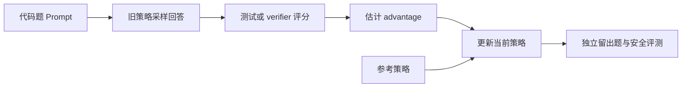

# LLM 强化学习：从 Policy Gradient 到 GRPO 与 RLVR

<!-- learning-contract -->

**学习导航**

- **适合读者**：需要理解或评审 LLM post-training、online RL 和 verifiable reward 的开发者与算法工程师。
- **先修**：[数学基础](../foundations/math.md)中的概率与梯度、[生成](../core/generation.md)和[对齐入门](alignment-basics.md)。
- **首次阅读**：跟随一道代码题，观察候选回答怎样被采样、评分、分配 credit，再进入 PPO、GRPO 与 RLVR。
- **完成信号**：能解释一个 verifier 分数怎样改变回答概率，并指出采样策略、优势估计和独立验收各自解决什么问题。
- **卡住时**：先运行本章的三动作 bandit，再回到[对齐完整章节](alignment.md)看 SFT、RM 和 DPO 数据流。

强化学习（Reinforcement Learning，RL）不会直接告诉模型“正确答案应该写什么”。它先让当前策略生成回答，
再根据结果调整这些回答被再次生成的概率。采样、评分和更新因此形成一个循环，训练数据也会随模型改变。

本章用一道代码题贯穿这个循环。假设 Prompt 要求实现一个带边界条件的函数，模型可能给出三种完整回答：

| 候选回答 | 测试现象 | 教学 reward |
|---|---|---:|
| A | 接口或语法错误 | 0 |
| B | 普通样例通过，边界条件失败 | 1 |
| C | 当前测试全部通过 | 4 |

这里的 0、1、4 是为了讲公式而设定的分数。仓库脚本只枚举三个抽象动作，并没有真的调用语言模型或运行代码测试。
后文会专门讨论：即使 C 通过当前测试，也不代表代码已经满足所有真实需求。

一次训练迭代可以先画成：

接下来先把完整回答看成一个动作，手算概率怎样变化；然后再把回答展开成 token 序列，加入延迟 reward、
value、PPO 和组内相对优势。这样每个术语都会对应到上图中的一个具体问题。

## 1. 先把一个完整回答当成一次选择

最简单的版本只选择一次：看到代码题 \(x\) 后，策略从 A、B、C 中选一个完整回答 \(a\)，
测试程序返回分数 \(r(x,a)\)。这种没有后续状态转移的问题叫 contextual bandit（带上下文老虎机）：

\[
J(\theta)=\mathbb E_{a\sim\pi_\theta(\cdot\mid x)}[r(x,a)].
\]

仓库样例使用 logits `[-0.4, 0.1, 0.3]`。经过 softmax 后，三个回答的概率约为 0.214、0.354 和 0.432。
因为这里只存在三个动作，可以直接枚举期望 reward：

\[
J=\sum_i p_i r_i.
\]

代入 0、1、4 后，当前期望 reward 约为 2.081。对每个 logit 的导数是：

\[
\frac{\partial J}{\partial z_j}=p_j(r_j-J).
\]

C 的 reward 高于当前期望，因此它的梯度为正；A 和 B 低于期望，梯度为负。沿梯度上升一步，
策略会提高 C 的相对概率。这个有限问题让我们先核对方向和数值，再处理无法枚举全部回答的真实 LLM。

## 2. 真实训练只能看到采样到的回答

利用恒等式 \(\nabla_\theta \pi=\pi\nabla_\theta\log\pi\)：

\[
\nabla_\theta J
=\mathbb E_{a\sim\pi_\theta}
\left[r(x,a)\nabla_\theta\log\pi_\theta(a\mid x)\right].
\]

真实 LLM 的完整回答太多，无法像上面那样全部枚举。训练只能采样若干回答，用
\(r\nabla\log\pi(a\mid x)\) 估计梯度。这个写法称为 score-function estimator，序列任务中的经典形式常称 REINFORCE。

测试分数本身可以来自不可微的编译器、单元测试或模拟器。梯度作用在“模型给采样回答分配了多少概率”上，
并没有穿过测试程序，也没有对离散采样直接求导。

### 2.1 为什么要减去 baseline

可减去不依赖当前 sampled action 的 baseline \(b(x)\)：

\[
\mathbb E[(r-b)\nabla\log\pi]
=\mathbb E[r\nabla\log\pi]
-b\nabla\sum_a\pi(a)
=\nabla J.
\]

baseline 可以理解成“这道题通常能拿多少分”。若采样到 C，reward 高于 baseline，就提高它的概率；
若采样到 A，则降低它的概率。baseline 可以依赖题目或当前状态，但不能根据本次选中的回答随意改值。

只要 baseline 与当前采样动作无关，上式最后一项为零，因此梯度期望保持不变。合适的 baseline 会降低采样方差。
常用的 \(V(s)\) 估计预期 return，但它未必是梯度向量总方差意义下的最优常数；最优值还取决于各动作的 score-gradient 范数。

### 2.2 先在三个动作上把公式对准

运行：

~~~powershell
python projects/single-gpu-finetuning/policy_gradient_toy.py
python -m pytest tests/test_policy_gradient.py -q
~~~

脚本枚举全部三个动作，因此结果不会受有限次随机采样影响。使用上面的 logits 和 rewards 时：

- exact expected reward 约为 2.081241；
- exact gradient 约为 [-0.446381, -0.382343, 0.828724]；
- baseline 为 0、期望 reward 或最小方差常数时，估计器的期望相同；
- 三种设置的总方差约为 2.609983、0.884520 和 0.784108。

测试还用中心有限差分独立核对精确梯度。这个 CPU 实验只证明公式实现与当前定义一致。
它没有运行语言模型、代码环境或随机采样，因此无法说明训练是否稳定，也无法说明这套 reward 是否代表真实代码质量。

## 3. 把完整回答展开成 token 序列

上面的 bandit 一次选完整回答。语言模型实际是逐 token 生成：当前前缀决定下一步分布，新 token 又成为下一步状态的一部分。
这时问题可以写成 Markov Decision Process（MDP，马尔可夫决策过程）：

- 状态 \(s_t\)：代码题、已经生成的前缀和当前可见环境信息；
- 动作 \(a_t\)：从 \(\pi_\theta(\cdot\mid s_t)\) 采样的下一个 token；
- 转移：把新 token 加入前缀，或执行工具后取得新的环境状态；
- reward \(r_t\)：当前步骤收到的反馈；
- return \(G_t=\sum_{k\ge0}\gamma^k r_{t+k}\)：从当前步骤开始的折扣回报。

对于代码题，测试分数通常到回答结束后才出现。前面许多 token 的即时 reward 都是 0，最后执行测试才得到 0、1 或 4。
如果模型还会调用编译器或工具，状态就要包括可信工具结果、权限和剩余预算，不能只保存文本前缀。

“Markov”要求当前状态包含预测未来所需的信息。现实系统经常只能观察到一部分环境，因而更接近 POMDP（部分可观测 MDP）。
历史记录、belief state（信念状态）或外部记忆可以帮助估计状态，却不会让缺失的业务事实自动出现。

### 3.1 Terminated 与 truncated

代码已经提交并完成判定时，轨迹真正结束，称为 **terminated**，后续 value 为 0。
如果回答只是因为最大长度、超时或采集预算而停止，则称为 **truncated**。此时任务也许仍有后续价值，
是否使用下一状态的 value 需要由采集协议明确决定。

无论是哪种停止方式，下一条样本都不能接到这条轨迹的 GAE 递推中。把“长度用完”误写成“任务成功结束”，
会扭曲长回答和工具任务的 value 目标。

## 4. 最后的测试分数应该归给哪些 token

候选 C 最后得到 4 分，但这 4 分由哪些 token 贡献？函数签名、边界判断和返回值显然比空格更重要，
终局 reward 本身却没有提供这种解释。这就是 credit assignment（信用分配）问题。

先定义三个量：

\[
V^\pi(s)=\mathbb E[G_t\mid s_t=s],
\quad
Q^\pi(s,a)=\mathbb E[G_t\mid s_t=s,a_t=a],
\quad
A^\pi(s,a)=Q^\pi(s,a)-V^\pi(s).
\]

\(V^\pi(s)\) 表示从当前状态继续时通常能得到多少回报，\(Q^\pi(s,a)\) 表示先选动作 \(a\) 后通常能得到多少。
二者之差 \(A^\pi(s,a)\) 是 advantage（优势）：这个 token 相对当前策略的平均选择好多少。

最直接的做法是把终局分数作为整条回答中每个 token 的 Monte Carlo return（蒙特卡洛回报）。
这种估计有效，但方差通常很大。

加入价值模型、逐步奖励或逐 token KL 会改变信用的分配方式，同时也引入新的预测误差和攻击面。

## 5. Actor–critic、TD 与 GAE

Actor 是生成回答的策略，critic 负责估计 value。一步 TD residual（时序差分残差）为：

\[
\delta_t=r_t+\gamma b_tV(s_{t+1})-V(s_t),
\]

其中 \(b_t\) 控制当前步骤是否使用下一状态的 value。Generalized Advantage Estimation（GAE，广义优势估计）继续递推：

\[
A_t=\delta_t+\gamma\lambda c_t A_{t+1},
\]

\(c_t\) 在轨迹边界和补齐位置为 0，防止信用穿过样本边界。
较小的 \(\lambda\) 更依赖价值估计，通常方差较低、偏差可能较大。
较大的 \(\lambda\) 更接近使用完整回报的蒙特卡洛估计。

运行现有 NumPy 对照示例：

~~~powershell
python projects/single-gpu-finetuning/ppo_objective_toy.py
python -m pytest tests/test_ppo_objectives.py -q
~~~

样例中的两步轨迹得到 TD residual `[-0.275, 0.75]`，GAE advantage 为 `[0.265, 0.75]`；
第三个 padding 位置始终为 0。另一个截断样例在启用 bootstrap 时 advantage 为 2.3，关闭时为 0.5，
而递推都不会跨进下一条轨迹。

这些数字验证 GAE、终止/截断和 padding 的实现。脚本没有运行 rollout engine 或语言模型，也没有验证 critic 是否准确。

## 6. 保存回答文本，还不等于保存了训练数据身份

PPO 等 on-policy（同策略）方法使用当前策略或一个受控旧版本采集回答。
每轮更新后，策略分布已经变化，旧回答也不再代表当前分布。

采集候选 C 时，至少保存以下信息：

| 数据 | 用途 |
|---|---|
| 每个有效 token 当时的 log probability | 计算新旧策略概率比 |
| Prompt、模板和 token IDs | 重建模型实际看到的序列 |
| 采样配置与 mask | 确认哪些动作来自模型并进入目标 |

off-policy 方法可以复用其他行为策略产生的数据，但需要重要性权重、value learning 或相应校正假设。
如果采集时没有保存行为策略和概率，事后重新 tokenize 一段文本无法恢复它当时被采样的概率。

SFT 样本和固定偏好对属于离线数据；PPO rollout 则来自不断更新的在线策略。两者的数据身份和可用公式不同。

## 7. PPO 为什么同时保留三个策略

候选 C 被采样后，PPO 会同时用到三个不同角色：

| 角色 | 在代码题中的作用 | 是否随这一小轮梯度更新 |
|---|---|---:|
| old policy \(\pi_{old}\) | 记录候选 C 是由什么分布采样出来的 | 否，下一轮采集时刷新 |
| current policy \(\pi_\theta\) | 正在提高或降低各 token 概率 | 是 |
| reference policy \(\pi_{ref}\) | 衡量当前行为偏离初始模型多远 | 通常冻结 |

三者即使源自同一个基础模型，也不是同一份训练状态。old policy 用于修正“数据由旧分布采集”这一事实，
reference policy 通常用于 KL 正则，限制模型远离初始行为。

Clipped surrogate 为：

\[
L^{clip}=\mathbb E_t\left[
\min(\rho_tA_t,\operatorname{clip}(\rho_t,1-\epsilon,1+\epsilon)A_t)
\right],
\qquad
\rho_t=\exp(\log\pi_\theta-\log\pi_{old}).
\]

\(\rho_t\) 比较当前策略与旧策略对这次采样 token 的概率。
优势为正时，PPO 限制概率上升带来的收益；优势为负时，则限制概率过度下降带来的收益。

仓库样例使用 ratios `[1.5, 0.5, 1.0]` 和 advantages `[1, -1, 1]`。当 \(\epsilon=0.2\) 时，
参与目标的 ratios 变成 `[1.2, 0.8, 1.0]`，三个 token 中有两个触发 clipping。

clipping 只作用在采样到的动作上。反例中，一个采样动作的 ratio 仍为 1、近似 KL 为 0，
完整三动作分布的 forward KL 却约为 11.76。因此 PPO clip 不是对整个输出分布的硬性 KL 约束。

## 8. GRPO：让同一道题的候选彼此比较

另一种做法是对同一道代码题一次采样多份回答，再比较组内分数。Group Relative Policy Optimization（GRPO）
类方法常用下面的教学形式构造相对 advantage：

\[
A_i=\frac{r_i-\bar r}{\sqrt{\operatorname{Var}(r)}+\epsilon}.
\]

在仓库样例中，四个候选的 rewards 是 `[0, 1, 4, 4]`。组内均值为 2.25，标准差约为 1.785，
对应 advantages 约为 `[-1.260, -0.700, 0.980, 0.980]`。高于组内平均的两个候选得到正信号。

如果四个候选都是 2 分，组内没有优劣信息，advantage 就应全为 0。给分母加 \(\epsilon\) 是为了数值稳定，
不应凭空制造训练信号。

组内比较省去了独立 value model，却仍要面对几个问题：样本少时均值与标准差噪声大；候选重复时有效样本量下降；
只有终局分数时，同一个 advantage 仍会作用在一长串 token 上。reward 的尺度、标准差定义、长度归一化、KL 和多轮更新方式也都会改变目标。

因此“使用 GRPO”还不是可复现描述。实验记录必须给出实际公式、mask、采样组构造和代码版本。

## 9. RLVR：测试程序能评分什么，模型就会优化什么

RLVR（可验证奖励强化学习）使用程序给出 reward，例如数学答案检查、代码测试或模拟器终态。
代码题正是一个典型场景；JSON 任务也可以检查输出是否符合 schema。

只检查最终答案的组件称为 outcome verifier；它容易自动化，但信号比较稀疏。
若系统还评价推理或执行过程中的中间状态，就属于 process reward。信号更密并不等于更可靠，
因为同一道题可能存在多条合法路径，中间步骤的标签本身也可能出错。

再看候选 C。“当前测试全部通过”仍可能来自以下捷径：

- 只为公开样例硬编码返回值；
- 利用答案解析器的宽松规则；
- 让测试超时被误记为通过；
- 读取残留环境状态或意外泄漏的隐藏测试信息。

所以训练 reward 要与独立任务成功率分开报告。采样 \(N\) 个候选时，至少区分三件事：

| 指标 | 它实际回答什么 |
|---|---|
| Oracle@N | \(N\) 个候选里是否至少存在一个真正正确的答案，是理想选择器的上限 |
| verifier-selected@N | 验证器实际挑中的答案是否通过独立验收 |
| proxy reward | 训练时使用的测试或模型给了多少分 |

候选集合里出现正确答案的概率可能随 \(N\) 上升，而实际选择质量反而下降：样本越多，越容易遇到一个专门利用 verifier 漏洞的高分答案。

## 10. 不是所有后训练方法都需要在线 RL

先看反馈以什么形式存在，再选算法：

| 已有反馈 | 常见起点 | 是否需要当前策略在线采样 |
|---|---|---:|
| 每道题有一份理想回答 | SFT，直接学习示范 | 否 |
| 每道题有 chosen/rejected 偏好对 | DPO、IPO、SimPO 等离线偏好目标 | 否 |
| 同时有理想回答和偏好对 | ORPO 等联合目标 | 否 |
| 只有 desirable/undesirable 单条反馈 | KTO 等非成对目标 | 否 |
| 有可复用 reward model 和交互环境 | RM + PPO | 是 |
| 当前回答可以由测试或模拟器评分 | RLVR、GRPO 类路线 | 是 |

例如，若代码题已经有人写好高质量参考实现，SFT 就能学习基本形式；若只有 A 优于 B 的固定标注，
离线偏好优化可以直接使用这些数据。只有当测试结果取决于当前策略实际生成了什么，在线采样才提供新的训练信息。

算法名仍不足以复现实验。还要核对是否使用 reference policy、loss 怎样归一化、偏好数据怎样产生、
长度怎样计权，以及 KL 放在 reward 还是 loss 中。

## 11. 为什么 reward 越高，真实结果反而可能越差

策略会寻找最容易提高 reward 的行为，而不是自动理解设计者的真实意图。当代理指标成为优化目标后，
它与真实目标原有的相关性可能失效，这是一类 Goodhart failure。

采样或搜索越多，越容易找到被 verifier 高估的异常答案，这称为 optimizer's curse（优化者诅咒）。

发布报告要分别保存候选集合命中率、最终选择成功率和代理 reward。
还要报告分布外与对抗切片，以及模型调用次数、token、费用和尾延迟。

训练 reward 曲线适合诊断优化过程。最终能力仍要由未参与训练的题目、安全样本和独立验收程序决定。

## 12. 一条回答进入 loss 前，先把 mask 打印出来

一条训练样本可能包含 Prompt、模型回答、padding、EOS，以及工具或环境返回的 token。它们的用途不同：

| 位置 | 通常怎样处理 | 必须确认什么 |
|---|---|---|
| Prompt | 提供上下文，不更新其采样动作 | policy mask 是否为 0 |
| 模型回答 | 计算策略概率和 advantage | EOS 与截断位置是否一致 |
| padding | 只用于对齐 batch | 所有 loss 与统计是否排除 |
| 工具/环境返回 | 作为观察，而非模型动作 | 是否被误计入 policy loss |

分母同样会改变训练目标。按 token 平均会让长回答拥有更多项；按序列平均或按 Prompt 组平均则采用不同权重。
无效回答、截断和 verifier 错误是否保留在“尝试过的任务”分母中，也要预先规定。

在扩大 batch 前，先把一条轨迹完整打印出来：

- token IDs，以及每个位置属于哪一类 mask；
- 当前、旧版和参考策略给出的 log probabilities；
- reward、advantage 与 return。

只看最终 loss 数字，很难发现错一位的 mask。

## 13. 方法选择

| 现有证据 | 推荐起点 |
|---|---|
| 有可靠示范，基础行为还不稳定 | 先做 SFT，让模型学会基本输出形式 |
| 有固定偏好对，不需要在线探索 | 使用 DPO 类离线目标 |
| 有可复用的偏好评分器 | 先训练并审计 reward model，再决定是否上线 RL |
| 环境反馈取决于策略实际行为 | 考虑 PPO 或其他在线 RL |
| 有高精度程序 verifier 和足够多可解题目 | 考虑 RLVR/GRPO 路线，同时保留人工与安全切片 |
| 问题来自权限、实时事实或副作用可靠性 | 优先修复 RAG、工具和运行时策略 |

回到代码题：如果模型连函数签名都无法稳定生成，先补 SFT 数据；如果它已经会写代码，
但必须通过实际执行才能发现边界错误，在线环境反馈才可能带来额外价值。
若瓶颈来自错误测试或答案泄漏，引入更复杂的 RL 只会更快地优化错误目标。

## 14. 怎样一步步证明实现可信

1. **核对公式**：枚举有限动作，用有限差分和手算检查梯度、mask 与边界；
2. **更新小策略**：确认优化目标提高时，策略行为确实朝预期方向变化；
3. **运行小模型**：固定 tokenizer 和 checkpoint，保存采样、概率与完整训练状态；
4. **留出评测**：检查真实任务、安全、长度、reward 捷径和 verifier 分布外行为；
5. **系统评测**：测量吞吐、失败、取消、费用、回滚和事件响应；
6. **目标环境**：观察真实用户结果，并接受独立安全审阅。

本仓库已经执行了前三步中的部分内容：三动作精确梯度、GAE/PPO 目标，以及小型文本或 Transformer 策略更新。
它尚未运行目标大模型 RLVR、真实 PRM、分布式 rollout 或线上用户实验，所以这些生产结论仍需目标环境证据。

## 15. 把常见误解放回代码题

- **“测试不可微，所以无法训练”**：梯度来自模型对采样回答的 log probability，测试程序只需要返回分数。
- **“减去 baseline 会改变优化方向”**：与当前动作无关的 baseline 保持梯度期望不变，主要改变方差。
- **“PPO clip 已经限制整个模型分布”**：它只裁剪采样动作在代理目标中的贡献。
- **“GRPO 没有 critic，所以没有 baseline 问题”**：组内均值本身就是随机 baseline，组的构成决定信号质量。
- **“候选 C 通过测试，所以实现一定正确”**：结论只覆盖当前测试、解析器和执行环境检查到的条件。
- **“多采样总会选到更好的答案”**：选择器失准时，更多候选也带来更多利用漏洞的机会。
- **“训练 reward 上升就是能力提升”**：还要查看留出任务、安全切片和分布外表现。

## 自测与实践

1. 从 softmax Jacobian 推导 \(\nabla_{z_j}J=p_j(r_j-J)\)，并解释为什么 C 的 logit 梯度为正。
2. baseline 为什么可以依赖代码题，却不能未经修正地依赖这次选中的回答？
3. 对真正完成和长度截断的回答，分别写出 bootstrap mask 与 GAE continuation mask。
4. 用候选 C 解释 old policy 与 reference policy 在 PPO 中为什么承担不同角色。
5. 同一道题的四个 reward 全为 2 时，组内相对 advantage 为什么应该为 0？
6. 为代码题设计三个能发现 verifier 捷径的独立测试。
7. 设计一张同时报告训练 reward、独立成功率、回答长度、KL 和成本的发布表。

## 一手资料

- Williams, *Simple Statistical Gradient-Following Algorithms for Connectionist Reinforcement Learning*, 1992。
- Sutton & Barto, *Reinforcement Learning: An Introduction*, second edition。
- Schulman et al., *Proximal Policy Optimization Algorithms*, 2017。
- Ouyang et al., *Training language models to follow instructions with human feedback*, 2022。
- Rafailov et al., *Direct Preference Optimization*, 2023。
- Shao et al., *DeepSeekMath: Pushing the Limits of Mathematical Reasoning in Open Language Models*, 2024。
