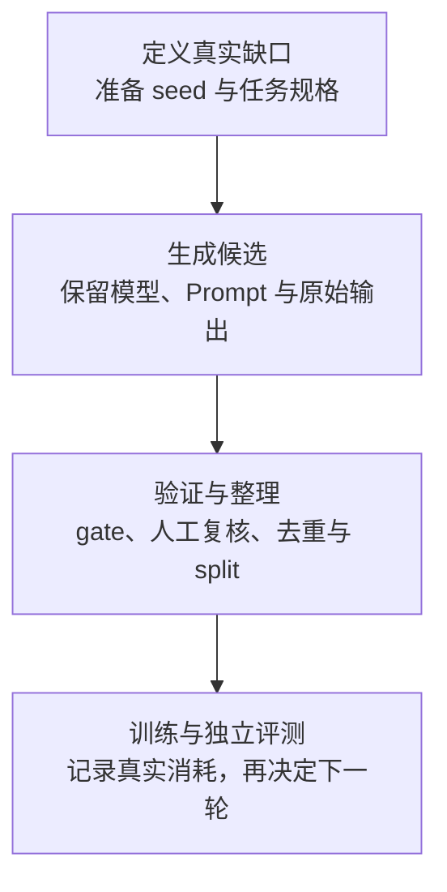

# 合成数据、蒸馏与反馈环

<!-- learning-contract -->
<div class="learning-contract" markdown="1">

**学习导航**

- **适合读者**：合成数据、蒸馏和评测工程师。
- **先修**：[训练数据工程](data.md)、基本采样和离线评测。
- **首次阅读**：先看清 4 条候选为什么得到“2 条通过、1 份新内容”，再学习怎样把合成数据放进训练。
- **完成信号**：能解释接受率如何改变分布，并保留来源和真实锚点。
- **卡住时**：先运行[合成数据审计项目](../practice/projects/synthetic-data-audit.md#run)。

</div>

先看仓库里的四条固定记录。第一轮由 `teacher@v1` 生成 `syn-001`、`syn-002` 和 `syn-003`；第二轮再由
`student@v2` 根据 `syn-001` 生成 `syn-004`。它们围绕同一条 RAG 陈述设计，用来演示数据记账，不是四条经过
真实模型评测的高质量训练样本。

流水线要求每条记录都通过 schema 与 grounding 两项检查：

| 候选 | 实际发生了什么 | 这一步怎样处理 |
|---|---|---|
| `syn-001` | 两项检查通过，并经过人工复核 | 进入 verifier-eligible 集合 |
| `syn-002` | 两项检查通过，但正文与 `syn-001` 完全相同 | 仍记为通过，同时单独报告重复 |
| `syn-003` | 只有 schema 结果，grounding 没有运行 | 记为 missing，不能混入明确失败 |
| `syn-004` | grounding 已运行且返回失败 | 记为 failed |

所以这批数据有四个候选、两个通过 gate 的记录，却只有一份 byte-exact（逐字节）唯一内容。通过率是 50%；按全部
候选计算，去重后内容只占 25%。`syn-002` 还有一项相关性风险：生成器和 grounding verifier 都写着 `teacher@v1`。

这里先建立两个彼此独立的账本：

1. **候选账本**回答“生成了什么、哪些检查通过、还剩多少唯一内容”；
2. **训练账本**回答“更大的真实/合成数据集各有多少 token、训练计划读取多少次”。

后文的 10 万 synthetic unique tokens 属于第二个示意账本，并不是把上面这一句短文本算成 10 万 token。分清这两个
口径，才能继续讨论筛选、混合、蒸馏和多代反馈。

四条记录可以在[合成数据审计项目](../practice/projects/synthetic-data-audit.md#run)中直接运行。后面的每个概念都会回到
“4 个候选 → 2 个 eligible → 1 份唯一内容”这条主线上。

## 先认清你在做哪一种合成

| 机制 | 生成什么 | 主要价值 | 主要风险 |
|---|---|---|---|
| Augmentation | 翻译、改写、扰动、格式变体 | invariance 与覆盖 | 标签语义被改变 |
| Instruction expansion | 新指令/场景/难度 | 任务多样性 | 模板化、teacher 风格收缩 |
| Rejection sampling | 多候选后按 verifier 选 | 提高某 gate 通过率 | reward hacking、覆盖下降 |
| Self-training | student/policy 给未标注样本打伪标签 | 利用无标注数据 | confirmation bias |
| Distillation | teacher 的 hard/soft target | 能力压缩、行为迁移 | 复制 teacher 错误与盲点 |
| Simulator/tool generation | 程序、环境、执行器产生状态与标签 | 可验证、可控难度 | simulator-to-real gap |
| Synthetic replay | 为旧任务生成复习样本 | 减少保存原始数据 | 遗漏长尾、泄露 teacher 记忆 |

这些术语不可互换。Teacher 生成最终答案再做 SFT，属于 sequence-level distillation；从多个候选中按规则筛选，
属于 rejection sampling；没有伪标签迭代，就不应称为 self-training。

## 一条候选怎样走到训练与评测



每个阶段都保存输入、输出和失败，而不是只留下最终通过的 JSONL。否则，团队无法区分“生成器没产出”“解析失败”
“verifier 拒绝”和“去重后消失”，也无法估计过滤带来的选择偏差。

## 先保存“它怎么来的”

一条 synthetic candidate 至少包含：

- stable record ID、父样本/任务/环境 ID；
- generator model/provider/revision、tokenizer/chat template；
- prompt/program/simulator revision；
- sampling 参数、seed 支持状态、生成时间；
- generation round 与上代模型/数据 manifest；
- raw response、解析结果和失败；
- 每个 verifier 的逻辑 ID、immutable revision、输入和结果；
- human review、rubric、reviewer group 和时间；
- license/consent/privacy 的继承与新风险；
- dedup cluster、split、mixture 和 consumed-token lineage。

父节点可以是真实样本、知识条目、schema、测试、模拟器状态或人工任务规格。只写 `generated_by=gpt-x` 不能解释内容如何产生，也不能证明允许训练。

仓库的固定记录只用一个 `content` 字段演示 lineage、gate 和去重。真实 SFT 数据还要说明：

- 哪一段是 Prompt，哪一段是 response；
- role 与 message 的边界；
- chat template 和 tokenizer revision；
- 哪些 token 参与 loss。

这个审计 schema 因此不能直接作为 trainer 输入格式。

样例中的外部父节点也由命令行参数 `--known-parent-id real-anchor-001` 声明。它让审计器把这个 ID 视为可解析，
不表示程序已经读取父样本正文、验证来源或检查许可。

## 先设计缺口，再让模型生成

### 从 coverage matrix 采样

先根据产品目标列出真正关心的轴，例如语言、领域、难度、输入长度、工具、风险和失败类型。然后找出覆盖不足的
格子，从这些缺口中采样任务。

如果只让 generator 自由列出“多样问题”，结果往往会集中在模型熟悉、容易生成的模式。

每个 cell（组合格子）分别记录计划数量、实际生成数、解析成功数、gate 通过数、去重后数量和人工错误率。通过的记录
很多，只说明产量高；是否覆盖了目标分布，还要看它们落在哪些格子。

### Difficulty 不是长度

用独立可观察量定义难度，例如：最短解题步骤、需要组合的证据数、程序执行深度、干扰项、稀有 schema、专家错误率或 baseline 成功率。让 teacher 自评“难度 9/10”需要校准，不能直接当标签。

### 多 generator 不等于错误独立

改变 Prompt、checkpoint、采样参数或生成程序可以增加表面差异，但同族模型仍可能共享盲点。应记录 generator 的
模型家族、已知训练关联和输出相似度。关键数据再用规则、执行器、领域专家或独立来源交叉验证。

## Verifier 只回答被问到的问题

验证方法越接近可重新执行的事实，结论通常越明确。可以按下面的顺序选择：

1. schema/type/parser；
2. deterministic rule、checksum、约束求解；
3. compiler、unit test、math solver、数据库最终状态；
4. source-grounded entailment/引用检查；
5. domain model 或 LLM judge；
6. 专家人工复核；
7. 真实环境/用户结果。

低层检查无法回答高层语义问题，高层 judge 也不该重新猜测编译器或数据库已经能确定的事实。每个 verifier 都要写清
它检查了什么。例如，`syn-003` 的 grounding 没有运行，和 `syn-004` 已运行但失败是两种不同状态。

`syn-002` 中，`teacher@v1` 同时出现在 generator 和 grounding verifier 字段里。审计会报告这项相关性风险，同时
保留原来的 gate 结果。

这个信号只说明记录中声明的 revision 重叠。真实运行是否使用同一模型实例、不同模型是否共享训练来源，还需要
运行身份和模型谱系证据。

## 筛选为什么会改写分布

若 generator 分布为 \(q(x)\)，接受函数 \(A(x)\in[0,1]\)，被接受分布为：

\[
q_{accept}(x)=\frac{q(x)A(x)}{\mathbb E_{x\sim q}[A(x)]}.
\]

因此 rejection sampling 不只是删掉坏样本，它还会重新分配留下数据的概率。若 verifier 偏好长答案、标准英语、
特定措辞或容易投机的格式，通过集合就会放大这些模式。实际项目至少比较：

- 总体与各 slice acceptance rate；
- 缺 verifier、执行失败、明确 reject 和 infra failure；
- accepted/ rejected 的长度、语言、难度和来源分布；
- verifier 与人工的 confusion matrix；
- 多候选数、采样预算和最终 unique count；
- 能通过 verifier 但实际错误的 adversarial cases。

开头的四条记录已经给出一个最小反例：通过率是 50%，但去重后只留下 25% 的新内容。更大数据集还要按语言、难度和
来源切片，因为通过率提高也可能来自任务变简单、重复变多或 verifier 变松。

## Self-training 怎样放大自己的偏见

典型循环是：模型给无标签数据生成伪标签，系统按置信度、一致性或规则筛选，再与真实标签混合并更新模型。问题在于，
模型更容易选择自己已经会做的样本，也可能对某类系统性错误非常自信。这会形成 confirmation bias（确认偏差）。

保护措施：

- 在独立真实标签集校准 selection score；
- 按群体/类别设 coverage，不只全局 top confidence；
- 保留低置信但重要的人工探索样本；
- teacher 与 student 的错误按 slice 比较；
- 每代固定 untouched real holdout；
- 不把 test/线上反馈直接回灌后继续宣称同一 test 独立。

一致性、低 entropy（熵）或多数投票只是选择信号。多个 sample 来自同一模型时，错误也可能高度相关。

## 蒸馏传递的是行为信号

### Hard target：直接学习生成结果

教师模型先生成完整答案，学生模型再把答案序列作为监督标签，学习预测下一个 token。这种做法只需保存文本，容易
接入现有 SFT 流水线。它会丢掉一部分信息：学生模型看不到教师模型对其他候选 token 的相对偏好。

### Soft target：学习概率分布

当 teacher/student token space 对齐，可在有效 response token 上最小化：

\[
\mathcal L_{KD}
=T^2\sum_t
D_{KL}\left(
p_T(\cdot\mid x,y_{<t};T)
\|p_S(\cdot\mid x,y_{<t};T)
\right).
\]

\(T\) 是蒸馏温度。升高温度会让概率分布更平缓，使低概率 token 之间的关系更明显；公式中的 \(T^2\) 是常见的
梯度尺度补偿约定，不是所有实现都必须采用。

复现实验时至少记录：

- teacher 与 student 分别看到了什么前缀；
- 哪些 response token 参与 loss，以及 loss 怎样归约；
- 是否只保存 top-k logits；
- hard-label loss 与蒸馏 loss 各占多大权重。

逐 token KL 还要求两边的 token 位置和词表可以对应。分词器不同，两个 logits 向量的同一索引通常不再表示同一个
token，不能直接比较。

### 蒸馏不会复制模型架构

Student 学到的是输出行为，teacher 的 MoE、MLA、训练数据或参数规模不会随文本一起迁移。例如，DeepSeek 生成的
文本可以用来训练 Qwen 或 Llama。

训练完成后，部署方式、LoRA 目标层和 KV cache 公式仍由 student checkpoint 的架构决定。

### Teacher 的错误也会一起迁移

Teacher 的事实错误、拒答边界、长度偏好、写作风格和 benchmark 记忆都可能被复制。只用 teacher 答对的样本训练，
得到的是“通过筛选条件下”的分布。

要知道 student 是否改善了 teacher 原本会失败的区域，应单独保留 teacher 失败、student 失败和双方分歧的样本。

## 过程数据最好能够重新执行

Process supervision（过程监督）可以使用中间状态、工具调用、程序执行轨迹、证明步骤或 verifier 反馈。自然语言
rationale 是模型生成的解释，其中可能包含无法验证的细节。

更可靠的过程记录应能重新执行或检查，例如代码、方程、检索来源、工具回执和环境状态变化。

不要默认保存或训练 provider 隐藏的 chain-of-thought。使用可公开的简要解释、结构化中间状态或 teacher 明确返回的训练 artifact，并遵守模型/API 条款和隐私策略。

## 不同任务需要不同的验证方法

### 代码

固定 base revision、环境和 hidden tests。防止候选修改测试、扩大权限或读取答案。Pass@k 与生成预算一起报告；测试通过不证明安全和可维护。

### 数学

用 symbolic/numeric checker 时处理等价形式、domain、单位和数值容差。只检查最终数值会接受错误推导和碰巧答案。

### RAG

如果问题、答案和引用都从同一语料自动生成，问题往往会直接复述原文词语，使检索任务变得过于容易。应按文档、
来源或时间切分数据，并加入无答案、证据冲突、跨文档推理和权限拒绝样本。测试集的问题生成器不能预先看到答案。

### Agent

Simulator（模拟器）提供可信的环境状态与执行回执。训练轨迹既要包含成功，也要包含超时、执行成功但响应丢失、
等待审批、预算耗尽和事后对账。只生成一路顺利的轨迹，会让 Agent policy 学不到恢复行为。

## 先区分逐字节重复与语义重复

开头的 `syn-001` 与 `syn-002` 逐字节相同，因此 byte-exact fingerprint 会把它们放入同一组。若两段文字只在
Unicode 组合形式或空白上不同，逐字节方法仍会视为不同。

NFC 与空白归一化可以合并更多自然语言文本。对代码、表格或格式任务，空白本身可能有语义，这种规则反而会误合并。
因此去重 profile 必须显式，并保留原始内容。

Exact unique count 只回答“规范化后是否完全相同”，不等于语义多样性。更大的数据集可以先用 n-gram、MinHash 或
向量聚类寻找相似候选，再按模板、父样本、答案模式、长度和人工分类检查分布。近似方法会有误报和漏报，需要按
数据域校准。

合成 benchmark 与训练数据共用 generator、prompt template、source 或 verifier 也会污染。即使文字不完全相同，任务生成规则泄漏仍可让评测过于容易。

## 混合比例最终要换算成重复暴露

对 component \(i\)，目标权重 \(w_i\) 归一化为：

\[
p_i=\frac{w_i}{\sum_jw_j}.
\]

总 consumed-token budget 为 \(D\)，unique token 为 \(n_i\)：

\[
E[C_i]=Dp_i,
\qquad
E[repeat_i]=\frac{Dp_i}{n_i}.
\]

```python
from about_llm.synthetic_data import (
    MixtureComponent,
    SourceKind,
    plan_mixture,
)

plan = plan_mixture(
    [
        MixtureComponent("real", SourceKind.REAL, 800_000, 3),
        MixtureComponent(
            "synthetic-r1",
            SourceKind.SYNTHETIC,
            100_000,
            1,
            generation_round=1,
        ),
    ],
    total_consumed_tokens=2_000_000,
)
assert plan.synthetic_fraction == 0.25
assert plan.exposures[1].expected_repetition_factor == 5
```

这个示意计划有 200 万个 consumed-token 预算。权重 3:1 先归一化为 75% 与 25%，再得到：

| 数据组件 | Unique token | 计划消费 token | 期望重复倍数 |
|---|---:|---:|---:|
| 真实锚点 | 800,000 | 1,500,000 | 1.875 |
| 第一轮合成数据 | 100,000 | 500,000 | 5.0 |

这里的第一轮合成数据代表一个拥有 10 万 unique tokens 的数据组件，与开头四条审计记录不是同一规模。

表中的数值是 sampler 根据目标权重算出的期望值，尚未包含 packing、动态过滤、分布式采样偏斜或读取失败。训练时
还要记录实际消费 token，才能知道 25% 的目标比例是否真的实现。

### 为什么仍然需要真实数据锚点

真实数据不一定自动高质量，但它可以防止反馈循环完全由模型自己的输出定义。应按语言、任务、风险和长尾保留
real anchor，并追踪每一代的合成比例与重复倍数。小而重要的安全数据可以设置最低配额，同时要监控频繁重复造成的
过拟合。

## 多代反馈会不会让数据越来越窄

可把第 \(g+1\) 代训练分布抽象为：

\[
D_{g+1}=\rho D_{real}+(1-\rho)S(M_g,D_g,V_g),
\]

其中 \(S\) 包含 generator、采样和 verifier，\(\rho\) 是真实锚点比例。这个式子是实验账本，不是 collapse 定理。

可能的退化：

- 低概率/少数模式消失；
- 错误在多代被当作事实放大；
- 输出长度、语气和模板收缩；
- verifier 漏洞成为新高概率模式；
- 数据重复增加但 unique 信息下降；
- 少数语言、边界输入和拒答先退化。

判断是否退化，需要做同预算对照：只用真实数据、加入一代合成数据，以及多代反馈且保留或移除真实锚点。每一代都
在从未回灌的真实 holdout 上检查平均表现、长尾、多样性、校准、安全和污染。

因此，“用了合成数据就一定 collapse”和“平均 benchmark 上升就没有 collapse”都缺少必要证据。结论应限定到具体
数据比例、反馈代数、筛选方法和评测切片。

## 合成数据仍然有隐私与版权问题

Generator 可能复述训练记忆、seed 中的个人信息、secret 或受限内容。合成数据应继承来源审查，并重新检查模型生成
带来的隐私、版权和用途风险：

- parent 的许可/consent/用途限制可能继续适用；
- 生成器服务条款可能限制训练、保存或再分发；
- 对 verbatim/near-copy、PII、secret 和敏感推断做扫描与人工审计；
- 记录 source → candidate → dataset → checkpoint lineage；
- 删除 seed 时定位派生候选、cache、shard 和 replay；
- 无法证明参数影响删除时保持 unknown，不把输出过滤称 unlearning。

## 怎样判断合成数据真的有用

| 层 | 指标 | 不能证明 |
|---|---|---|
| Generation | 成功率、成本、长度、coverage cell | 标签正确 |
| Gate | missing/fail/infra、acceptance、人工混淆 | 无共享盲点 |
| Identity | exact/near duplicate、unique/consumed | 语义多样 |
| Mixture | synthetic fraction、重复倍数、每代消耗 | 模型会利用数据 |
| Student | target/real holdout、slice、calibration | 生产长期结果 |
| Safety | 泄露、越权、拒答、攻击 | 所有攻击已覆盖 |
| Multi-generation | tail、diversity、错误放大 | collapse 已被普遍解决 |

所有比较固定 base model、训练 FLOPs/token budget、优化器、调参预算和评测集，或明确回答的是“同成本”还是“各自最优”。

## 亲手审计开头的四条候选

正文先学习“为什么这样审计”，具体报告结构和故障实验放在[合成数据审计项目](../practice/projects/synthetic-data-audit.md)。
先从仓库根目录生成一份报告：

~~~powershell
python -m about_llm.synthetic_data_cli `
  --records projects/synthetic-data-audit/records.example.jsonl `
  --required-verifier schema `
  --required-verifier grounding `
  --known-parent-id real-anchor-001 `
  --mixture projects/synthetic-data-audit/mixture.example.json `
  --output artifacts/synthetic-data/audit.json
~~~

第一次运行后，先预测再查看这些结果：

| 字段 | 预期结果 | 应怎样解释 |
|---|---|---|
| `candidate_count` | 4 | 输入记录总数 |
| `eligible_record_ids` | `syn-001`、`syn-002` | 两项 required verifier 都存在且通过 |
| `duplicate_content_groups` | `syn-001` 与 `syn-002` | 两条通过记录只有一份逐字节唯一内容 |
| `missing_verifier_record_ids` | `syn-003` | grounding 没有结果 |
| `failed_verifier_record_ids` | `syn-004` | grounding 已运行并失败 |
| `self_verified_record_ids` | `syn-002` | 声明的 generator/verifier revision 重叠 |
| `synthetic_fraction` | 0.25 | 3:1 目标权重归一化后的比例 |

`eligible_record_ids` 只回答 required verifier 是否通过，去重与 lineage 问题仍会单独保留。`self_verified_record_ids`
也只是 revision 字符串重叠信号，不能替代真实运行身份和模型谱系证据。

如果目标文件已经存在，CLI 会先停止，避免无意覆盖；确认要替换自己的本地报告时再添加 `--overwrite`。

仓库还保存了一份固定报告。下面的命令会重新读取记录、混合计划和命令行给出的 policy，重算完整结果后再比较：

~~~powershell
python -m about_llm.synthetic_data_cli `
  --records projects/synthetic-data-audit/records.example.jsonl `
  --required-verifier schema `
  --required-verifier grounding `
  --known-parent-id real-anchor-001 `
  --mixture projects/synthetic-data-audit/mixture.example.json `
  --verify-report projects/synthetic-data-audit/audit.example.json
~~~

这能发现输入字节、policy 或报告结果发生漂移，比只检查报告自带的 hash 更强。不过 SHA-256 没有密钥，不能认证
文件是谁发布的；验证与使用之间的文件替换、断电持久性也需要部署系统另外解决。

严格 JSON 规则、固定字节数、schema 字段和故意篡改实验都在项目页集中说明。主线只需记住：这次运行审计的是四条
仓库样例和一个混合预算，没有调用真实 teacher、student 或 verifier model，也没有执行训练。

## 送入训练前还要检查什么

### 先确认数据能追溯

- generator/prompt/verifier/parent/round 可解析；
- raw candidate 与所有失败保留在受控 artifact；
- internal/external parent、cycle 与 round monotonicity 分账；
- fingerprint profile、dedup/split/mixture 明确；
- candidate、eligible、unique 和 consumed 数分别报告。

### 再确认筛选没有掩盖分布问题

- required verifier 版本冻结，infra failure 不当 reject/pass；
- verifier 在独立人工集按 slice 校准；
- accepted set 的分布变化和 coverage 可解释；
- real untouched holdout 与 baseline 对比。

### 最后确认下一代能够停止和回滚

- 每代模型、数据和真实锚点有 immutable manifest；
- 目标与实际 synthetic fraction/repetition 对账；
- 长尾、少数语言、安全和 calibration 无不可接受退化；
- 停止、回滚和删除路径已演练。

## 当前仓库能证明什么

| 仓库实际执行了什么 | 还需要在真实项目中完成什么 |
|---|---|
| 检查 JSON 结构与输入边界 | 调用真实 teacher 和 verifier |
| 审计 lineage、verifier 结果和逐字节重复 | 运行并校准近重复检测 |
| 计算目标混合比例与期望重复倍数 | 记录训练实际消费 token |
| 从指定输入完整复算固定报告 | 训练 student 并做独立质量评测 |
| 用专项测试覆盖这些离线契约 | 执行多代反馈、人工标注与法律审查 |

这些证据可以支持离线数据契约和指定输入下的确定性复算。目标模型是否受益、法律审查是否通过、长期分布是否退化，
仍要由表格右侧的真实实验回答。

## 八个常见误判

- **“生成一百万条就有一百万条信息”**：先报 unique、cluster 和重复暴露。
- **“Verifier 通过就是真实正确”**：它只验证编码的性质，并可能被投机。
- **“换一个 LLM judge 就独立”**：训练来源、族谱和 benchmark 可能相关。
- **“Synthetic 没有隐私/版权问题”**：seed 和记忆复述仍带来源义务。
- **“Pass rate 提高表示 generator 变强”**：任务、重复或 gate 可能变化。
- **“蒸馏模型继承 teacher 架构”**：student 架构由自己的 checkpoint 决定。
- **“使用 synthetic 必然 collapse”**：结果依比例、代数、选择和真实锚点。
- **“平均分没降所以没有 collapse”**：tail、diversity 和少数 slice 可能先退化。

## 自测与实践

1. 从 rejection sampling 推导 accepted distribution，解释 verifier bias 怎样重加权。
2. 为代码、RAG 和 Agent 各选择一层 deterministic verifier 与一层语义 verifier。
3. 计算 25% synthetic mixture 在 5 倍重复暴露下的 unique/consumed token。
4. 设计 real-only、single-generation 和 multi-generation 的同预算消融。
5. 为什么同一模型多次采样的一致性不等于正确？
6. 何时 NFC + whitespace fingerprint 会破坏代码或表格语义？
