# 合成数据、蒸馏与反馈环

<!-- learning-contract -->
<div class="learning-contract" markdown="1">

**学习导航**

- **适合读者**：合成数据、蒸馏和评测工程师。
- **先修**：[训练数据工程](data.md)、基本采样和离线评测。
- **首次阅读**：七类机制 → 供应链 → verifier → rejection sampling → 评测矩阵。
- **完成信号**：能解释接受率如何改变分布，并保留来源和真实锚点。
- **卡住时**：先运行[合成数据审计项目](../practice/projects/synthetic-data-audit.md#run)。

</div>

合成数据是由模型、规则、模拟器或程序生成的训练/评测候选。它能扩大任务覆盖、提供可验证轨迹和传递 teacher 行为，也会复制错误、风格、隐私风险与 verifier 漏洞。关键问题不是“是否使用合成数据”，而是：生成了什么分布、由谁验证、与真实数据怎样混合、经过几代反馈，以及结论如何被独立证据支持。

本章不把“模型输出”自动视为数据。候选只有在 lineage、许可/隐私、质量 gate、去重、split 和 mixture 契约完成后，才能进入指定训练版本。

## 1. 先区分七类机制

| 机制 | 生成什么 | 主要价值 | 主要风险 |
|---|---|---|---|
| Augmentation | 翻译、改写、扰动、格式变体 | invariance 与覆盖 | 标签语义被改变 |
| Instruction expansion | 新指令/场景/难度 | 任务多样性 | 模板化、teacher 风格收缩 |
| Rejection sampling | 多候选后按 verifier 选 | 提高某 gate 通过率 | reward hacking、覆盖下降 |
| Self-training | student/policy 给未标注样本打伪标签 | 利用无标注数据 | confirmation bias |
| Distillation | teacher 的 hard/soft target | 能力压缩、行为迁移 | 复制 teacher 错误与盲点 |
| Simulator/tool generation | 程序、环境、执行器产生状态与标签 | 可验证、可控难度 | simulator-to-real gap |
| Synthetic replay | 为旧任务生成复习样本 | 减少保存原始数据 | 遗漏长尾、泄露 teacher 记忆 |

这些术语不可互换。用 teacher 生成最终答案再做 SFT 是 sequence-level distillation；用同一模型生成候选并按规则选是 rejection sampling；没有伪标签迭代就不应称 self-training。

## 2. 端到端供应链

```mermaid
flowchart LR
  S["Real seed / task spec"] --> G["Versioned generator"]
  G --> R["Raw candidates"]
  R --> V["Rules / execution / verifier"]
  V --> H["Human audit"]
  H --> D["Dedup / contamination / split"]
  D --> M["Real + synthetic mixture"]
  M --> T["Train student"]
  T --> E["Independent evaluation"]
  E --> N["Next generation decision"]
```



每条边保存输入/输出 artifact，不只保存最终 accepted JSONL。否则无法估计生成失败率、过滤选择偏差或 verifier 漏报。

## 3. Provenance 最小契约

一条 synthetic candidate 至少包含：

- stable record ID、父样本/任务/环境 ID；
- generator model/provider/revision、tokenizer/chat template；
- prompt/program/simulator revision；
- sampling 参数、seed 支持状态、生成时间；
- generation round 与上代模型/数据 manifest；
- raw response、解析结果和失败；
- 每个 verifier 的逻辑 ID、immutable revision、输入和结果；
- human review、rubric、reviewer group 和时间；
- license/consent/privacy 的继承与新风险；
- dedup cluster、split、mixture 和 consumed-token lineage。

父节点可以是真实样本、知识条目、schema、测试、模拟器状态或人工任务规格。只写 `generated_by=gpt-x` 不能解释内容如何产生，也不能证明允许训练。

## 4. 生成分布设计

### 4.1 从 coverage matrix 采样

先定义轴：语言、领域、难度、输入长度、技能、工具、风险、输出格式和失败类型。按目标产品/课程分布与已知缺口采样，而不是让 generator 自由列出“多样问题”。模型自由生成往往集中在高概率、熟悉、易写的模式。

对每个 cell 记录：目标数量、生成数量、解析成功、gate 通过、unique count 和人工错误率。最终 accepted count 高不表示 coverage 合理。

### 4.2 Difficulty 不是长度

用独立可观察量定义难度，例如：最短解题步骤、需要组合的证据数、程序执行深度、干扰项、稀有 schema、专家错误率或 baseline 成功率。让 teacher 自评“难度 9/10”需要校准，不能直接当标签。

### 4.3 多 generator 与 decorrelation

不同 prompt、checkpoint、采样或程序可增加候选差异，但多个同族模型不保证错误独立。记录 generator 族、训练关联和输出相似度；关键数据用规则、执行器、领域专家或独立来源交叉验证。

## 5. Verifier 阶梯

按可证明性优先：

1. schema/type/parser；
2. deterministic rule、checksum、约束求解；
3. compiler、unit test、math solver、数据库最终状态；
4. source-grounded entailment/引用检查；
5. domain model 或 LLM judge；
6. 专家人工复核；
7. 真实环境/用户结果。

低层验证不能替代高层语义，反之也不应让 LLM judge 重判可执行事实。测试通过只说明测试编码的性质；错误测试会稳定选择错误答案。

同一 revision 既生成又验证是需报告的相关性风险，不是自动失败：它们可能共享知识缺口、风格偏好和攻击面。即使不同模型，若由同一 teacher 蒸馏或同一公开 benchmark 调优，也不保证独立。

## 6. Rejection sampling 改变分布

若 generator 分布为 \(q(x)\)，接受函数 \(A(x)\in[0,1]\)，被接受分布为：

\[
q_{accept}(x)=\frac{q(x)A(x)}{\mathbb E_{x\sim q}[A(x)]}.
\]

因此 rejection sampling 不只是“删掉坏样本”，而是在重加权。若 verifier 偏好长答案、标准英语、特定措辞或可投机格式，accepted set 会放大偏差。至少报告：

- 总体与各 slice acceptance rate；
- 缺 verifier、执行失败、明确 reject 和 infra failure；
- accepted/ rejected 的长度、语言、难度和来源分布；
- verifier 与人工的 confusion matrix；
- 多候选数、采样预算和最终 unique count；
- 能通过 verifier 但实际错误的 adversarial cases。

通过率提高可能意味着 generator 变好，也可能是任务变简单、重复更多或 verifier 变松。

## 7. Self-training 与伪标签

典型循环：在无标签数据上预测 → 按 confidence/一致性/规则选择 → 与真实标签混合 → 更新模型。Confirmation bias 来自模型更愿意选择自己已会、且自信但可能系统性错误的样本。

保护措施：

- 在独立真实标签集校准 selection score；
- 按群体/类别设 coverage，不只全局 top confidence；
- 保留低置信但重要的人工探索样本；
- teacher 与 student 的错误按 slice 比较；
- 每代固定 untouched real holdout；
- 不把 test/线上反馈直接回灌后继续宣称同一 test 独立。

一致性、低 entropy 或多数投票是选择信号，不等于标签正确。多个 sample 来自同一模型时也不独立。

## 8. Distillation

### 8.1 Hard target

Teacher 生成 token/答案，student 做普通 supervised next-token learning。它易部署，但只看到一个或少量序列，丢失 teacher 对其他 token 的相对概率。

### 8.2 Soft target

当 teacher/student token space 对齐，可在有效 response token 上最小化：

\[
\mathcal L_{KD}
=T^2\sum_t
D_{KL}\left(
p_T(\cdot\mid x,y_{<t};T)
\|p_S(\cdot\mid x,y_{<t};T)
\right).
\]

\(T\) 是 distillation temperature，\(T^2\) 是常见梯度尺度补偿约定，不是所有实现必须相同。必须明确：teacher forcing 上下文、token mask、sum/mean、词表映射、top-k logits 截断和与 hard-label loss 的权重。Tokenizer 不同不能逐 token 直接 KL。

### 8.3 蒸馏不复制架构

Student 学到行为信号，不会因此拥有 teacher 的 MoE、MLA、训练数据或参数规模。DeepSeek teacher 生成的数据可训练 Qwen/Llama student；部署、LoRA target module 和 KV 公式仍由 student checkpoint 决定。

### 8.4 蒸馏错误

Teacher 的事实错误、拒答边界、长度、风格和 benchmark 记忆都可能被复制。只筛 teacher 正确样本会得到条件分布，不能证明 student 在真实失败区改善。保留 teacher-fail、student-fail 和 disagreement 集进行独立分析。

## 9. 推理轨迹与过程数据

Process supervision 可以提供中间状态、tool call、程序 trace、proof step 或 verifier feedback。自然语言 rationale 未必是模型真实因果过程，也可能包含无法验证的细节。优先记录可执行/可检查状态：代码、方程、检索 source、工具 receipt 和环境 transition。

不要默认保存或训练 provider 隐藏的 chain-of-thought。使用可公开的简要解释、结构化中间状态或 teacher 明确返回的训练 artifact，并遵守模型/API 条款和隐私策略。

## 10. 代码、数学、RAG 与 Agent 数据

### 代码

固定 base revision、环境和 hidden tests。防止候选修改测试、扩大权限或读取答案。Pass@k 与生成预算一起报告；测试通过不证明安全和可维护。

### 数学

用 symbolic/numeric checker 时处理等价形式、domain、单位和数值容差。只检查最终数值会接受错误推导和碰巧答案。

### RAG

问题、答案和引用从同一 corpus 自动生成时，容易产生过于直接的 lexical match。按文档/来源/time 分 split，加入无答案、冲突、跨文档和权限负例；生成器不能看到 test answer key 后再写问题。

### Agent

Simulator 提供 authoritative state 和 receipt。轨迹包含失败、超时、执行成功但响应丢失、approval、budget 和 reconciliation；只生成顺利轨迹会教 policy 忽略恢复。

## 11. Exact identity、近重复与污染

Byte-exact hash 不把 Unicode/空白变体视为相同；NFC + whitespace normalization 会合并更多 prose，但可能破坏代码、表格和格式任务。Profile 必须显式，且保留 raw content。

Exact unique count 不等于语义多样性。还要看 n-gram/MinHash candidate、embedding cluster、模板/父样本分布、答案模式、长度和人工 taxonomy。近似方法有 false positive/negative，按域校准。

合成 benchmark 与训练数据共用 generator、prompt template、source 或 verifier 也会污染。即使文字不完全相同，任务生成规则泄漏仍可让评测过于容易。

## 12. Mixture 与重复暴露

对 component \(i\)，目标权重 \(w_i\) 归一化为：

\[
p_i=\frac{w_i}{\sum_jw_j}.
\]

总 consumed-token budget 为 \(D\)，unique token 为 \(n_i\)：

\[
E[C_i]=Dp_i,
\qquad
E[repeat_i]=\frac{Dp_i}{n_i}.
\]

```python
from about_llm.synthetic_data import (
    MixtureComponent,
    SourceKind,
    plan_mixture,
)

plan = plan_mixture(
    [
        MixtureComponent("real", SourceKind.REAL, 800_000, 3),
        MixtureComponent(
            "synthetic-r1",
            SourceKind.SYNTHETIC,
            100_000,
            1,
            generation_round=1,
        ),
    ],
    total_consumed_tokens=2_000_000,
)
assert plan.synthetic_fraction == 0.25
assert plan.exposures[1].expected_repetition_factor == 5
```

这是目标 sampler 的期望值，不包含 packing、动态过滤、分布式 sampler skew 或实际读取失败。训练时还要记录 observed consumed tokens；不要把 target weight 当实际消耗。

### 12.1 真实锚点

真实数据不是自动高质量，但能防止循环完全由模型自我定义。按语言、任务、风险和长尾保留 real anchor，追踪每代 synthetic fraction 与重复倍数。小而重要的 safety set 可设置最低配额，但频繁重复也会过拟合。

## 13. 多代反馈与 model collapse

可把第 \(g+1\) 代训练分布抽象为：

\[
D_{g+1}=\rho D_{real}+(1-\rho)S(M_g,D_g,V_g),
\]

其中 \(S\) 包含 generator、采样和 verifier，\(\rho\) 是真实锚点比例。这个式子是实验账本，不是 collapse 定理。

可能的退化：

- 低概率/少数模式消失；
- 错误在多代被当作事实放大；
- 输出长度、语气和模板收缩；
- verifier 漏洞成为新高概率模式；
- 数据重复增加但 unique 信息下降；
- 少数语言、边界输入和拒答先退化。

“用了合成数据必然 collapse”和“平均 benchmark 提高所以没有 collapse”都不成立。实验至少包含：real-only、real+single-generation synthetic、多代有/无 real anchor、不同 verifier 与 synthetic fraction；每代在不回灌的 real holdout 上测平均、tail、diversity、calibration、安全和 contamination。

## 14. 隐私、版权与删除

Generator 可能复述训练记忆、seed 中的 PII/secret 或受限内容。Synthetic 不等于匿名或无版权：

- parent 的许可/consent/用途限制可能继续适用；
- 生成器服务条款可能限制训练、保存或再分发；
- 对 verbatim/near-copy、PII、secret 和敏感推断做扫描与人工审计；
- 记录 source → candidate → dataset → checkpoint lineage；
- 删除 seed 时定位派生候选、cache、shard 和 replay；
- 无法证明参数影响删除时保持 unknown，不把输出过滤称 unlearning。

## 15. 评测矩阵

| 层 | 指标 | 不能证明 |
|---|---|---|
| Generation | 成功率、成本、长度、coverage cell | 标签正确 |
| Gate | missing/fail/infra、acceptance、人工混淆 | 无共享盲点 |
| Identity | exact/near duplicate、unique/consumed | 语义多样 |
| Mixture | synthetic fraction、重复倍数、每代消耗 | 模型会利用数据 |
| Student | target/real holdout、slice、calibration | 生产长期结果 |
| Safety | 泄露、越权、拒答、攻击 | 所有攻击已覆盖 |
| Multi-generation | tail、diversity、错误放大 | collapse 已被普遍解决 |

所有比较固定 base model、训练 FLOPs/token budget、优化器、调参预算和评测集，或明确回答的是“同成本”还是“各自最优”。

## 16. 可执行审计

仓库 reference core 只审计显式 artifact：

```python
from about_llm.synthetic_data import audit_synthetic_records

report = audit_synthetic_records(
    records,
    required_verifiers=("schema", "grounding"),
    known_parent_ids=("real-anchor-001",),
)
```

它报告 verifier missing/fail、generator–verifier exact revision overlap、unresolved parent、内部 parent round 非单调、lineage cycle、human review 和 exact duplicate。`eligible_record_ids` 只表示所有 required verifier 存在且 pass；重复内容与 lineage finding 仍显式保留，不会被“通过率”隐藏。当前 `self_verified_record_ids` 只是 revision-string overlap，不证明同一模型真的执行生成和验证；没有 overlap 也不证明 judge 独立。

离线项目：

~~~powershell
python -m about_llm.synthetic_data_cli `
  --records projects/synthetic-data-audit/records.example.jsonl `
  --required-verifier schema `
  --required-verifier grounding `
  --known-parent-id real-anchor-001 `
  --mixture projects/synthetic-data-audit/mixture.example.json `
  --output artifacts/synthetic-data/audit.json
~~~

输出 schema 是 `about-llm.synthetic-data-audit.v2`。它绑定 records/mixture 的 exact byte size 与 SHA-256，也绑定 required verifiers、known parents、fingerprint profile、完整 audit/mixture、scope 与 canonical report fingerprint。`--output` 默认 exclusive-create；显式 `--overwrite` 才覆盖旧文件。File `fsync` 不等于 directory entry durable、断电原子发布或 verify-use TOCTOU 已解决。

不要只检查报告携带的 self-hash。用 caller-supplied 输入与 policy 完整复算固定 artifact：

~~~powershell
python -m about_llm.synthetic_data_cli `
  --records projects/synthetic-data-audit/records.example.jsonl `
  --required-verifier schema `
  --required-verifier grounding `
  --known-parent-id real-anchor-001 `
  --mixture projects/synthetic-data-audit/mixture.example.json `
  --verify-report projects/synthetic-data-audit/audit.example.json
~~~

固定 records 为 1,457 bytes，mixture 为 341 bytes，report fingerprint 是 `sha256:202d8db97b704c5542e8516c5bd0c945da1c1022100f6ecbfb828f2d2bb6f4cd`。验证成功的 scope 为 `full_local_recomputation`：重读输入、重跑审计并比较完整 canonical JSON。因此 input drift、policy drift，以及同时篡改结果与无密钥 hash 的 cooperative rehash 都会相对可信 caller 输入失败。若 caller 也接受攻击者替换的 inputs/policy，无密钥 SHA-256 仍不能认证来源。

Loader 还会拒绝 duplicate JSON keys、non-finite number、invalid UTF-8、unknown/missing fields、boolean 冒充 integer、重复 ID 与超限输入。样例故意包含 exact duplicate、revision overlap、missing verifier 和 failed verifier，用来验证审计约定；它没有运行 teacher/student、verifier model、训练或 observed-token ledger，不代表真实模型数据质量。

## 17. 发布门禁

### Artifact

- generator/prompt/verifier/parent/round 可解析；
- raw candidate 与所有失败保留在受控 artifact；
- internal/external parent、cycle 与 round monotonicity 分账；
- fingerprint profile、dedup/split/mixture 明确；
- candidate、eligible、unique 和 consumed 数分别报告。

### Quality

- required verifier 版本冻结，infra failure 不当 reject/pass；
- verifier 在独立人工集按 slice 校准；
- accepted set 的分布变化和 coverage 可解释；
- real untouched holdout 与 baseline 对比。

### Feedback

- 每代模型、数据和真实锚点有 immutable manifest；
- 目标与实际 synthetic fraction/repetition 对账；
- 长尾、少数语言、安全和 calibration 无不可接受退化；
- 停止、回滚和删除路径已演练。

## 18. 当前仓库证据边界

仓库已有 strict JSON、lineage/verifier/duplicate audit、mixture exposure 数学、v2 input/policy-bound artifact、full-local-recomputation CLI fixture 和 40 个专项测试。它没有调用真实 teacher/verifier、训练 student、执行多代反馈、做近似去重 benchmark、人工标注或证明任何模型避免 collapse。因此现有证据只支持离线数据契约、计算约定与可信 caller 输入下的复算，不支持合成数据能提高目标模型、通过法律审查、保持长期分布或来自所声明发布者。

## 19. 常见错误结论

- **“生成一百万条就有一百万条信息”**：先报 unique、cluster 和重复暴露。
- **“Verifier 通过就是真实正确”**：它只验证编码的性质，并可能被投机。
- **“换一个 LLM judge 就独立”**：训练来源、族谱和 benchmark 可能相关。
- **“Synthetic 没有隐私/版权问题”**：seed 和记忆复述仍带来源义务。
- **“Pass rate 提高表示 generator 变强”**：任务、重复或 gate 可能变化。
- **“蒸馏模型继承 teacher 架构”**：student 架构由自己的 checkpoint 决定。
- **“使用 synthetic 必然 collapse”**：结果依比例、代数、选择和真实锚点。
- **“平均分没降所以没有 collapse”**：tail、diversity 和少数 slice 可能先退化。

## 自测与实践

1. 从 rejection sampling 推导 accepted distribution，解释 verifier bias 怎样重加权。
2. 为代码、RAG 和 Agent 各选择一层 deterministic verifier 与一层语义 verifier。
3. 计算 25% synthetic mixture 在 5 倍重复暴露下的 unique/consumed token。
4. 设计 real-only、single-generation 和 multi-generation 的同预算消融。
5. 为什么同一模型多次采样的一致性不等于正确？
6. 何时 NFC + whitespace fingerprint 会破坏代码或表格语义？
