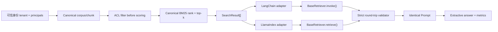

# LangChain 与 LlamaIndex：让同一次 RAG 检索跨框架保持一致

这个项目回答一个容易被框架营销掩盖的问题：怎样接入 LangChain 和 LlamaIndex，同时不改变原有 RAG 的授权、排序、Prompt 与评测语义？

答案是 **canonical-first**：领域对象和安全策略仍由应用核心掌握，框架对象只是可验证的运输值。项目不会把“换框架”包装成检索质量提升，也不会让框架 metadata 成为授权事实源。

第一次运行 `python projects/rag-framework-adapters/parity_control.py`。输入是四份固定文档、一个中文 query 和
两个授权主体；输出会并排展示 canonical、LangChain 与 LlamaIndex 的 document ID、正文、rank、score、Prompt
和抽取答案。先看哪一项发生漂移，再阅读后面的字段映射与安全边界。

## 当前可证实的结论

本仓库当前完成的是一个离线 L3 集成示例：

- 真实执行 `langchain-core==1.5.3`；
- 真实执行 `llama-index-core==0.14.23`；
- 真实调用 LangChain `BaseRetriever.invoke()`；
- 真实调用 LlamaIndex `BaseRetriever.retrieve()`；
- 在 scorer 与 top-k 前执行 canonical tenant/principal ACL；
- 对照 ID、正文、完整 metadata、rank、score 与 metadata exclusion；
- 对照两个框架的 Prompt bytes/hash；
- 对照 deterministic extractive answer artifact；
- 在 authored qrels 上计算 Recall@4 与 nDCG@4；
- 16 个专项测试覆盖字段、安全上下文与漂移负例。

它没有执行 learned embedding、向量 index、learned reranker、provider/local LLM、框架默认 query engine、网络、并发、持久化或性能负载。

## 文件地图

```text
projects/rag-framework-adapters/
├── README.md
├── demo.py
└── parity_control.py

src/about_llm/integrations/rag_frameworks.py
tests/test_rag_framework_adapters.py
```

各文件职责：

| 文件 | 作用 | 不证明 |
|---|---|---|
| `demo.py` | 最小 canonical result→framework object 转换 | Retriever/Prompt 端到端执行 |
| `parity_control.py` | 双 Retriever、双 Prompt、ACL、answer、metrics 闭环 | learned retrieval 或模型生成 |
| `rag_frameworks.py` | 严格转换、round trip、security context 与 Retriever wrapper | 框架默认 ACL |
| adapter tests | 保护键、rank/ID/score、mutation、security context | 真实线上流量 |
| parity tests | 固定报告、Prompt/answer identity 与 scope | 质量/性能外推 |

## 架构：canonical core 是权威



授权优先的检索是：

$$
\operatorname{TopK}_{d\in A(t,p)} s(q,d),
$$

其中 $A(t,p)$ 是服务器根据 tenant $t$ 和 principals $p$ 得到的授权集合。

先全库 top-k 再过滤则是：

$$
\operatorname{Filter}_{A(t,p)}\left(\operatorname{TopK}_{d\in D}s(q,d)\right).
$$

两者通常不同。无权高分文档会占用候选位，而且它已经进入 scorer、trace 或 cache 边界。Prompt 中写“忽略无权内容”不能修复越权。

## Canonical 数据契约

`about_llm.rag.Document` 与 `SearchResult` 是权威领域对象。框架 adapter 接收已经完成授权和排序的 `SearchResult[]`，并保留：

- document identity；
- tenant/ACL context；
- exact text；
- business metadata；
- retrieval score；
- one-based rank；
- retriever/source identity。

### 六个保护 metadata 键

```text
document_id
tenant_id
acl
retrieval_score
retrieval_rank
retriever
```

业务 metadata 若已经占用任意保护键，adapter 会在转换前报错。不能让用户或旧索引中的 metadata 覆盖 canonical 安全字段。

### 输入结果的 canonical gate

进入框架前，结果必须满足：

- rank 严格为连续 one-based rank：`1..N`；
- document ID 不重复；
- score 是 real number；
- bool 不能冒充整数/实数；
- score 必须 finite，拒绝 NaN/±Inf；
- 结果顺序就是 canonical rank 顺序。

这些约束阻止 adapter 把一个含糊列表“尽量转换”后继续运行。

## 字段映射

| Canonical 字段 | LangChain | LlamaIndex | 验证 |
|---|---|---|---|
| `document_id` | `Document.id` + metadata | `TextNode.node_id` + metadata | exact、唯一 |
| text | `page_content` | `TextNode.text` | exact |
| `tenant_id` / `acl` | metadata | metadata | exact、不可覆盖 |
| score | `metadata.retrieval_score` | `NodeWithScore.score` + metadata | finite、exact |
| rank | `metadata.retrieval_rank` | metadata | 连续 one-based |
| retriever | `metadata.retriever` | metadata | exact source |
| business metadata | metadata | metadata | 原样保留 |

### LlamaIndex metadata exclusion

LlamaIndex 的 `TextNode` 内容构造可能把 metadata 纳入 embedding 或 LLM content。项目把六个保护键写入：

- `excluded_embed_metadata_keys`；
- `excluded_llm_metadata_keys`。

这避免默认内容构造因控制面字段而变化，但它不是授权或通用防泄漏证明：

- 自定义 formatter 可以主动读取 metadata；
- callback/tracer 可以记录 metadata；
- 自定义 Prompt 可以插入 metadata；
- 其他 serializer 可能忽略 exclusion；
- metadata 已进入对象，不等于它从进程内消失。

因此正确结论是“当前 TextNode exclusion policy 被构造并逐项验证”，不是“metadata 不会泄漏”。

## 安装

推荐安装开发与两套框架 extras：

~~~powershell
python -m pip install -e ".[dev,torch,rag,langchain,llamaindex]"
~~~

只运行对象 demo 时也可以按需安装：

~~~powershell
python -m pip install -e ".[langchain,llamaindex]"
~~~

仓库声明的是教学兼容范围，不是 lockfile。可复现报告还应保存：

- Python 与操作系统；
- `langchain-core` / `llama-index-core` exact version；
- 完整依赖 lock/constraints；
- source revision；
- 运行命令与环境变量 allowlist。

## 运行 1：对象转换 demo

~~~powershell
python projects/rag-framework-adapters/demo.py
~~~

`demo.py` 只展示同一 canonical result 如何转换为：

- LangChain `Document`；
- LlamaIndex `TextNode + NodeWithScore`。

它适合检查字段，但没有调用 Retriever API、Prompt、answer 或 metrics，不能写成端到端 parity。

## 运行 2：双框架 parity control

~~~powershell
python projects/rag-framework-adapters/parity_control.py
~~~

脚本向 stdout 输出机器可读 JSON。它在同一进程执行：

1. 构造固定四文档 authored corpus；
2. 建立 canonical BM25 index；
3. 以 engineering 与 anonymous 两种 security context 检索；
4. 调用 LangChain Retriever；
5. 调用 LlamaIndex Retriever；
6. 严格 round trip；
7. 以两个框架自己的 PromptTemplate 渲染相同 Prompt；
8. 比较 Prompt bytes/hash；
9. 调用共同的 deterministic extractive baseline；
10. 比较 answer artifact；
11. 计算 authored qrels 的 Recall@4/nDCG@4；
12. 输出 assertions 与 closed scope。

## 固定 corpus 与授权预测

| document | tenant | ACL | 设计作用 |
|---|---|---|---|
| `acl-before-ranking` | `tenant-a` | public | 所有人可见的核心证据 |
| `citation-binding` | `tenant-a` | `engineering` | engineering 可见 |
| `finance-secret` | `tenant-a` | `finance` | lexical overlap 高但当前主体无权 |
| `other-tenant` | `tenant-b` | public | tenant 错误，评分前排除 |

固定 query：

```text
RAG 检索为什么要在排序前做权限过滤
```

预期结果：

- engineering：`acl-before-ranking → citation-binding`；
- anonymous：`acl-before-ranking`；
- `finance-secret` 不进入 engineering/anonymous scorer 候选；
- `other-tenant` 不进入 tenant-a 候选。

## 本轮固定报告

当前工作树实跑得到：

| case | canonical/LangChain/LlamaIndex | Prompt bytes | Prompt SHA-256 | answer artifact |
|---|---|---:|---|---|
| engineering | `acl-before-ranking, citation-binding` | 385 | `b9c8cb77…e1e8e19c` | `sha256:d1045446…48180cca` |
| anonymous | `acl-before-ranking` | 277 | `1e33ed13…e396d8fd` | `sha256:ed8e3f45…8441e8c` |

engineering 的 authored Recall@4 与 nDCG@4 都是 1.0，两例 extractive coverage 都是 1.0。

这些满分来自四文档 fixture、确定性 BM25/extractive baseline 与 authored qrels。它们是协议回归，不是：

- “LangChain 检索准确率 100%”；
- “LlamaIndex 优于原生实现”；
- “RAG 质量达到生产要求”；
- “模型忠实度 100%”；
- “框架默认安全”。

## Round-trip validator 的证明范围

LangChain validator 对照：

- 结果数量；
- 位置上的 document ID；
- `page_content`；
- 完整 metadata。

LlamaIndex validator 还对照：

- `node_id`；
- node text；
- `NodeWithScore.score`；
- embedding exclusion keys；
- LLM exclusion keys。

Supplied expected results 本身先通过 canonical gate。validator 能发现本地字段丢失、重排和 mutation，但不能认证 expected 的来源。

如果攻击者能同时改写 canonical expected 与框架对象，普通 round trip 仍会自洽。更强的来源证据需要：

- 独立生成 expected；
- corpus/index/policy identity；
- authenticated artifact；
- trusted release head；
- 外部审计或不可变运行证据。

## 专项测试

~~~powershell
python -m pytest tests/test_rag_framework_adapters.py -q
~~~

专项测试覆盖：

- 两种对象的 canonical 字段；
- LlamaIndex embed/LLM exclusion keys；
- 业务 metadata 伪造保护字段；
- LangChain rank mutation；
- LlamaIndex text mutation；
- LlamaIndex exclusion drift；
- rank gap；
- duplicate document ID；
- NaN、+Inf、-Inf score；
- bool score；
- public/allowed/denied/other-tenant；
- 空 tenant；
- 重复 principal；
- bool `top_k`；
- 两个真实 Retriever API；
- Prompt/answer identity 与 machine-readable scope。

建议评审时再手工预测一个负例：只看最终 ID 的 post-filter 可能“碰巧”与授权优先结果一样，但无权内容已经进入 scorer。安全属性不能只靠最终列表证明。

## 公平比较协议

如果目标是比较 orchestration 层，应固定：

1. corpus bytes、chunk ID/version 与 ingestion snapshot；
2. server-resolved tenant/principals；
3. authorization policy revision；
4. query、top-k 与同一次 canonical results；
5. context packing 与 Prompt bytes；
6. model/provider revision；
7. generation config 与 stop；
8. qrels/answer cases/judge；
9. timeout、retry 与缺失样本规则；
10. cold/warm、并发与资源环境。

本项目故意让框架只承担 adapter、Retriever/Prompt API 和 orchestration 边界，所以 parity 是预期不变量。

如果改为比较各自 native index/query engine，实验问题已经变化，必须分别冻结：

- embedding/index snapshot；
- chunking 与 metadata filter；
- candidate set；
- raw 与 normalized score；
- reranker；
- Prompt/context；
- raw model output；
- usage/error/latency；
- held-out qrels/cases。

不能把 native retrieval 差异归因于“框架本身”。

## 从 control 扩展到 learned retrieval

保持 `SearchResult` 为出口，并在每次 retrieval trace 绑定：

- query fingerprint；
- tenant/principal/policy；
- corpus/chunk/index snapshot；
- embedding model/revision；
- candidate content hashes；
- raw scores 与 score semantics；
- reranker model/config；
- authorization decisions；
- top-k 与 tie-break；
- latency/error denominator。

不同 retriever 的 score 不一定同尺度。字段都叫 `score` 不表示可以直接比较、平均或融合。

## 从 control 扩展到 LLM generation

复用同一 context/source map，并固定：

- tokenizer/revision；
- chat/system/user template；
- model/provider revision；
- sampling/stop/output cap；
- tool/schema；
- retry/usage/cost；
- raw output；
- parsed answer/citations；
- claim-evidence verifier。

当前 `answer_artifact_fingerprint` 来自确定性 extractive baseline，不是 provider/local LLM 调用证明。

## 异步、callback 与 tracing

接入真实系统后分别测试 sync/async/batch/stream 路径，不假设 callback 在异常、取消和 retry 时恰好一次。

Trace 可能包含 Prompt、正文、metadata、tenant 和 ACL，因此需要：

- redaction/allowlist；
- tenant 隔离；
- 访问控制；
- retention/delete；
- sampling policy；
- trace schema/version；
- callback failure isolation。

“接了 tracing 平台”不自动证明可观测性完整或数据安全。

## 生产身份与 cache

tenant/principals 必须来自可信认证层。不得让请求 body 自报安全身份，也不得把 framework metadata 当授权事实。

cache identity 至少应包含：

- tenant/visibility domain；
- principals 或稳定授权域；
- policy revision；
- query；
- index/corpus snapshot；
- retriever/reranker identity；
- top-k；
- context/template/model identity。

遗漏任一影响结果的字段，都可能造成跨租户或跨版本 cache 污染。

## 框架选择决策表

| 问题 | 原生 canonical core | LangChain adapter | LlamaIndex adapter |
|---|---|---|---|
| 领域对象/ACL | 权威实现 | 复用 | 复用 |
| provider/tool orchestration | 自建 | 评估 Runnable/provider 生态 | 通过边界接入 |
| ingestion/node/index abstraction | 自建 | 需额外组件 | 可评估数据/index abstraction |
| 审计可见性 | 最透明、自建成本高 | 取决于 adapter/callback | 取决于 adapter/callback |
| 选择依据 | 简单系统、强控制 | 团队已有编排需求 | 团队已有数据/index/query 需求 |

这不是能力排行榜。最终选择要比较维护、升级、调试、依赖、故障与团队 ownership 成本。

## 故障定位

| 现象 | 优先检查 | 常见误判 |
|---|---|---|
| 两框架 ID 不同 | security context、top-k、adapter mutation | “框架检索质量不同” |
| ID 同但 Prompt hash 不同 | text/metadata formatter、模板、换行 | “只是无关格式” |
| LlamaIndex 内容多出 metadata | exclusion keys、formatter | “metadata 不影响 embedding” |
| score/rank 漂移 | framework object mutation、类型转换 | “浮点误差都可忽略” |
| anonymous 看见私有文档 | identity source、ACL-before-ranking | “Prompt 会让模型忽略” |
| 升级后测试失败 | actual framework/dependency versions | “代码没改就不可能漂移” |
| CLI 报告变化 | corpus/query/template/dependency | 直接更新 golden 而不审计 |

遇到 drift 时先定位 identity 与层级，再决定是预期升级还是安全/语义回归。

## 项目验收清单

- [ ] canonical object 与保护键有明确 owner；
- [ ] ACL 在 scorer/reranker/cache/Prompt 前；
- [ ] tenant/principals 来自可信认证层；
- [ ] rank、ID、score 经过严格 gate；
- [ ] 两种 round trip 在字段漂移时停止并指出具体字段；
- [ ] metadata exclusion 的证明范围写清楚；
- [ ] Prompt bytes/hash 与 answer artifact 可追溯；
- [ ] qrels/cases 与代码路径隔离；
- [ ] native framework retrieval 与 adapter parity 分开；
- [ ] 依赖 exact version 写入报告；
- [ ] async/cancel/retry/callback 有独立测试计划；
- [ ] trace/log/cache 有 tenant/redaction policy；
- [ ] learned retrieval、LLM、网络、性能未执行项显式为 false；
- [ ] 简历数字能链接到 report/test/artifact；
- [ ] 生产发布有升级与 rollback gate。

## 面试讲法

推荐按以下顺序：

1. 为什么 canonical-first；
2. ACL-before-ranking 的公式与反例；
3. 两个框架对象的字段映射；
4. LlamaIndex metadata exclusion 的真实边界；
5. round-trip、Prompt hash 与 answer artifact；
6. 保护字段/rank/score/security context 负例；
7. learned retrieval/LLM/production 扩展需要的新证据。

重点不是背框架 API，而是解释为什么便利层不能成为安全事实源。

## 可以写进简历的结论

> 以 canonical `Document/SearchResult` 和 authorization-first BM25 为权威核心，把同一检索结果接入 LangChain `BaseRetriever.invoke()` 与 LlamaIndex `BaseRetriever.retrieve()`；逐字段校验 ID、正文、保护 metadata、rank/finite score 与 metadata exclusion，并绑定两种 Prompt 和 deterministic extractive answer artifact。固定四文档 fixture 中 engineering/anonymous 分别得到 2/1 条授权证据，16 个测试覆盖保护字段、rank/ID/score、mutation 与 security context 漂移。

紧接着说明：这是 CPU 本地固定样例，未执行 native embedding/index/query engine、learned reranker、
provider/local LLM、网络或性能负载。

## 不能写进简历的结论

- “比较出 LangChain/LlamaIndex 检索质量”；
- “框架默认支持多租户 ACL”；
- “metadata 不会进入模型或日志”；
- “RAG 准确率达到 100%”；
- “已接入向量数据库和生产 LLM”；
- “显著降低延迟或提高吞吐”；
- “完成生产级 RAG 平台”。

## 证据边界

当前 control 证明当前环境中的两个 core framework API 可以承载同一 canonical retrieval，而不改变本项目审计的字段、Prompt 与 extractive artifact。

它不证明：

- 框架默认 ACL；
- expected result 来源认证；
- metadata 永不泄漏；
- native embedding/index/query 等价；
- 模型生成忠实度；
- 线上延迟、吞吐或容量；
- 网络、持久化、灾备；
- 目标向量库、GPU 或 provider；
- 生产安全。

CPU 本地固定样例也不能代表目标向量库、模型、GPU 或线上流量。

站点教材见 [`docs/practice/projects/rag-framework-adapters.md`](../../docs/practice/projects/rag-framework-adapters.md)。
